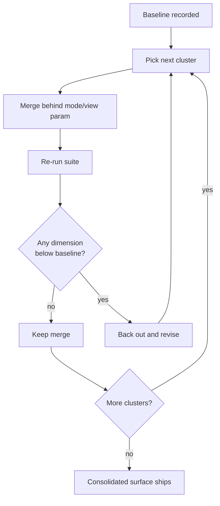
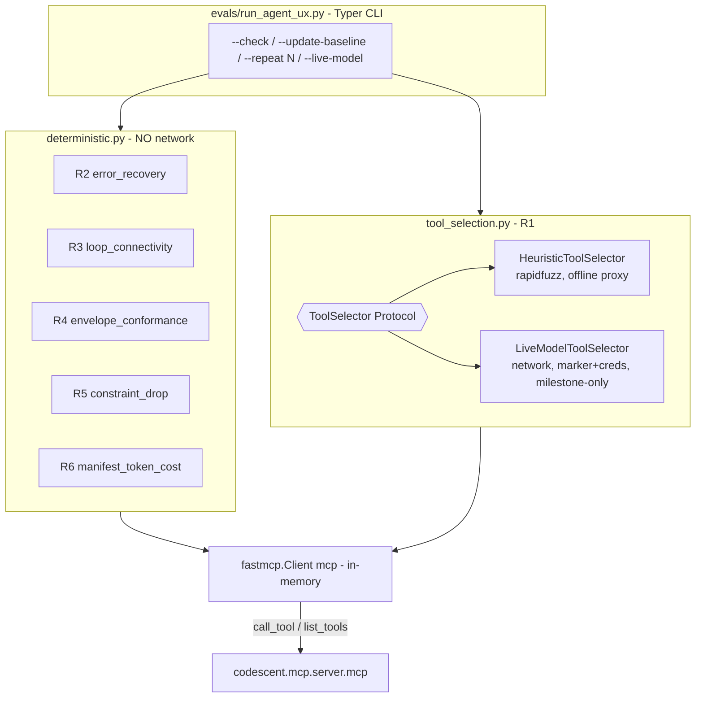

# CodeScent Audit Phase 2 — design diagrams

Referenced from beads epic `code-scent-mcp-audit-phase2-consolidation-yzsz` and its units. Design assets only; work state and dependencies live in beads (`br show <id>`, `br dep tree <id>`).

## Eval-gated cluster merge loop (KF1) — the pending-consolidation workflow — beads P2.1 (`…yzsz.2`), P2.3 (`…yzsz.4`)

Every consolidation cluster lands as its own commit, re-runs the offline `run_agent_ux.py --check` (deterministic dims + R6), and is backed out if any dimension regresses beyond its band.

## Eval-suite no-network architecture (shipped PR #15; reference for the gate the merges run) — epic `…yzsz`

The deterministic dimensions (R2–R6) stay inside the pure-Python floor; R1's model driver is the single network-touching component, isolated behind a `ToolSelector` Protocol, never imported by the deterministic path or the default CI gate.

