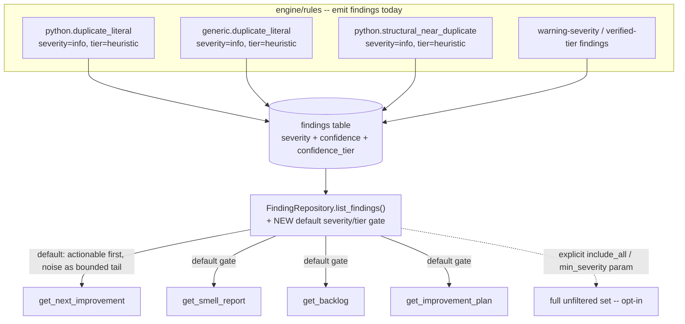
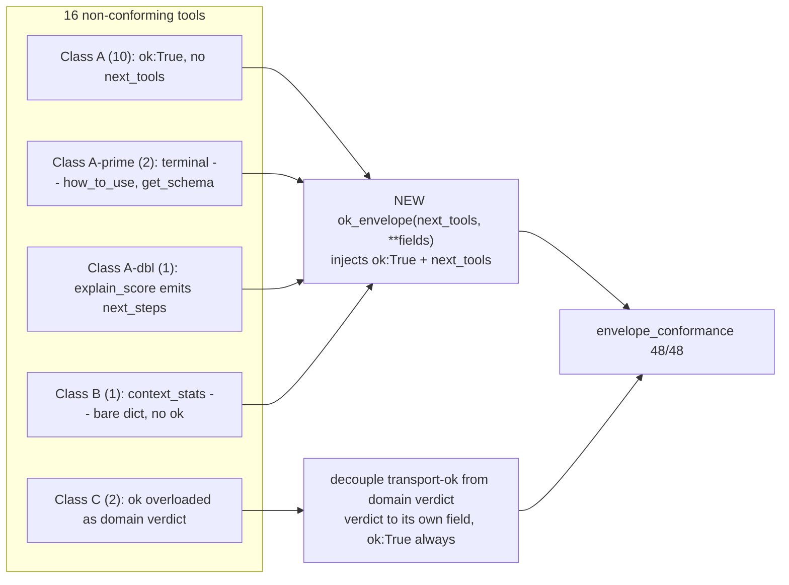

# CodeScent Audit Phase 3 — design diagrams

Referenced from beads epic `code-scent-mcp-audit-phase3-internals-signal-ul1r` and its units. These are design assets only; work state lives in beads (`br show <id>`, `br dep tree <id>`).

## Finding-view severity/tier gate (firehose fix) — bead P3.1 (`…ul1r.1`)

Every default view funnels through one no-`WHERE`-clause choke (`FindingRepository.list_findings`). The gate is inserted once, at that shared boundary, reading the axes findings already carry. The full unfiltered set stays reachable behind an explicit parameter — nothing is deleted.

## Envelope conformance fix (one constructor, 16 call sites) — beads P3.3 (`…ul1r.3`) + P3.4 (`…ul1r.4`)

