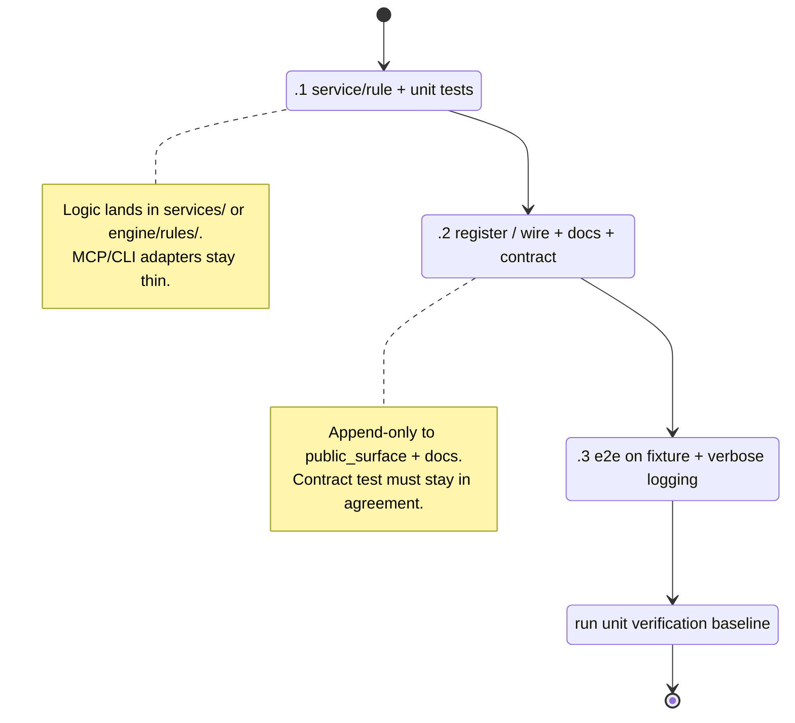

# feat: Implement the full open-beads backlog (25 features + 2 sweeps)

## Summary

CodeScent has 100 open beads in its `br` tracker: 25 feature epics (each split
into `.1` implement+unit-tests, `.2` integrate+docs/contract, `.3` e2e+logging
subtasks) plus two cross-cutting release-readiness sweep tasks. This plan
organizes all 100 beads into 27 dependency-ordered implementation units so
`ce-work` can execute them as the bead graph intends: one feature per unit, each
unit landing its beads in `.1 → .2 → .3` order on its own branch, with two
integration gates (`top5-integration-sweep`, `full-backlog-sweep`) reconciling
the shared public surface, docs, and verification baseline.

The bead bodies are the **authoritative spec** for each feature — this plan does
not restate every acceptance criterion; it grounds each feature in concrete
CodeScent file paths and extension patterns, encodes the cross-feature ordering
and shared-surface coordination that no single bead can see, and records the
audit corrections that overturn naive assumptions. Read the bead body
(`br show <id>`) at the start of each unit; this plan tells you where it plugs in.

**Product Contract preservation:** No upstream `ce-brainstorm` document exists;
the beads are the requirements source. Scope is unchanged from the tracker — this
plan adds sequencing and grounding, not new product scope.

---

## Problem Frame

The backlog was authored as a fine-grained bead graph (`code-scent-mcp-*`), but
the graph is flat: `br ready` surfaces 47 ready leaves with no narrative of how
they compose. Several features mutate the **same shared files**
(`core/public_surface.py`, `docs/mcp-tools.md`, contract tests) and would
conflict or drift if landed blindly. Two beads are explicit integration gates
that must run last in their cluster. Four bead bodies carry "CORRECTED after code
audit" notes that contradict their own titles (e.g. there is no tree-sitter
anywhere — the TS pack is regex-based). An implementer working bead-by-bead off
`br ready` alone will hit merge churn on the public surface, risk re-introducing
the audit-corrected assumptions, and has no view of the two terminal gates.

This plan exists to give `ce-work` that missing cross-cutting view while
delegating per-feature detail to the bead bodies.

---

## Goal Capsule

- **Outcome:** Every open bead closed; both sweep gates green; CodeScent ships a
  coherent, precision-gated, confidence-tiered, MCP-first, read-only, no-network
  quality layer with broadened language coverage and new output formats.
- **Definition of Done:** see [Definition of Done](#definition-of-done) — gated by
  `full-backlog-sweep-8yvv`.
- **Non-negotiables (apply to every unit):** writes only `.codescent/` state in
  analyzed repos; never edits analyzed source; no runtime network (subjective
  review uses client-side MCP **sampling**, not server network); MCP adapters stay
  thin (logic in `services/`); payloads bounded; checked-in fixtures are
  intentionally flawed and must not be "fixed".

---

## Requirements Traceability

Each implementation unit maps 1:1 to a feature epic (or sweep) bead and carries
that bead's subtasks. The bead ID **is** the requirement ID; subtasks `.1/.2/.3`
are the acceptance units. Closing a unit means closing all its subtask beads via
`br` and satisfying that bead's stated Definition of Done.

| Priority | Features (units) | Sweep gates |
|----------|------------------|-------------|
| P1 | capability-guide, auto-bootstrap, resume-task, refactor-preflight, import-cycle-rule (U1–U5); finding-confidence, deadcode-entrypoint, dogfood-gate, precision-harness, inline-suppression (U7–U11) | top5-integration-sweep (U6) |
| P2 | explain-finding, rule-precision, confidence-badges, incremental-reindex, scan-cache, repo-calibration, go-pack, fallback-pack, bus-factor, characterization-scaffold, sarif-output, test-quality-smells, finding-identity, subjective-sampling (U12–U25) | full-backlog-sweep (U27) |
| P3 | cbm-backend (U26) | — |

---

## Key Technical Decisions

**KTD-1 — One implementation unit per feature epic; beads stay the execution
unit of record.** `ce-work` tracks progress in `br` (the beads), not in this
plan. Each unit names its bead IDs; the implementer runs `br update <id>
--status in_progress` / closes on completion and `br sync --flush-only` per repo
convention. This avoids duplicating the bead graph's state into the plan.

**KTD-2 — Two-cluster + two-gate sequencing.** The first five P1 features (U1–U5)
feed `top5-integration-sweep` (U6); the second five P1 features plus all P2/P3
feed `full-backlog-sweep` (U27). Honor the gates: do not start a sweep until its
dependency leaves are closed. Rationale: the sweeps are the only place
cross-feature public-surface/doc/contract drift is reconciled. Because 20 units
(U7–U26) land between U6 and U27 — several repeatedly touching the same shared
files (`core/public_surface.py`, `engine/rules/model.py`, `services/risk.py`,
contract tests) — run a lightweight **interim reconciliation** after the cluster-2
P1 units (U7–U11) close: re-run the full verification baseline + contract tests on
the integrated branch before starting P2 work, so drift surfaces in bounded
batches rather than all at once at the terminal gate.

**KTD-3 — Bump `SCHEMA_VERSION` by landing order, not by feature; prefer no bump.**
Pre-backlog `SCHEMA_VERSION = 8` in `src/codescent/storage/schema.py`, and
`migrate()` runs `range(current_version + 1, SCHEMA_VERSION + 1)` — so the version
must increase monotonically **in the order migrations actually land**. Do **not**
pre-assign fixed numbers per feature: the four schema-touching candidates
(finding-identity, incremental-reindex, repo-calibration, scan-cache) land in a
different order than any fixed reservation, and a later-landing feature holding a
lower number would register a migration keyed to an already-passed version that
never executes on existing DBs (a silent missed migration). Instead, any feature
that genuinely needs a table greps `SCHEMA_VERSION` **at landing time** and uses
`current + 1`. Most features need **no** bump: `files.hash`, `files.size_bytes`,
and `findings.stable_key` already exist; prefer `.codescent/` state or config.
Migrations stay strictly ascending and collision-free by construction.

**KTD-4 — Shared public surface is append-only per feature; reconciled at the
gates.** Five new MCP tools land across the backlog: `how_to_use` (U1),
`resume_task` (U3), `refactor_preflight` (U4), `explain_finding` (U12),
`subjective_review` (U25). Each unit adds **only its own** entry to
`core/public_surface.py` and `docs/mcp-tools.md` and extends contract tests
(`tests/contract/test_public_surface_registry.py`,
`test_mcp_tool_surface.py`). Each such unit lands on its own branch to minimize
contract-test merge churn. The gates assert full agreement.

**KTD-5 — Honor the audit corrections in the bead bodies over the titles.**
Concretely: (a) **No tree-sitter** anywhere — `engine/packs_ts.py` is regex-based;
the Go pack (U18) and fallback pack (U19) must mirror that regex/LOW_CONFIDENCE
pattern, never add a parser dependency, and U18 must *correct* the aspirational
"tree-sitter" wording in `docs/language-packs.md`. (b) **bus-factor** (U20)
extends the existing single-pass `git log` parse in `services/git.py`
(`%H` → `%H%x00%an`); no per-commit subprocess. (c) **SARIF** (U22) lives in the
findings/CI path (`services/ci.py` + `services/reports.py` or new
`services/sarif.py`) and must **not** touch `core/output_formatter.py` (that is
test-run output). (d) **incremental-reindex** (U15) and **finding-identity** (U24)
build on already-shipped primitives (`files.hash`, content-anchored
`_stable_key`) — audit, prove, and extend; do not rebuild.

**KTD-6 — Derive-don't-hardcode for self-describing surfaces.** The capability
guide (U1), the entry-point registry (U8), the dogfood gate (U9), and all
contract tests read the registered surface at runtime from
`core/public_surface.py` (`registered_mcp_tool_names()`, `cli_commands`). No
feature hardcodes a tool list; future tools must require no edits to these.

**KTD-7 — Confidence tier + provenance is the spine of the trust layer.** U7
adds `confidence_tier` (verified|heuristic) and `provenance` to the finding
model; downstream units consume it (explain-finding U12, confidence-badges U14)
and risk ranking respects it. U7 and finding-identity (U24) both edit
`engine/rules/model.py` on different fields (tier/provenance vs `_stable_key`
hardening) — land merge-aware.

---

## High-Level Technical Design

### Unit dependency graph

```mermaid
graph TD
    subgraph clusterA["Cluster 1 — feeds Top-5 sweep"]
        U1[U1 capability-guide<br/>how_to_use tool+resource]
        U2[U2 auto-bootstrap]
        U3[U3 resume-task<br/>resume_task tool]
        U4[U4 refactor-preflight<br/>refactor_preflight tool]
        U5[U5 import-cycle-rule]
        U6{{U6 top5-integration-sweep}}
        U1 --> U6
        U2 --> U6
        U3 --> U6
        U4 --> U6
        U5 --> U6
    end

    subgraph clusterB["Cluster 2 — P1 precision/quality"]
        U7[U7 finding-confidence<br/>tier + provenance]
        U8[U8 deadcode-entrypoint]
        U9[U9 dogfood-gate]
        U10[U10 precision-harness]
        U11[U11 inline-suppression]
        U8 -->|fg9.2 blocks jqn.1| U9
    end

    subgraph clusterC["P2 / P3"]
        U12[U12 explain-finding]
        U13[U13 rule-precision]
        U14[U14 confidence-badges]
        U15[U15 incremental-reindex]
        U16[U16 scan-cache]
        U17[U17 repo-calibration]
        U18[U18 go-pack]
        U19[U19 fallback-pack]
        U20[U20 bus-factor]
        U21[U21 characterization-scaffold]
        U22[U22 sarif-output]
        U23[U23 test-quality-smells]
        U24[U24 finding-identity]
        U25[U25 subjective-sampling]
        U26[U26 cbm-backend P3]
        U7 -.tier dep.-> U14
        U13 -.precision dep.-> U14
        U15 -->|unu.1 blocks d9d.1| U16
        U7 -.soft.-> U12
    end

    U6 --> U27
    U7 --> U27
    U8 --> U27
    U9 --> U27
    U10 --> U27
    U11 --> U27
    U12 --> U27
    U13 --> U27
    U14 --> U27
    U15 --> U27
    U16 --> U27
    U17 --> U27
    U18 --> U27
    U19 --> U27
    U20 --> U27
    U21 --> U27
    U22 --> U27
    U23 --> U27
    U24 --> U27
    U25 --> U27
    U26 --> U27
    U27{{U27 full-backlog-sweep<br/>terminal gate}}
```



### Per-feature subtask lifecycle (applies to every feature unit)



(`dogfood-gate` U9 and `confidence-badges` U14 have only `.1`/`.2`; the two sweeps
have no subtasks.)

---

## Shared Execution Conventions

These apply to **every** unit; per-unit sections below do not repeat them.

- **Start each unit by reading its bead:** `br show <feature-id>` and each
  subtask `br show <feature-id>.N`. The bead body is authoritative for acceptance
  criteria; this plan is authoritative for sequencing and file grounding.
- **Bead workflow:** mark `in_progress` when starting a subtask, close it when its
  acceptance criteria are met, and `br sync --flush-only` per repo convention.
  Land each new-MCP-tool feature on its own branch (KTD-4).
- **Adding a rule** (per architecture reference): create
  `src/codescent/engine/rules/<rule>.py` exposing
  `scan_<rule>(root, *, config=None) -> tuple[CodeHealthFinding, ...]`; build
  findings via `build_finding()` in `engine/rules/model.py` (auto stable-key);
  register a `RulePack` in `engine/packs.py::_rule_packs()` (or extend the
  language aggregator); export in `engine/rules/__init__.py`; add a checked-in
  fixture + eval expectations under `evals/`/`tests/fixtures/`.
- **Adding an MCP tool:** thin function in `src/codescent/mcp/<group>_tools.py`,
  `mcp.tool(description=...)(fn)` inside the group's `register_*` function, calling
  a `services/` function and returning a bounded TypedDict; add to
  `core/public_surface.py` and `docs/mcp-tools.md`; extend contract tests.
- **Adding a service:** `src/codescent/services/<name>.py`, constructor takes
  `repo: str | Path`, returns structured results; callable from both CLI and MCP.
- **Adding a language pack:** regex parser in
  `src/codescent/engine/parsers/<lang>.py` returning `ParsedPythonFile` (the
  shared AST model), register `LanguagePack`+`RulePack` in `engine/packs.py`,
  update `ProjectConfig.language_packs` defaults — mirror `engine/packs_ts.py`.
- **Tests:** pytest under `tests/` (`integration/`, `unit/`, `contract/`,
  `security/`); deterministic evals under `src/codescent/evals/` /
  `evals/fixtures`; e2e/proof scripts under `scripts/` mirroring
  `scripts/prove_source_read_only.py` (verbose per-assertion logging: expected vs
  found).
- **Per-unit verification baseline** (run before closing a unit):
  `uv run pytest`, `uv run ruff check .`, `uv run ruff format --check .`,
  `uv run basedpyright`, plus the deterministic eval and source-read-only proof
  when the unit touches rules, scanning, or payloads.

---

## Output Structure (new files this backlog introduces)

```
src/codescent/
├── services/
│   ├── guide.py                 # U1 capability guide render
│   ├── bootstrap.py             # U2 auto-bootstrap
│   ├── session_resume.py        # U3 (or extend task_brief.py)
│   ├── refactor_preflight.py    # U4 blast-radius bundle
│   ├── explain.py               # U12 (or extend findings.py)
│   └── sarif.py                 # U22 (or fold into reports.py)
├── engine/
│   ├── parsers/go.py            # U18 Go regex parser
│   ├── packs_go.py              # U18 Go pack (mirrors packs_ts.py)
│   └── rules/
│       ├── import_cycles.py     # U5
│       ├── test_quality.py      # U23
│       └── (bus-factor, fallback rules per local cohesion)
├── mcp/
│   └── (new tools appended to existing groups; new task_tools.py only if cohesive)
scripts/
└── dogfood_scan.py              # U9
.github/
└── workflows/
    └── ci.yml                   # U9.2 — first CI host (baseline + dogfood + precision gate)
evals/fixtures/                  # new flawed fixtures: import-cycle, test-quality, go, generic-fallback
```

Per-unit `**Files:**` lists are authoritative; the implementer may relocate a
service if local cohesion suggests it (e.g. extend `task_brief.py` instead of a
new module).

---

## Implementation Units

> Ordering note: U1–U5 (then gate U6), then U7–U11, then U12–U25, then U26, then
> terminal gate U27. Within P2, respect the two intra-cluster edges:
> `incremental-reindex (U15) → scan-cache (U16)` and
> `finding-confidence (U7) + rule-precision (U13) → confidence-badges (U14)`.

### U1. Capability guide — `how_to_use` tool + `codescent://guide` resource

- **Beads:** `code-scent-mcp-capability-guide-2ae` (.1/.2/.3)
- **Dependencies:** none upstream; feeds U6. Coordinate with U8 (the new
  `how_to_use` tool must be recognized as an entry point so dead-code doesn't flag
  it).
- **Files:** `src/codescent/services/guide.py` (new),
  `src/codescent/core/public_surface.py`, `src/codescent/mcp/prompts.py` (inspect
  first — fold in if it already exposes a guide),
  a registering MCP group file, `docs/mcp-tools.md`; style ref
  `scripts/prove_source_read_only.py`.
- **Approach:** Deterministic service renders ONE bounded payload from
  `public_surface` (`registered_mcp_tool_names()` + group metadata) + the
  recommended workflow (init → index → scan → pick finding → context → plan →
  tests → verify → mark) + safety boundaries. Must NOT hardcode the tool list
  (KTD-6). Expose both a `how_to_use` tool and a `codescent://guide` resource. No
  source content.
- **Test scenarios:** guide tool-name set == `registered_mcp_tool_names()` exactly
  (order-independent; contract test fails on any divergence); every tool has a
  non-empty group + one-line purpose; no source path/content leaks; boundedness
  caps respected; adapter stdio call returns the bounded payload; e2e smoke boots
  the MCP path, calls `how_to_use`, reads the resource, asserts all workflow steps
  + safety boundaries present.
- **Verification:** contract (surface == docs == guide) passes; e2e smoke script
  runs green with per-assertion logging.

### U2. Auto-bootstrap on first use

- **Beads:** `code-scent-mcp-auto-bootstrap-n54` (.1/.2/.3)
- **Dependencies:** none upstream; feeds U6.
- **Files:** `src/codescent/services/bootstrap.py` (new),
  `src/codescent/services/config.py`, `docs/configuration.md`; reuse existing
  `repo_index` / scan / freshness services; style ref
  `scripts/prove_source_read_only.py`.
- **Approach:** Idempotent helper invoked from the shared service entry path (and
  `start_task`): if `.codescent/` missing or index clearly stale, run minimal
  init → index → scan (writing only under `.codescent/`), then proceed. Present +
  fresh → no-op. Opt-out config `auto_bootstrap` (default true). Triggering tool
  payload carries a bounded `bootstrapped: true|false` note. STOP if any path
  would write outside `.codescent/` or require network.
- **Test scenarios:** fresh temp repo → bootstrap runs, `.codescent/` created,
  analyzed source untouched (fixture `git status` clean); already-fresh → no-op;
  stale index → reindex path; no network (reuse no-network test pattern);
  `bootstrapped` note accurate; `auto_bootstrap=false` → legacy "run init"
  guidance; config round-trip; e2e on brand-new repo returns useful bounded answer
  with `bootstrapped: true`.
- **Verification:** source-read-only proof still passes; opt-out path exercised.

### U3. `resume_task` — post-compaction session brief

- **Beads:** `code-scent-mcp-resume-task-u18` (.1/.2/.3)
- **Dependencies:** none upstream; feeds U6. Adds one MCP tool → own branch.
- **Files:** `src/codescent/services/session_resume.py` (new) **or** extend
  `services/task_brief.py` (choose by local cohesion);
  `storage/repositories/session_events`; `src/codescent/mcp/repo_tools.py` or a new
  `task_tools.py`; `core/public_surface.py`; `docs/mcp-tools.md`.
- **Approach:** Deterministic router, **no new storage**: read session_events +
  findings + verification ledger + ratchet → ONE bounded brief (active/last
  finding(s), what's verified, ratchet status, recently touched files, recommended
  next tool call). If session_events lacks granularity, scope to "last N findings
  + ledger + ratchet" and document the limitation.
- **Test scenarios:** seeded temp repo (events + ledger + open finding) → brief
  names the finding, shows verified items, recommends a concrete next call; empty
  state → graceful "nothing in progress" (no crash); boundedness caps; contract
  (surface == docs, payload fields match); e2e simulates work → fresh session →
  `resume_task` reflects prior progress + sensible next step.
- **Verification:** contract green; e2e logging shows reconstructed brief from
  persisted state only (no source dump).

### U4. `refactor_preflight` — blast-radius bundle

- **Beads:** `code-scent-mcp-refactor-preflight-sdz` (.1/.2/.3)
- **Dependencies:** none upstream; feeds U6. Adds one MCP tool → own branch.
- **Files:** `src/codescent/services/refactor_preflight.py` (new),
  `src/codescent/mcp/planning_tools.py`, `core/public_surface.py`,
  `docs/mcp-tools.md`; composes existing impact/risk, git co-change,
  coverage/select_tests, changed-file-health services.
- **Approach:** Pure composition — given a file/symbol or finding id, bundle
  impact (callers/refs) + git co-change coupling + minimal verification set
  (select_tests) + changed-file health into one bounded, deduped payload.
  Orchestration only; **no new analysis**. Respect the most restrictive existing
  cap; drop source ranges before raising caps if oversized. Results must match the
  component tools called directly.
- **Test scenarios:** each section matches its component service's own output
  (composition fidelity); boundedness + dedupe; missing inputs (e.g. no coverage
  data) degrade gracefully; contract (surface == docs) + adapter returns bounded
  bundle; e2e on a known-coupling fixture asserts all four sections present and
  bounded.
- **Verification:** component-parity assertions green; e2e logging compares each
  section vs expectations.

### U5. Import-cycle / dependency-SCC detection rule

- **Beads:** `code-scent-mcp-import-cycle-rule-7md` (.1/.2/.3)
- **Dependencies:** none upstream; feeds U6.
- **Files:** `src/codescent/engine/rules/import_cycles.py` (new),
  `engine/rules/__init__.py`, `engine/rules/model.py` (finding shape),
  `storage/schema.py` (read the existing `imports` table — do **not** add a table),
  `services/context.py` (`_persisted_file_imports` / `_persisted_imports_by_path`),
  `evals/fixtures`.
- **Approach:** Compute SCCs (Tarjan/Kosaraju) over the **existing** module import
  graph (`imports` table, RESOLVED edges only — skip `resolved_file_id` NULL as
  external). SCC size > 1 or a re-export self-loop → finding; evidence = ordered
  cycle path; suggestion = safest edge to break; rank by cycle size × churn (reuse
  hotspot churn). New rule_ids `python.import_cycle`, `typescript.import_cycle`.
  Degrade gracefully on partial graphs; if TS graph confidence is too low, ship
  Python first and gate TS, documenting the limitation. **Reuse the existing
  graph — do not add a second builder** (KTD-5d).
- **Test scenarios:** constructed 3-module cycle → exactly one finding with the
  correct ordered path; acyclic → none; re-export self-loop → finding; partial
  graph → no crash, conservative; registration test (rule_ids in public set); new
  checked-in cycle fixture stays **unfixed** (per AGENTS.md); deterministic eval
  expectation passes; e2e on cycle fixture → expected path, acyclic fixture → zero.
- **Verification:** deterministic eval stable-ordered; rule_ids documented in
  config/rule-catalog docs.

### U6. Top-5 integration & release-readiness sweep `{{gate}}`

- **Beads:** `code-scent-mcp-top5-integration-sweep-mei` (no subtasks)
- **Dependencies:** **U1, U2, U3, U4, U5 must all be closed** (specifically
  their `.3` terminal subtasks). Do not start earlier.
- **Files (reconcile):** `core/public_surface.py`, `docs/mcp-tools.md` / README,
  contract tests.
- **Approach:** Prove the five features compose into one coherent bounded
  MCP-first, read-only, no-network workflow. Fix any surface/docs/contract
  disagreement **here** rather than shipping inconsistent state.
- **Acceptance / verification:** `registered_mcp_tool_names()`, `docs/mcp-tools.md`,
  and contract tests agree on the full surface including `how_to_use`,
  `resume_task`, `refactor_preflight`; capability guide enumerates the FINAL
  combined tool set (dynamic check passes regardless of merge order);
  `bootstrapped` note + `auto_bootstrap` opt-out documented and consistent; full
  baseline green (`uv run pytest`, `ruff check`, `ruff format --check`,
  `basedpyright`); deterministic eval + source-read-only proof pass; no fixture
  source modified except the intentional new import-cycle fixture; new rule_ids
  documented.

### U7. Confidence tier + provenance on findings

- **Beads:** `code-scent-mcp-finding-confidence-l5e` (.1/.2/.3)
- **Dependencies:** none upstream. Feeds U27. **Coordinate with U24** (both edit
  `engine/rules/model.py`; different fields → merge-friendly). U7's `.2` is a
  dependency of confidence-badges (U14); `.3` blocks U27.
- **Files:** `engine/rules/model.py` (`CodeHealthFinding`, `FindingSpec`,
  builder), `engine/parsers/python.py` (HIGH/LOW_CONFIDENCE), `engine/packs_ts.py`,
  `services/risk.py`, `mcp/finding_payloads.py`, `mcp/finding_tools.py`, smell
  report, `docs/mcp-tools.md`.
- **Approach:** Add `confidence_tier` (verified|heuristic) and `provenance`
  (resolution source + language tier + rule id) on top of the existing numeric
  `confidence`. Derive tier deterministically (HIGH_CONFIDENCE + resolved symbol →
  verified-capable; LOW_CONFIDENCE/regex → heuristic). Extend `services/risk.py`
  so verified outranks heuristic at equal severity. Propagate through payloads +
  docs; keep bounded (KTD-7).
- **Test scenarios:** Python finding → `verified`; regex/TS → `heuristic`; ranking
  orders verified above heuristic at equal severity; contract covers new fields;
  e2e on mixed Python+TS fixture asserts tiers, provenance present, ranking
  correct, bounded.
- **Verification:** contract green; e2e logging confirms tier assignment.

### U8. Entry-point-aware dead-code + structural-dup hardening

- **Beads:** `code-scent-mcp-deadcode-entrypoint-fg9` (.1/.2/.3)
- **Dependencies:** none upstream. **`.2` blocks dogfood-gate (U9) `.1`.** `.3`
  blocks U27. Coordinate with U1 (`how_to_use` must be recognized as an entry
  point).
- **Files:** `engine/rules/dead_code.py`, the structural near-duplicate rule,
  `core/public_surface.py` (`registered_mcp_tool_names()`, `cli_commands`).
- **Approach:** Build an entry-point registry the dead-code rule consults:
  registered MCP tool names + CLI command names from `public_surface`, plus
  `__all__` exports, decorator-registered callables (FastMCP/Typer), and
  dynamic-dispatch indicators. An entry-point symbol with no internal callers is
  excluded from dead-code with a "reachable via `<registration>`" reason. Required
  so the dogfood gate doesn't fail on `how_to_use` (the cbm in-degree=0 trap).
- **Test scenarios:** registered tool name + `__all__` export + decorated function
  all recognized as entry points; private helper is not; rule excludes entry
  points and attaches the reason; fixture with a registered-but-uncalled symbol +
  a genuinely-dead private function → only the private one flagged; deterministic
  eval.
- **Verification:** rule test + eval green; e2e logging.

### U9. Dogfood gate — scan CodeScent in CI

- **Beads:** `code-scent-mcp-dogfood-gate-jqn` (.1/.2 only — **no .3**)
- **Dependencies:** **U8 `.2` must be closed first** (so the gate isn't failed by
  registered-but-uncalled tools). `.2` blocks U27.
- **Files:** `scripts/dogfood_scan.py` (new, style of
  `scripts/prove_source_read_only.py`), an allowlist file,
  `docs/evals.md` or `docs/workflows.md`.
- **Approach:** Script runs the engine on this repo and asserts zero open findings
  except an explicit reviewed allowlist; wire as a CI gate. Reuse scan + ratchet.
  Allowlist changes must be reviewed/auditable. **No CI host exists in the repo
  yet** (`.github/workflows/` is absent) — U9 `.2` must create the CI workflow
  (e.g. `.github/workflows/ci.yml`) that runs the verification baseline + dogfood
  scan + the U10 precision gate; until that exists, "CI gate" means the runnable
  script the workflow will invoke.
- **Test scenarios:** smoke test invokes the script and asserts exit 0 on the
  clean tree; a new non-allowlisted finding fails the gate; detailed logging of
  finding vs allowlist.
- **Verification:** CI runs the gate; gate fails on a synthetic new finding.

### U10. Per-rule precision harness + CI gate

- **Beads:** `code-scent-mcp-precision-harness-2is` (.1/.2/.3)
- **Dependencies:** none upstream. `.3` blocks U27.
- **Files:** `evals/`, `evals/run_deterministic.py`, `evals/fixtures`,
  `docs/evals.md`.
- **Approach:** Labeled per-rule corpora (known-clean / known-smelly snippets per
  `rule_id`); runner computes precision per rule = TP/(TP+FP) deterministically,
  reusing the deterministic-eval machinery. CI gate records per-rule baselines and
  fails on regression below baseline. Call this metric **eval precision** —
  distinct from U13's runtime **acceptance precision** (accept-vs-dismiss); the CI
  gate and Definition of Done refer to *eval precision*.
- **Test scenarios:** tiny labeled corpus → expected precision numbers; simulated
  precision drop → gate fails; no drop → passes; baselines inspectable; e2e
  per-rule precision report across all rules with logging.
- **Verification:** `docs/evals.md` documents the harness + baselines.

### U11. Inline suppression comments

- **Beads:** `code-scent-mcp-inline-suppression-ye5` (.1/.2/.3)
- **Dependencies:** none upstream. `.3` blocks U27.
- **Files:** `services/findings.py`, `services/code_health.py`; new `suppressed`
  status; config to disable.
- **Approach:** Honor `# codescent: ignore[<rule_id>]` (Python) and
  `// codescent: ignore[...]` (TS/Go) on or directly above a finding's line, plus
  a bare `# codescent: ignore` that suppresses all rules on that line. Matched
  findings get a distinct `suppressed` status (not `open`), recorded with the
  comment as audit evidence; excluded from open counts + ratchet but still
  inspectable. Start with a pure-function comment parser (`.1`), then integrate
  into the pipeline (`.2`).
- **Test scenarios:** Python + TS comment forms, bare form, multiple rule ids,
  negative cases; pipeline test for suppress vs not + audit trail; e2e — ignore
  comment over a real finding → suppressed (audited), others open; remove comment
  → finding reappears.
- **Verification:** suppressed findings excluded from ratchet but inspectable;
  e2e logging.

### U12. `explain_finding` MCP tool

- **Beads:** `code-scent-mcp-explain-finding-zq2x` (.1/.2/.3)
- **Dependencies:** none hard; **soft synergy with U7** (include tier/provenance
  if landed). Adds one MCP tool → own branch. `.3` blocks U27.
- **Files:** `services/explain.py` (new) or extend `services/findings.py`;
  `mcp/finding_tools.py` or `mcp/planning_tools.py`; `core/public_surface.py`;
  `docs/mcp-tools.md`; `engine/source_read.py`, `engine/context/ranges.py`.
- **Approach:** One bounded payload combining the finding's why
  (`message`/`evidence`) + fix (`suggested_action`) + a **bounded** source snippet
  via `source_read` + `ranges`. Clip/drop the snippet before exceeding caps — never
  an unbounded dump. Register `explain_finding` in the planning group.
- **Test scenarios:** payload has snippet + why + fix for a fixture finding;
  oversized source clipped, not dumped; tool in `registered_mcp_tool_names()`,
  callable, bounded; surface == docs; e2e takes a real finding id and asserts the
  single bounded payload.
- **Verification:** contract + docs agree; e2e logging.

### U13. Per-rule precision + health trend

- **Beads:** `code-scent-mcp-rule-precision-nob` (.1/.2/.3)
- **Dependencies:** none upstream. **`.1` is a dependency of confidence-badges
  (U14).** `.3` blocks U27.
- **Files:** new metric service; dashboard `/api/precision` or extend
  `/api/progress` + payloads; a CLI report subcommand; `docs/dashboard.md`,
  `docs/cli-reference.md`.
- **Approach:** Metric service computes per-rule accepted-vs-dismissed precision
  from calibration suppression data + finding status history, plus ordered
  health-trend points. Pure/deterministic, bounded, read-only, loopback-only. This
  runtime **acceptance precision** is distinct from U10's labeled-corpus **eval
  precision**; confidence-badges (U14) surfaces *acceptance precision*.
- **Test scenarios:** unit on seeded findings with accept/dismiss history → correct
  precision numbers + trend points; API payload test; CLI report test; e2e asserts
  numbers via both CLI and dashboard API (loopback smoke).
- **Verification:** read-only/loopback preserved; docs updated.

### U14. Dashboard confidence/tier badges

- **Beads:** `code-scent-mcp-confidence-badges-7ou` (.1/.2 only — **no .3**)
- **Dependencies:** **U7 `.2`** (`confidence_tier`/`provenance` on findings) **and
  U13 `.1`** (per-rule precision metric). `.2` blocks U27.
- **Files:** `dashboard/server.py`, `dashboard/payloads.py`, dashboard static UI,
  `docs/dashboard.md`.
- **Approach:** Extend `/api/findings` (+ payloads) to expose each finding's
  `confidence_tier`/`provenance` + per-rule precision; render badges in the static
  UI. Read-only, loopback-only.
- **Test scenarios:** API payload test (tier/provenance/precision present, bounded);
  badges visible; dashboard smoke passes.
- **Verification:** dashboard stays local/loopback; docs updated.

### U15. Incremental dirty-file reindex + debounced watch

- **Beads:** `code-scent-mcp-incremental-reindex-unu` (.1/.2/.3)
- **Dependencies:** none upstream. **`.1` is a dependency of scan-cache (U16).**
  `.3` blocks U27.
- **Files:** `services/repo_index`, `services/freshness`, `cli/admin.py` (watch),
  the `index` command, `storage/schema.py`, `docs/cli-reference`,
  `docs/configuration`.
- **Approach:** Compute changed/added/deleted by comparing on-disk content hash to
  the **already-persisted** `files.hash`; reindex only the delta; cascade-delete
  rows for removed files (FKs are already `on delete cascade`). `index` becomes
  incremental by default with a `--full` escape hatch; `watch` debounces FS events
  → incremental reindex. Optional `mtime` pre-filter column **only** as a fast
  pre-filter — bump to the next free `SCHEMA_VERSION` at landing time only if added
  (grep first; likely none) per KTD-3.
  Correctness (incremental == full) is the real risk (KTD-5d).
- **Test scenarios:** modify one file → only it; delete → removed; no-op → empty
  set; incremental == full for the same change set; `--full` works; watch debounces
  + reindexes only the delta; e2e mutates N files and asserts the incremental index
  equals a fresh full reindex (log reprocessed counts).
- **Verification:** incremental-equals-full proven; watch debounce tested.

### U16. Content-hash scan cache + parallel scan

- **Beads:** `code-scent-mcp-scan-cache-d9d` (.1/.2/.3)
- **Dependencies:** **U15 `.1`** (reuse its hash-delta detection — do not build a
  second hashing path). `.3` blocks U27.
- **Files:** `.codescent/` state (cache); reuses `files.hash`. Schema bump to
  the next free version only if unavoidable (most likely none — prefer `.codescent/`
  state) per KTD-3.
- **Approach:** Per-file finding cache keyed by content hash; reuse cached findings
  for unchanged files, re-run rules only on changed files. Parallelize rule
  execution across files with a bounded pool (cores-aware; start simple — a
  thread/process pool sized ~cores-1, no custom scheduler); merge deterministically
  (stable order) so output is identical to serial.
- **Test scenarios:** change one file → only it re-scanned, results identical to
  cold scan; parallel result == serial result (deterministic); e2e cold vs
  warm(cached) vs parallel all yield identical findings (log timings +
  reprocessed-file counts).
- **Verification:** cached == cold; parallel == serial.

### U17. Per-repo severity calibration

- **Beads:** `code-scent-mcp-repo-calibration-soh` (.1/.2/.3)
- **Dependencies:** none hard. `.3` blocks U27.
- **Files:** `services/risk.py`, `services/calibration.py` (`AdaptiveSettings`),
  `docs/configuration.md`. Schema bump to the next free version only if a table is
  truly needed (grep first; likely none) per KTD-3.
- **Approach:** Learn per-repo baseline noise per rule (firing frequency) and
  normalize severity/ranking in `services/risk.py` (rule firing everywhere →
  downweighted; rare rule stands out). Extend the existing calibration system, not
  a parallel one. Persist baseline (prefer config/derived state). Must not silently
  hide findings — transparent + inspectable.
- **Test scenarios:** noisy rule downweighted, rare rule preserved (deterministic);
  baseline round-trip/derivation; e2e two synthetic repos (noisy vs clean) →
  ranking adapts (log baseline + adjusted ranks).
- **Verification:** integrates with existing calibration; nothing hidden silently.

### U18. Go language pack

- **Beads:** `code-scent-mcp-go-pack-19m` (.1/.2/.3)
- **Dependencies:** none hard. **Precedence coordination with U19** (specific Go
  pack wins over generic fallback). `.3` blocks U27.
- **Files:** `engine/parsers/go.py` (new), `engine/packs_go.py` (new),
  `engine/packs.py`, `engine/parsers/python.py` (confidence constants),
  `ProjectConfig.language_packs`, `docs/language-packs.md`, eval fixtures.
- **Approach:** **Regex** extraction of Go `func`/`type`/`package`/`import (...)`
  → `ParsedSymbol`/`ParsedImport` at LOW_CONFIDENCE, mirroring `engine/packs_ts.py`
  exactly. **No tree-sitter, no parser dependency** (KTD-5a). Register Go
  `LanguagePack`+`RulePack`, config-gated. Go rule_ids: `go.large_file`,
  `go.large_function`, `go.missing_nearby_test`, `go.duplicate_literal`. **Correct**
  the aspirational "tree-sitter" wording in `docs/language-packs.md`.
- **Test scenarios:** small `.go` file → expected funcs/types/imports; degrade
  gracefully on unparseable files; pack-selection + registration; deterministic
  eval; e2e on a Go fixture → expected symbols + findings (log detected vs
  expected).
- **Verification:** Go fixture yields LOW_CONFIDENCE symbols + Go smells
  deterministically; Python/TS unaffected; no new heavy dependency.

### U19. Generic fallback language pack

- **Beads:** `code-scent-mcp-fallback-pack-0yf` (.1/.2/.3)
- **Dependencies:** none hard. **Precedence coordination with U18** (specific
  packs always win). `.3` blocks U27.
- **Files:** `engine/packs.py`, new fallback pack + rules, config,
  fixtures in an unsupported language, `docs/language-packs.md`,
  `docs/configuration.md`.
- **Approach:** Lowest-precedence text-only fallback pack (line/text heuristics
  only — no parser, no fake symbols/references). Rules: file size/large-file, TODO
  cluster, duplicate literal under a `generic.*` namespace. Config enable/disable
  (default on). Degrade honestly — no structural/semantic claims it cannot prove.
- **Test scenarios:** unit per rule on a plain-text fixture (assert no symbol
  output); precedence test (Python/TS unaffected); config toggle; e2e on an
  unsupported-language repo → only generic findings; disabling fallback → no
  findings.
- **Verification:** specific packs win; no structural claims from fallback.

### U20. Bus-factor / knowledge-silo signal

- **Beads:** `code-scent-mcp-bus-factor-jvr` (.1/.2/.3)
- **Dependencies:** none hard. `.3` blocks U27.
- **Files:** `services/git.py`, rule emission in `engine/rules`, git fixtures +
  eval.
- **Approach:** Extend the **existing single-pass** `git log` parse in
  `services/git.py` to capture author (`--format=%H` → `%H%x00%an`) and aggregate
  per file; compute author concentration + churn. **Reuse the single-pass idiom —
  no per-commit subprocess** (KTD-5b). Emit `python/typescript.knowledge_silo`
  (or enrich hotspot ranking); self-disable cleanly when there's no git history.
- **Test scenarios:** seeded git fixture → expected concentration (single- vs
  multi-author); registration + deterministic eval; e2e — single-author high-churn
  file → silo finding, well-distributed → none, no history → no finding (log
  concentration vs threshold).
- **Verification:** no per-commit subprocess; deterministic.

### U21. Characterization-test scaffolding

- **Beads:** `code-scent-mcp-characterization-scaffold-fth` (.1/.2/.3)
- **Dependencies:** none hard. `.3` blocks U27.
- **Files:** new skeleton-generator service; `suggest_tests` payload;
  `docs/mcp-tools.md`; contract.
- **Approach:** Python-first skeleton generator: given a target symbol, emit a test
  module that imports it, constructs/calls with placeholders, and includes clearly
  marked TODO assertions — **never a fake green** (no `assert True`). Bounded.
  Opt-in `scaffold` field on `suggest_tests`.
- **Test scenarios:** generated code parses (ast) + imports the target; contract
  test for the new field; e2e writes the skeleton to a temp file and asserts pytest
  **collects** it without error and without a false-positive pass.
- **Verification:** honest skeleton (collected, no fake pass); bounded.

### U22. SARIF / GitHub PR annotation output

- **Beads:** `code-scent-mcp-sarif-output-zbv` (.1/.2/.3)
- **Dependencies:** none hard. `.3` blocks U27.
- **Files:** `services/reports.py` or new `services/sarif.py`, `services/ci.py`,
  `ci` + `review-diff` CLI, `docs/cli-reference.md`, `docs/configuration.md`.
  **Do NOT modify `core/output_formatter.py`** (that's test-run output) (KTD-5c).
- **Approach:** SARIF + GitHub-annotation serializers for **findings** in the
  CI/reporting path, mapping `rule_id`, `severity`, `file_path`, evidence range,
  `message`, `suggested_action`. Add `--format sarif` and `--format github` to `ci`
  and `review-diff`; existing JSON/markdown formats unchanged. Pure functions.
- **Test scenarios:** SARIF validates against the SARIF schema; annotation lines
  match `::warning file=...,line=...::message`; golden-output unit tests for both
  formats; both commands accept the new formats (existing unchanged); e2e runs
  `ci --format sarif` (schema-validate) and `--format github` (assert lines).
- **Verification:** schema-valid SARIF + correct annotation lines; existing formats
  intact.

### U23. Test-quality smells

- **Beads:** `code-scent-mcp-test-quality-smells-vqz` (.1/.2/.3)
- **Dependencies:** none hard. `.3` blocks U27.
- **Files:** `engine/rules` (new rule module, e.g. `test_quality.py`),
  `engine/rules/__init__.py`, checked-in flawed-test fixtures, `evals/fixtures`.
- **Approach:** Deterministic rules (Python + TS) for assertion-free tests,
  no-op/always-pass, over-mocking (mock-to-assert ratio), and skip/xfail clusters,
  detecting test functions via existing pack/parser data. Evidence = offending
  location; suggestion = add a meaningful assertion / reduce mocking / unskip or
  delete. New rule_ids `python.*` / `typescript.*`. Bounded, ranked.
- **Test scenarios:** unit per smell (positive fixture string → finding; healthy
  test → none); registration + deterministic eval; new flawed fixtures preserved
  as intentionally flawed; e2e bad-test fixture → expected findings, healthy → none.
- **Verification:** no false positives on healthy tests; deterministic ordering.

### U24. Edit-stable finding identity

- **Beads:** `code-scent-mcp-finding-identity-4v5` (.1/.2/.3)
- **Dependencies:** none hard. **Coordinate with U7** (both edit
  `engine/rules/model.py`). `.3` blocks U27.
- **Files:** `engine/rules/model.py` (`_stable_key`), `services/code_health.py`,
  `services/ci.py`, `services/verification.py`, `storage/schema.py` (bump to the
  next free `SCHEMA_VERSION` only if re-verification must persist a prior
  fingerprint — grep first) per KTD-3.
- **Approach:** Identity is **already** content-anchored (`_stable_key` hashes
  `rule_id | file_path | symbol | fingerprint(evidence)`, excluding volatile keys
  like `line_count`) (KTD-5d). Scope: (1) audit `_stable_key` + callers — confirm
  every folded evidence value is stable across benign edits, exclude any volatile
  value leaking via `evidence`; (2) confirm rename legitimately changes identity,
  document as intended; (3) add fingerprint re-verification — when `stable_key`
  persists but the evidence fingerprint (symbol body) changes, mark the prior
  verification stale so the ledger/ratchet don't carry a stale pass.
- **Test scenarios:** characterization tests pin identity across (a) inserting
  lines above a finding and (b) reformatting whitespace; unit covers both
  re-verification transitions; e2e seeds findings + ledger + ratchet baseline,
  applies line-shifting edits, rescans, asserts the logical finding keeps identity
  and ledger/ratchet stay attached (log id-before vs id-after).
- **Verification:** identity survives line shifts/reformatting; fingerprint change
  triggers re-verification.

### U25. Subjective LLM review via MCP sampling (Phase 9)

- **Beads:** `code-scent-mcp-subjective-sampling-nbv` (.1/.2/.3)
- **Dependencies:** none hard. Adds one MCP tool → own branch. `.3` blocks U27.
  **STOP if any path makes a direct network call from the server.**
- **Files:** `services/subjective_review.py` (already scaffolded:
  `SubjectiveReviewProvider` Protocol, `FakeSubjectiveReviewProvider`,
  `SubjectiveReviewService` gated by `config.privacy.allow_llm_review`,
  `build_subjective_review_prompt()`); new `SamplingSubjectiveReviewProvider`;
  `subjective_review` MCP tool; `core/public_surface.py`; `docs/mcp-tools.md`;
  `docs/configuration.md` (config `privacy.allow_llm_review`, default false);
  contract tests.
- **Approach:** Add a `SamplingSubjectiveReviewProvider` that issues an MCP
  **sampling** request via the server session/context using
  `build_subjective_review_prompt()` so the **client's** LLM judges — the server
  makes no network call. Gated by `allow_llm_review` (default false). Degrade
  gracefully when the client can't sample (clear "sampling unavailable", no crash).
  Expose opt-in `subjective_review` tool; persist subjective findings with distinct
  `subjective` provenance + confidence, merged into backlog but visually/semantically
  separate (never masquerading as deterministic). Document the data-exposure
  implication per PRD 14.5. **Data minimization:** bound what
  `build_subjective_review_prompt()` carries to finding metadata + minimal evidence
  (never whole-file source) and run a secret/PII scrub before issuing the sampling
  request, mirroring the existing `sanitize_event_payload` discipline.
- **Test scenarios:** fake sampling channel → parsed findings; gate off → no-op;
  sampling unavailable → graceful; no socket/network use (reuse no-network test
  pattern); contract surface/docs agreement; provenance separation; e2e with
  `allow_llm_review=true` + fake client model returns labeled subjective findings,
  flag false → clean no-op.
- **Verification:** no server network I/O; clean no-op by default.

### U26. Optional cbm structural backend (GraphBackend) — P3

- **Beads:** `code-scent-mcp-cbm-backend-66b` (.1/.2/.3)
- **Dependencies:** none hard, but **tackle only after the P1/P2 quality layer
  lands** (heavy, optional, external-tool integration). `.3` blocks U27.
- **Files:** new `GraphBackend` interface; native backend wrapping current
  `inventory`/`imports`/`symbol_references`; cbm adapter.
- **Approach:** Define a `GraphBackend` interface (symbols, complexity props, call
  edges, clusters) with the native engine as default. cbm is a **local** process
  (MCP/CLI) — local IPC only, no internet. **Hard constraint:** trust cbm's CALL
  GRAPH only for Hybrid-LSP languages (Python, TS/JS, Go, Java, Rust, C#, Kotlin,
  PHP, C, C++); for the tree-sitter tail degrade to symbol-only (cbm resolves by
  bare name and collapses same-named symbols across languages — bake the tiering
  into the adapter so its collision bug can't leak into findings). If cbm
  absent/unhealthy, behave exactly as today (native engine).
- **Test scenarios:** interface conformance against the native backend; unit with a
  fake cbm client (tiering enforced, fallback works); e2e parity — findings with
  cbm present (fake/real) vs absent are quality-equivalent and never inherit
  bare-name collisions; extend `tests/security/test_runtime_safety.py` to assert
  the cbm adapter performs no network I/O (local IPC only).
- **Verification:** correct language tiering; native fallback; no collision leaks.

### U27. Full-backlog integration & release-readiness sweep `{{terminal gate}}`

- **Beads:** `code-scent-mcp-full-backlog-sweep-8yvv` (no subtasks)
- **Dependencies:** **every other unit's terminal subtask closed**, including U6
  (top-5 sweep). Do not start until all dependency leaves are closed.
- **Approach:** Final coherence + release-readiness gate across the whole backlog.
- **Acceptance / verification (the backlog [Definition of Done](#definition-of-done)):**
  see below.

---

## Verification Contract

Run at every unit's close (see Shared Execution Conventions) and exhaustively at
both gates (U6, U27):

```bash
uv run pytest
uv run ruff check .
uv run ruff format --check .
uv run basedpyright
```

Plus, for any unit touching rules/scanning/payloads:

- Deterministic eval suite (`evals/run_deterministic.py` machinery) passes with
  stable ordering.
- Source-read-only proof (`scripts/prove_source_read_only.py`) passes — no writes
  to analyzed source, no network.
- New `scripts/dogfood_scan.py` (after U9) yields zero non-allowlisted findings.

---

## Definition of Done

The backlog is done when `full-backlog-sweep-8yvv` (U27) passes:

- Full verification baseline green: `uv run pytest`, `uv run ruff check .`,
  `uv run ruff format --check .`, `uv run basedpyright`.
- Deterministic eval + source-read-only proof pass.
- Dogfood scan of CodeScent itself yields zero non-allowlisted findings.
- Public surface coherent: `core/public_surface.py`, `docs/mcp-tools.md`, and
  contract tests (`tests/contract/test_public_surface_registry.py`,
  `test_mcp_tool_surface.py`) agree on **all five** new MCP tools — `how_to_use`,
  `resume_task`, `refactor_preflight`, `subjective_review`, `explain_finding`.
- `SCHEMA_VERSION` migrations strictly ascending, no collisions (verify against
  `storage/schema.py`; pre-backlog version is 8).
- Every finding carries a confidence tier + provenance; per-rule **eval** precision
  gate (U10) enforced in CI.
- No checked-in fixture source modified except the intentional **new** fixtures
  (import cycle, test-quality, Go, generic-fallback, etc.); docs coherent.
- All 100 beads closed in `br`.

---

## Scope Boundaries

**In scope:** all 100 open beads (25 feature epics + their `.1/.2/.3` subtasks +
the two sweep tasks), exactly as specified in their bead bodies.

### Deferred to Follow-Up Work

- cbm-derived complexity smells via Cypher (cbm doc #6: `transitive_loop_depth`,
  `linear_scan_in_loop`, `alloc_in_loop`) and coupling/god-object smell from cbm
  Leiden clusters (cbm doc #7) — documented in the cbm-backend bead as future, not
  separate beads.
- Diff-time symbol-level rescan for `review_diff_risk` building on incremental
  reindex (learnings #8) — noted in the incremental-reindex bead as future.

These are not open beads; do not implement them in this backlog.

---

## Risks & Mitigations

| Risk | Mitigation |
|------|-----------|
| Public-surface merge churn across 5 new-tool features | KTD-4: append-only per feature, own branch per tool, reconcile at U6/U27. |
| Re-introducing audit-corrected assumptions (tree-sitter, per-commit git, touching `output_formatter.py`, rebuilding hash/identity) | KTD-5 enumerates each; read the bead's "CORRECTED" note first. |
| Dogfood gate (U9) fails on the new `how_to_use`/registered tools | Hard ordering: U8 `.2` (entry-point awareness) before U9 `.1`. |
| Incremental reindex / scan cache producing results ≠ full scan | U15/U16 e2e prove incremental == full and parallel == serial; correctness is the gating acceptance criterion. |
| Schema-version collisions / silently-skipped migrations | KTD-3: bump by landing order (`current + 1`), grep `SCHEMA_VERSION` at landing time; prefer no bump. |
| Subjective review leaking source/secrets to client LLM | U25 data-minimization (metadata + minimal evidence, no whole-file source) + secret/PII scrub; sampling is client-side, server makes no network call. |
| 20 units drift between the two gates (U6→U27) | Interim reconciliation after U7–U11 (KTD-2) re-runs baseline + contract tests before P2. |

---

## Open Questions & Review Considerations

These were surfaced by document review and are **not** resolved by this plan
because each conflicts with the standing instruction ("implement all open beads")
or with a bead's authored design. They are recorded so the implementer (and a
future re-prioritization pass) can act on them without re-discovering them. None
blocks execution.

- **Backlog provenance is unvalidated.** The 25 feature epics were generated by
  `idea-wizard` with no upstream `ce-brainstorm` and no recorded user/agent demand
  per feature. This plan treats them as authoritative because the directive is to
  implement them all; if value-validation is wanted, run it *before* sequencing and
  cut features with no concrete demand. (Does not change this plan's scope.)
- **Definition of Done measures completion, not effect.** U27 passes on "beads
  closed + gates green + dogfood clean" — none of which proves the trust layer
  reduces real false positives or changes agent behavior. Consider adding one
  outcome criterion to U27 (e.g. measured eval precision exceeds a stated threshold,
  or a before/after false-positive count on the dogfood target).
- **Confidence tier may encode language, not trust.** U7 derives `verified` from
  HIGH_CONFIDENCE + resolved symbol, so all regex-parsed languages (TS, Go U18,
  fallback U19) become `heuristic`, and "verified outranks heuristic" then
  blanket-deprioritizes non-Python findings. This is the bead's authored design;
  if it proves too coarse, scope the ranking to within-language comparisons or
  derive the tier from per-rule precision (U13) rather than parser confidence.
- **cbm-backend (U26) buys parity, not new capability, by its own acceptance
  test.** Its DoD is "findings quality-equivalent to native"; the bead's value
  (broad language coverage, ms structural indexing) is real but unmeasured here,
  and U27/DoD couple shippability to this heaviest optional P3 unit. Confirm the
  capability gap is worth the GraphBackend abstraction before building, or land the
  P1/P2 quality layer as an independently shippable milestone first.

---

## Sources & Research

- **Origin:** beads tracker (`br` CLI), 100 open issues as of 2026-06-28; each
  feature bead and its `.1/.2/.3` subtasks read via `br show`.
- **Codebase architecture:** `src/codescent/` (engine/rules, mcp, services, cli,
  storage, dashboard, evals), `docs/architecture.md`, `docs/mcp-tools.md`,
  `docs/configuration.md`, `docs/language-packs.md`, `docs/evals.md`.
- **Audit corrections** are carried verbatim from the relevant bead bodies
  (go-pack, bus-factor, sarif-output, incremental-reindex, finding-identity,
  finding-confidence) and take precedence over bead titles.
