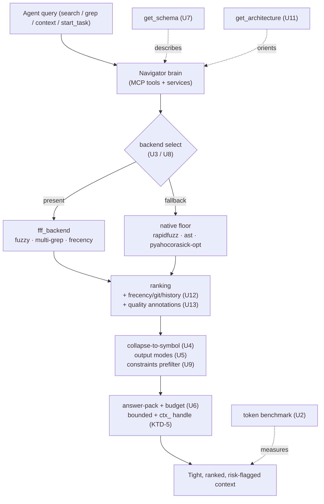
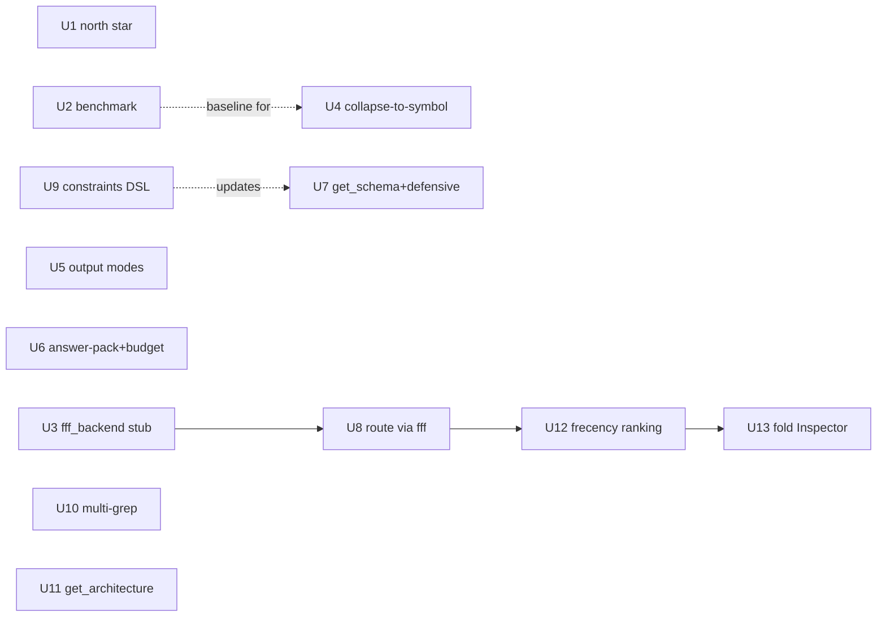

# feat: CodeScent quality-aware navigator — Phases 0-3

## Summary

Implement the first four phases of the CodeScent v2 roadmap (`CODESCENT_ROADMAP.html`) — **Frame & measure (0)**, **Tighten the answers (1)**, **Find fast & forgiving (2)**, and **Quality-aware ranking (3)** — as 13 implementation units mapping 1:1 to the open `br` beads under epics `phase0-frame-measure-v9tp`, `phase1-tighten-answers-3ops`, `phase2-find-fast-llix`, and `phase3-quality-ranking-n9p0`.

This run deliberately stops at the end of Phase 3 ("the moat"). Everything through Phase 3 is native or optional-dependency, fully deterministic, and adds **zero runtime network paths** — preserving the repo's `no-network-in-core` invariant. Phase 4 (the LLM/network layer), Phase 5 (reach & proof), and the Moonshots are out of scope for this run and become a clean follow-up.

The throughline is the roadmap's single yardstick: *does it get the right code into the model with fewer tokens and tighter focus?* Phase 0 builds the benchmark that makes that measurable; Phases 1-3 each report token deltas against it.

---

## Problem Frame

CodeScent today returns correct but token-heavy answers: raw line hits the agent must read whole files to understand, single fixed payload shapes, rapidfuzz-only retrieval, and ranking that does not know what *this* developer touches or which code is risky. The roadmap reframes CodeScent as the LLM's **quality-aware navigator**: native is the always-on floor; `fff`/`cbm`/LLM are optional accelerators; facts stay deterministic while judgment is opt-in.

The work is incremental on a substantial existing codebase (193 closed beads of prior work). It is not greenfield — every unit plugs into an existing seam (`cbm_backend`, `ranking`, `code_health`, `start_task`, `retrieve_result`, the symbol packs). The risk is drift from the settled identity and unbounded payloads creeping back in; the guardrails below hold the line.

**Target repo:** `code-scent-mcp` (this repo). All paths repo-relative.

---

## Requirements Traceability

Each unit maps to exactly one bead. The bead carries the canonical Goal/Build/Acceptance/Tests; this plan carries the implementation seam, file paths, and test scenarios. Bead acceptance criteria are the bar.

| U-ID | Bead | Phase | Outcome |
| ---- | ---- | ----- | ------- |
| U1 | `code-scent-mcp-phase0-frame-measure-v9tp.1` (P0.1) | 0 | Navigator north star + anti-drift checklist in `AGENTS.md`; CI lint that the section exists |
| U2 | `code-scent-mcp-phase0-frame-measure-v9tp.2` (P0.2) | 0 | Token-efficiency benchmark harness + committed baseline JSON; CLI entrypoint |
| U3 | `code-scent-mcp-phase0-frame-measure-v9tp.3` (P0.3) | 0 | `fff_backend` detect + capability probe + graceful fallback (mirrors `cbm_backend`) |
| U4 | `code-scent-mcp-phase1-tighten-answers-3ops.1` (P1.1) | 1 | `auto_expand_defs` / collapse-to-symbol for search & grep; measurable token drop |
| U5 | `code-scent-mcp-phase1-tighten-answers-3ops.2` (P1.2) | 1 | Output modes: content / files / count / usage |
| U6 | `code-scent-mcp-phase1-tighten-answers-3ops.3` (P1.3) | 1 | Answer-pack + universal `budget` / `max_tokens` with result-handle re-slice |
| U7 | `code-scent-mcp-phase1-tighten-answers-3ops.4` (P1.4) | 1 | `get_schema` self-describe + LLM-defensive API (aliases, coercion, 0-result fallback) |
| U8 | `code-scent-mcp-phase2-find-fast-llix.1` (P2.1) | 2 | Route retrieval through `fff_backend`; rapidfuzz fallback; bounds preserved |
| U9 | `code-scent-mcp-phase2-find-fast-llix.2` (P2.2) | 2 | Constraints DSL prefilter (git status, glob, negation, prefix, size, time) |
| U10 | `code-scent-mcp-phase2-find-fast-llix.3` (P2.3) | 2 | aho-corasick multi-grep (OR of many literals, one pass) |
| U11 | `code-scent-mcp-phase3-quality-ranking-n9p0.3` (P3.3) | 3 | One-call `get_architecture` + module view (cbm clusters; native Louvain fallback) |
| U12 | `code-scent-mcp-phase3-quality-ranking-n9p0.1` (P3.1) | 3 | Frecency + git-status + query-history ranking signals |
| U13 | `code-scent-mcp-phase3-quality-ranking-n9p0.2` (P3.2) | 3 | Fold the Inspector into navigation — quality annotations + rank adjustments |

**Product Contract preservation:** unchanged. This plan adds HOW; the beads own WHAT. No bead scope was altered.

---

## Key Technical Decisions

**KTD-1 — Bead lifecycle is driven live during execution.** For each unit: `br update <bead-id> --status=in_progress` when the unit starts, `br close <bead-id>` once its acceptance criteria and tests pass, `br sync --flush-only` before the unit's commit, and the bead ID referenced in the commit message. The `.beads/` JSONL syncs through the branch. (Per user direction.)

**KTD-2 — Native floor never regresses; engines stay optional.** `fff` and `pyahocorasick` are optional accelerators. The pure-Python install (no `fff`, no `pyahocorasick`) must remain fully functional with rapidfuzz/native fallbacks. `pyahocorasick` goes in `[project.optional-dependencies]`, never the base `dependencies`. Every fff-routed path has a tested absent-path. This is the roadmap's "engines stay optional" guardrail and the repo's pure-Python install contract.

**KTD-3 — No runtime network in any Phase 0-3 path.** Phases 0-3 add no network access to indexing, scanning, search, context, or eval paths (the existing `AGENTS.md` anti-pattern). This is *why* the run stops at Phase 3 — Phase 4 is where the network deliberately opens. Token counting (KTD-4) must therefore use a local estimator, not a model-hosted encoder.

**KTD-4 — Token counting uses a single local, deterministic estimator.** Add one `estimate_tokens(text: str) -> int` helper in `src/codescent/core/` (a word+punctuation heuristic; default ~chars/4 class accuracy), used by *both* the benchmark (U2) and the answer-pack budget (U6). It is approximate but consistent; the benchmark's metric is *relative* token deltas, which are robust to the estimator. The helper is pluggable behind one call site so a real tokenizer can replace it later without touching callers — and without ever adding a network dependency. (ponytail: heuristic estimator, swap for a real tokenizer if absolute counts ever matter.)

**KTD-5 — Bounded outputs + result-handles are non-negotiable.** Every new tool, mode, and the answer-pack keeps an explicit bound and, where payloads can be large, a `ctx_` result-handle via the existing `retrieve_result` mechanism. Budget enforcement caps each contributor so no sub-source over-fetches internally before truncation.

**KTD-6 — Per-user state stays out of shared artifacts.** The frecency store (U12) lives at `.codescent/frecency.json`, is per-user, and is git-ignored. It is a session/personal ranking signal, never committed, never a second graph.

**KTD-7 — Public surface changes go through the contract.** Any new or renamed MCP tool (`get_schema`, `get_architecture`, new params on search/grep) updates `src/codescent/core/public_surface.py` and its contract tests, and is described by `get_schema` (U7). `docs/` was removed from the repo; the stale `AGENTS.md` reference to `docs/mcp-tools.md` does not apply — user-facing documentation updates land in `README.md`, and the machine-readable surface is `get_schema` itself.

**KTD-8 — Facts stay deterministic; quality is a ranking signal, not a verdict rewrite.** Folding the Inspector in (U13) *annotates and reranks* retrieval; it never mutates `scan_code_health` outputs or the finding lifecycle. The Inspector apparatus is demoted to a signal source, not deleted.

---

## High-Level Technical Design

### Navigator layering (where each phase plugs in)



### Unit dependency graph



Hard dependencies (blocking): U3→U8→U12→U13. Everything else is parent-only and may land in phase order. Soft: U2's baseline is the reference for the token-delta claims in U4/U8/U12; U9 updates the `get_schema` surface authored in U7.

---

## Output Structure

New source files (everything else modifies existing modules at the seams mapped in research):

```text
src/codescent/
  services/fff_backend.py          # U3 — mirrors services/cbm_backend.py
  core/token_estimate.py           # KTD-4 — estimate_tokens() helper
  engine/search/frecency.py        # U12 — .codescent/frecency.json read/write + decay
  engine/search/constraints.py     # U9  — constraints DSL parser + native filter
  engine/search/multi_grep.py      # U10 — aho-corasick / pyahocorasick multi-pattern
evals/
  run_token_efficiency.py          # U2  — benchmark CLI entrypoint
  token_baselines.json             # U2  — committed baseline
tests/integration/
  test_<feature>.py per unit       # mirrors existing tests/integration/ layout
```

Runtime-only (git-ignored, not source): `.codescent/frecency.json` (U12). The per-unit **Files** lists remain authoritative.

---

## Implementation Units

> Execution protocol for every unit (KTD-1): claim the bead in_progress → implement → tests + `uv run ruff check . && uv run ruff format --check . && uv run basedpyright` green → `br close <bead-id>` → `br sync --flush-only` → commit citing the bead ID. Tests accompany each unit; units whose bead calls for an "e2e proving token reduction" get an integration test asserting a token delta vs the U2 baseline.

### U1. North star into AGENTS.md

- **Goal:** Encode the settled navigator identity so future work cannot drift.
- **Bead:** P0.1 (`...phase0-frame-measure-v9tp.1`).
- **Dependencies:** none.
- **Files:** `AGENTS.md` (new top-level section after OVERVIEW); `scripts/check_north_star.py` (CI lint — section header presence); `tests/integration/test_north_star_lint.py`.
- **Approach:** Add a "NAVIGATOR NORTH STAR" section: CodeScent is the quality-aware navigator; native is the always-on floor; fff/cbm/LLM are optional accelerators; **facts stay deterministic** (where-is-X, who-calls-Y, smells, CI gate) while **judgment** (rank/summarize/suggest) may use the opt-in LLM layer. Add a short anti-drift checklist (the four guardrails: facts deterministic, LLM opt-in/cached/labeled, stay bounded, engines optional). Add a tiny lint script asserting the header string exists, runnable in CI/pytest.
- **Patterns to follow:** existing `AGENTS.md` section style; `scripts/` helper-script convention (e.g. `scripts/prove_source_read_only.py`).
- **Test scenarios:** lint passes when the section header is present; lint fails (non-zero / assertion) when it is absent (use a temp copy with the header stripped). `Covers` P0.1 acceptance.
- **Verification:** `AGENTS.md` contains the section + checklist; lint test green.

### U2. Token-efficiency benchmark harness

- **Goal:** The scoreboard for the whole roadmap — prove token savings, guard regressions.
- **Bead:** P0.2 (`...phase0-frame-measure-v9tp.2`).
- **Dependencies:** none (uses KTD-4 estimator — create `core/token_estimate.py` here).
- **Files:** `src/codescent/core/token_estimate.py` (new, KTD-4); `evals/run_token_efficiency.py` (new CLI); `evals/token_baselines.json` (new, committed); register a `codescent bench-tokens` (or `evals` subcommand) entrypoint per CLI pattern in `src/codescent/cli/main.py`; `tests/integration/test_token_efficiency.py`.
- **Approach:** Define scenarios (find symbol, locate string, gather task context) run two ways — via CodeScent tools (`find_symbol`/`search_content`/`start_task`) vs naive `grep + read whole file` — counting tokens with `estimate_tokens` for each. Emit per-scenario `{scenario, codescent_tokens, naive_tokens, delta, ratio}` to a baseline JSON under `evals/`. Run against a checked-in fixture repo (`tests/fixtures/python-basic`) so numbers are stable. Mirror the `evals/run_deterministic.py` entrypoint shape.
- **Patterns to follow:** `evals/run_deterministic.py`, `evals/precision_harness.py`, `evals/fixtures/*.expected.json`; CLI registration in `cli/main.py`.
- **Test scenarios:** `estimate_tokens` is deterministic and monotonic (longer text ≥ tokens); each scenario produces both counts and a positive reduction for the CodeScent path; golden baseline scenario reproduces stable numbers against the fixture; harness emits valid JSON matching the documented schema. `Covers` P0.2 acceptance.
- **Verification:** `uv run python evals/run_token_efficiency.py --repo tests/fixtures/python-basic` produces reproducible deltas; baseline committed; test green.
- **Execution note:** This baseline is the reference for the token-drop claims in U4/U8/U12 — land it before those.

### U3. fff_backend stub (detect + graceful fallback)

- **Goal:** The optional retrieval-backend seam, mirroring `services/cbm_backend.py`.
- **Bead:** P0.3 (`...phase0-frame-measure-v9tp.3`).
- **Dependencies:** none. **Blocks:** U8.
- **Files:** `src/codescent/services/fff_backend.py` (new); `tests/integration/test_fff_backend.py`.
- **Approach:** Mirror `cbm_backend.py` exactly: an `FffClient` Protocol (capabilities: fuzzy path search, content grep, multi-grep, frecency), an `FffCliClient`/wheel-import implementation, `detect_fff(repo_root, *, runner=None) -> FffClient | None` probing for the `fff-search` Python package (import) and/or an `fff` binary, env override `CODESCENT_FFF_CMD`, and a `select_search_backend(...)` returning fff when available else the native (rapidfuzz) path. No behavior change when absent.
- **Patterns to follow:** `services/cbm_backend.py` — `detect_cbm()` (L271), `CbmClient` protocol (L54), `CbmCliClient` (L88), `select_graph_backend()` (L295), `_pull()` fallback (L253).
- **Test scenarios:** present path returns an `FffClient` (probe stubbed via injected `runner`); absent path returns `None` and selection yields the native backend; `CODESCENT_FFF_CMD` override honored; capability probe degrades cleanly when fff present but a capability is missing; import works with fff package absent (pure-Python). `Covers` P0.3 acceptance.
- **Verification:** detection + capability probe + clean fallback; zero impact when fff missing; test green including the pure-Python absent path.

### U4. auto_expand_defs / collapse-to-symbol

- **Goal:** Biggest token win for the smallest lift — stop returning raw line hits the agent must read whole files to understand.
- **Bead:** P1.1 (`...phase1-tighten-answers-3ops.1`).
- **Dependencies:** none (reports delta against U2 baseline).
- **Files:** `src/codescent/engine/parsers/python.py`, `parsers/go.py` (extend symbol payload with start/end line range); `src/codescent/engine/packs.py` / `packs_ts.py` / `packs_go.py` / `packs_generic.py` (enclosing-definition mapping); `src/codescent/core/output_formatter.py` + `core/symbol_formatter.py` (collapse + signature render, skip import-only lines, truncate fat lines, `compact|full|files` modes); wire into `mcp/search_tools.py` (`search_content`/grep) and `services/search.py`; `tests/integration/test_collapse_to_symbol.py`.
- **Approach:** Map each match line to its enclosing function/class via the Python AST (exact, `confidence=exact`); heuristic for TS/Go packs with a `confidence` label. Return signature + minimal context; once a definition is shown, skip subsequent import-only lines; truncate over-long lines. Add `compact|full|files` render modes (coordinate with U5's mode param).
- **Patterns to follow:** `engine/parsers/python.py::parse_python_file`, `parsers/go.py::parse_go_file`; existing `SymbolPayload` and `output_formatter` envelope/preview logic.
- **Test scenarios:** Python match collapses to enclosing `def`/`class` with exact signature; TS/Go collapse carries a heuristic `confidence` label; import-only lines suppressed after the symbol is shown; over-long line truncated to bound; nested def resolves to the innermost enclosing symbol; match with no enclosing symbol (module level) degrades gracefully; e2e asserts measurable token reduction vs the U2 baseline. `Covers` P1.1 acceptance.
- **Verification:** grep/search results collapse to enclosing symbol with signature; token-delta test green against U2 baseline.
- **Execution note:** Start the Python path test-first (exact AST contract); the TS/Go heuristics follow with confidence labels.

### U5. Output modes: content / files / count / usage

- **Goal:** Let the agent pick payload shape; `files` and `count` are near-free when it only needs locations or a tally.
- **Bead:** P1.2 (`...phase1-tighten-answers-3ops.2`).
- **Dependencies:** none (shares the render path with U4).
- **Files:** `src/codescent/mcp/search_tools.py` (add `output_mode` param to `search_files`/`search_content`/grep tools); `src/codescent/services/search.py`; `src/codescent/core/output_formatter.py`; `src/codescent/core/public_surface.py` (param is part of the contract); `tests/integration/test_output_modes.py`.
- **Approach:** Add an `output_mode: content|files|count|usage` param shaping the bounded response — `content` (current default, collapse-aware), `files` (paths only), `count` (tally), `usage` (match sites / reference-style). Each mode stays bounded.
- **Patterns to follow:** existing param handling in `mcp/search_tools.py`; bound enforcement in `output_formatter.py`.
- **Test scenarios:** each of the four modes returns the correct shape; each respects the bound; default mode unchanged (back-compat); invalid mode value falls back gracefully (ties into U7 defensive parsing). `Covers` P1.2 acceptance.
- **Verification:** four modes return correct, bounded shapes; contract test updated.

### U6. Answer-pack + universal budget / max_tokens

- **Goal:** One bounded, composed object per ask, with predictable size — the heart of tight context.
- **Bead:** P1.3 (`...phase1-tighten-answers-3ops.3`).
- **Dependencies:** none (uses KTD-4 estimator from U2; reuses `retrieve_result`).
- **Files:** `src/codescent/services/context.py` + `services/context_support.py` (compose); `src/codescent/mcp/repo_tools.py` (`start_task`) and a generalized `answer_pack` tool in `mcp/context_tools.py` or `repo_tools.py`; `src/codescent/mcp/result_tools.py` (`retrieve_result` handle reuse); `core/token_estimate.py` (budget accounting); `core/public_surface.py`; `tests/integration/test_answer_pack.py`.
- **Approach:** Generalize the `start_task` composition (top files, key symbols + signatures, likely tests, in-scope findings, related) into a deduped answer-pack across sources. Add a `budget`/`max_tokens` param that auto-summarizes/samples each contributor to fit and returns a `ctx_` handle to expand. Cap each contributor so no internal over-fetch precedes truncation (KTD-5).
- **Patterns to follow:** `mcp/repo_tools.py::start_task` (TaskBrief composition), `mcp/result_tools.py::retrieve_result`, `services/context.py::get_related_files`.
- **Test scenarios:** composed pack dedupes overlapping files/symbols across sources; `budget`/`max_tokens` enforced (output `estimate_tokens` ≤ budget); the `ctx_` handle re-slices an existing pack without re-running retrieval; each contributor is capped (assert no contributor fetches beyond its cap even when budget is large); empty/zero-result query returns a valid bounded empty pack. `Covers` P1.3 acceptance.
- **Verification:** composed bounded payload; budget enforced; handle re-slices without rerun; tests green.

### U7. get_schema self-describe + LLM-defensive API

- **Goal:** Orient the agent in one call and stop wasted/failed tool calls.
- **Bead:** P1.4 (`...phase1-tighten-answers-3ops.4`).
- **Dependencies:** none (describes the surface that U5 adds; U9 will extend it).
- **Files:** `src/codescent/mcp/guide_tools.py` (`get_schema` alongside `how_to_use`); a shared defensive-parsing helper in `src/codescent/core/` (e.g. extend `core/json_decode.py` or new `core/defensive.py`) applied across `mcp/*_tools.py`; `core/public_surface.py`; `tests/integration/test_get_schema.py`, `tests/integration/test_defensive_api.py`.
- **Approach:** `get_schema` returns node/finding/result types + counts + each tool's response shape (a run-this-first companion to `how_to_use`). Add defensive parsing: param aliases (e.g. `pattern`→`query`), float→int coercion for numeric args, and graceful 0-result fallbacks instead of errors. Centralize the coercion/alias logic so every tool shares it.
- **Patterns to follow:** `mcp/guide_tools.py::how_to_use`; `core/json_decode.py`; `core/public_surface.py` registry as the schema source of truth.
- **Test scenarios:** `get_schema` returns a machine-readable surface (types, counts, per-tool response shapes) matching `public_surface`; aliased param accepted (`pattern` resolves to `query`); float passed where int expected is coerced; a query yielding nothing returns a bounded empty result rather than an error; unknown param is ignored gracefully (not a hard error). `Covers` P1.4 acceptance.
- **Verification:** schema call returns machine-readable surface; sloppy inputs accepted instead of erroring; tests green.

### U8. Route retrieval through fff_backend (fallback rapidfuzz)

- **Goal:** Upgrade the weakest layer to sub-10ms, typo-resistant, frecency-aware retrieval.
- **Bead:** P2.1 (`...phase2-find-fast-llix.1`). **Depends on U3.**
- **Dependencies:** U3. **Blocks:** U12.
- **Files:** `src/codescent/services/search.py` (route `find_symbol`/`search_files`/`search_content`/grep through `select_search_backend`); `src/codescent/services/fff_backend.py` (consume); `src/codescent/engine/search/ranking.py` (preserve bounding + confidence + freshness on results returned from fff); `tests/integration/test_fff_routing.py`.
- **Approach:** When fff is present (pip `fff-search` wheel or `fff` binary), route retrieval through it, then re-apply CodeScent bounding + confidence + freshness on the way out. When absent, the existing rapidfuzz path runs unchanged. Results from either backend pass through the same envelope so callers see no shape difference.
- **Patterns to follow:** `services/cbm_backend.py::_pull` (cbm-or-native fallback), `engine/search/ranking.py`, `services/freshness.py::confidence_for_results`.
- **Test scenarios:** fff-routed results achieve parity-or-better recall vs rapidfuzz on a fixture query (fff stubbed/mocked at the client boundary); fallback path runs identically when fff absent; bounds + confidence + freshness preserved on fff results; e2e captures a latency + token comparison vs the U2 baseline with logging. `Covers` P2.1 acceptance.
- **Verification:** parity-or-better vs rapidfuzz; clean fallback; bounded outputs preserved; tests green.

### U9. Constraints DSL prefilter

- **Goal:** One compact param to scope search instead of many — fewer tokens, precise intent.
- **Bead:** P2.2 (`...phase2-find-fast-llix.2`).
- **Dependencies:** none (richer when on the fff backend from U8; native parser otherwise). Updates U7's schema.
- **Files:** `src/codescent/engine/search/constraints.py` (new native parser); `src/codescent/services/search.py` (apply prefilter); `src/codescent/services/fff_backend.py` (delegate to fff-query-parser when on fff); `src/codescent/mcp/guide_tools.py` (`get_schema` documents the DSL); `core/public_surface.py`; `tests/integration/test_constraints_dsl.py`.
- **Approach:** Parse an inline constraint mini-language shared by path + content search: git status (`git:modified`), extension/glob (`*.rs`), negation (`!test/`), path prefix (`src/`), size, and time. Reuse the fff-query-parser when on the fff backend; else a small native parser. Apply as a prefilter before ranking.
- **Patterns to follow:** `services/git.py::detect_git_state` (for `git:modified`); existing glob/exclude handling; `core/public_surface.py`.
- **Test scenarios:** each constraint kind parses and filters correctly — `git:modified`, glob/extension, negation/exclude, path prefix, size, time; combined constraints compose (AND); malformed constraint degrades gracefully (no hard error, ties to U7); the DSL appears in `get_schema` output. `Covers` P2.2 acceptance.
- **Verification:** constraints correctly prefilter results; documented in `get_schema`; tests green.

### U10. aho-corasick multi-grep

- **Goal:** Trace every usage of many identifiers in a single call instead of N — speed + token win for impact analysis.
- **Bead:** P2.3 (`...phase2-find-fast-llix.3`).
- **Dependencies:** none (uses fff `multi_grep` when present, else `pyahocorasick`).
- **Files:** `src/codescent/engine/search/multi_grep.py` (new, `pyahocorasick` fallback); `src/codescent/services/fff_backend.py` (delegate to fff `multi_grep` when present); `src/codescent/mcp/search_tools.py` (expose / extend `multi_search_content`); `pyproject.toml` (`pyahocorasick` in `[project.optional-dependencies]`, KTD-2); `core/public_surface.py`; `tests/integration/test_multi_grep.py`.
- **Approach:** Multi-pattern literal search in one pass — fff `multi_grep` when present, else `pyahocorasick`; if neither is installed, a bounded native multi-substring fallback so pure-Python still works (KTD-2). Returns files where any pattern matches, bounded and deduped.
- **Patterns to follow:** existing `mcp/search_tools.py::multi_search_content`; `services/fff_backend.py` capability delegation.
- **Test scenarios:** one call matches across all supplied patterns (≥8 literals); results bounded + deduped by file; `pyahocorasick`-absent path falls back to the native scan and still passes; empty pattern list returns empty bounded result; overlapping patterns dedupe correctly. `Covers` P2.3 acceptance.
- **Verification:** one call covers all patterns; results bounded + deduped; tests green including the pyahocorasick-absent fallback.

### U11. One-call get_architecture + module view

- **Goal:** Orient in one call instead of many repo-map + read cycles.
- **Bead:** P3.3 (`...phase3-quality-ranking-n9p0.3`).
- **Dependencies:** none (surfaces data the cbm adapter already fetches; native fallback otherwise).
- **Files:** new `get_architecture` tool in `src/codescent/mcp/repo_tools.py`; `src/codescent/services/cbm_backend.py` (expose the `clusters()` data already fetched); `src/codescent/services/context.py` or a new `services/architecture.py` (compose overview); native Louvain/label-propagation over the import graph in `src/codescent/engine/rules/architecture.py` / `import_cycles.py` as fallback; `core/public_surface.py`; `tests/integration/test_get_architecture.py`.
- **Approach:** Return languages, packages, entry points, layers, hotspots, and de-facto modules in one bounded call. Surface the clusters the cbm adapter already retrieves (`CbmClient.clusters()`) but never exposes; when cbm is absent, run native Louvain/label-propagation over the import graph and label modules heuristically.
- **Patterns to follow:** `services/cbm_backend.py::clusters`, `engine/rules/architecture.py`, `engine/inventory.py` (languages/packages/entry points), `mcp/repo_tools.py::get_repo_map`.
- **Test scenarios:** single call returns a bounded overview with languages/packages/entry-points/layers/hotspots/modules; cbm-present path surfaces cbm clusters; cbm-absent path produces native heuristic clusters labeled as heuristic; overview respects the bound on a large fixture. `Covers` P3.3 acceptance.
- **Verification:** single bounded overview; modules labeled (heuristic when native); tests green.

### U12. Frecency + git-status + query-history ranking

- **Goal:** Rank by what THIS developer actually touches — the personal-first edge no pure search tool has.
- **Bead:** P3.1 (`...phase3-quality-ranking-n9p0.1`). **Depends on U8.**
- **Dependencies:** U8. **Blocks:** U13.
- **Files:** `src/codescent/engine/search/frecency.py` (new — `.codescent/frecency.json` read/write + time decay); `src/codescent/engine/search/ranking.py` (add `frecency_score`, `git_modified`, `query_history` to `PathRank` + scoring + ranking reasons); `src/codescent/services/search.py`, `services/context.py` (`get_related_files`), `mcp/repo_tools.py` (`start_task`) — wire signals in and record access; `.gitignore` (ensure `.codescent/` ignored, KTD-6); `tests/integration/test_frecency_ranking.py`.
- **Approach:** A small `.codescent/frecency.json` store of per-file access/edit frequency + recency (decayed), per-user and git-ignored. Combine with git status (`services/git.py`) and recent query history as ranking signals wired into search, `get_related_files`, and `start_task`. Surface the contributing signals in ranking reasons (explainability).
- **Patterns to follow:** `engine/search/ranking.py::PathRank.rank_path`, `services/git.py::detect_git_state`, `.codescent/` JSON-artifact convention.
- **Test scenarios:** access increments frequency and updates recency; decay lowers an old entry's score over simulated time (inject clock, no real sleep); recently/frequently touched files rank above equal-relevance untouched files; git-modified files float up; ranking reasons name the contributing signals; store is created under `.codescent/` and is absent from git status; missing/corrupt store degrades to neutral (no crash). `Covers` P3.1 acceptance.
- **Verification:** recently/frequently touched + modified files float up; signals explainable in ranking reasons; e2e shows relevant-first results; tests green.
- **Execution note:** Inject the clock for decay tests (no wall-clock sleeps); keep the store per-user and git-ignored.

### U13. Fold the Inspector into navigation (the moat)

- **Goal:** Make the navigator smarter than fff/cbm by annotating + reranking retrieval with code quality.
- **Bead:** P3.2 (`...phase3-quality-ranking-n9p0.2`). **Depends on U12.**
- **Dependencies:** U12.
- **Files:** `src/codescent/engine/search/ranking.py` (apply `quality_score` adjustment); `src/codescent/services/code_health.py`, `services/findings.py` (read existing hotspot/dead-code/duplication/complexity signals); `src/codescent/engine/rules/{dead_code,structural_duplicates,relative_size}.py` (consume, do not modify outputs — KTD-8); `src/codescent/core/output_formatter.py` (inline annotations on results); `tests/integration/test_quality_ranking.py`.
- **Approach:** Attach hotspot (churn×size), dead-code, duplication, and complexity signals as inline annotations on retrieval results and adjust ranking — down-weight dead/duplicate/irrelevant, flag risky. E.g. "here is the auth code; this function is a hotspot with a twin two files over, and that import is dead." Read-only on the Inspector: it stays a signal source; `scan_code_health` and the finding lifecycle are untouched (KTD-8). Bounded.
- **Patterns to follow:** `services/code_health.py::CodeHealthService.scan`, `services/findings.py`, the `engine/rules/*` Finding outputs; `engine/search/ranking.py` scoring.
- **Test scenarios:** a hotspot result carries a hotspot annotation; a dead-code result is down-weighted and flagged; a structural-duplicate result names its twin; complexity reflected in rank; annotations stay within the output bound; ranking adjustment is explainable; `scan_code_health` output is byte-identical before/after (no mutation of facts). `Covers` P3.2 acceptance.
- **Verification:** results carry quality annotations; ranking reflects them; bounded; deterministic-facts test green.

---

## Scope Boundaries

**In scope (this run):** the 13 units above — Phases 0-3 in full, with bead lifecycle driven live (KTD-1), landing on one branch / one PR.

### Deferred for later (roadmap, separate run)
- **Phase 4 — The intelligent layer** (`phase4-intelligent-layer-6ynu`): LLM provider abstraction, semantic search (embeddings), rerank + NL→query, smart answer-pack. This is where the network deliberately opens; kept out so this run stays deterministic and pure-Python.
- **Phase 5 — Reach & proof** (`phase5-reach-proof-hrrz`): PreToolUse Grep/Glob context-injection hook, benchmark → public artifact + CI gate, `query_graph` bounded passthrough.
- **Moonshots** (`moonshots-oi9v`): autonomous retrieval planner, frecency×centrality×quality compound rank, cross-session navigation memory. Explicitly excluded per user direction (depend on Phases 2·3·4).

### Non-goals (identity guardrails — never cross)
- No runtime network in indexing/scan/search/context/eval paths (KTD-3).
- No LLM call into `scan_code_health` or any fact/CI-gate path; quality is a ranking signal, not a verdict rewrite (KTD-8).
- No unbounded payloads — every answer keeps its bound + result-handle (KTD-5).
- No hard dependency on fff or pyahocorasick — pure-Python install stays fully functional (KTD-2).
- No per-user state in shared/committed artifacts (KTD-6).

---

## Risks & Mitigations

| Risk | Mitigation |
| ---- | ---------- |
| `fff-search` wheel / binary unavailable in the run environment | fff is optional by design; every fff path has a tested absent path (U3/U8/U9/U10). The native floor is the deliverable; fff is an accelerator. |
| Token estimator inaccuracy undermines benchmark credibility | KTD-4: relative deltas are the metric and are robust to the estimator; estimator is pluggable for a real tokenizer later. Golden fixture keeps numbers stable. |
| Collapse-to-symbol heuristics wrong for TS/Go | Python is AST-exact; TS/Go carry an explicit `confidence` label so consumers know it's heuristic (U4). |
| Frecency store corruption / concurrent writes | Missing/corrupt store degrades to neutral ranking, no crash (U12 test scenario); per-user JSON, atomic write. |
| Public-surface drift breaks contract tests | KTD-7: every tool/param change updates `public_surface.py` + contract tests + `get_schema` in the same unit. |
| Single large PR (13 units) hard to review | Atomic per-unit commits in dependency order, each citing its bead; phases form natural review groupings. |

---

## Verification Contract

Gates that must pass before the run is done (per `AGENTS.md` COMMANDS, all via `uv run`):

- `uv run pytest` — full suite green, including every new `tests/integration/test_*.py`.
- `uv run ruff check .` and `uv run ruff format --check .` — clean.
- `uv run basedpyright` — clean (typeCheckingMode = all).
- `uv run python evals/run_token_efficiency.py --repo tests/fixtures/python-basic` — reproducible per-scenario deltas; baseline committed (U2).
- Pure-Python install path: suite green with `fff` and `pyahocorasick` absent (KTD-2).
- Contract tests for `public_surface.py` updated and green for new/changed tools.
- Each unit's bead acceptance criteria satisfied (the bead is the bar).

## Definition of Done

- All 13 beads (P0.1–P3.3) closed via `br close` with `.beads/` synced and bead IDs cited in commits (KTD-1).
- Token-efficiency baseline committed; U4/U8/U12 demonstrate measurable token reduction against it.
- Navigator north star + anti-drift checklist live in `AGENTS.md`; lint green (U1).
- All Verification Contract gates green; no new runtime network in core paths; per-user state git-ignored.
- `README.md` and `get_schema` reflect the new/changed public surface; `public_surface.py` contract current.
- Phases 4-5 and Moonshots remain open and untouched — clean handoff for the next run.

---

## Sources & Research

- **Origin:** `CODESCENT_ROADMAP.html` (Roadmap v2, navigator-first), Phases 0-3.
- **Backing reports:** `FFF_MINING_REPORT.md` (#1 fff_backend, #2 frecency, #3 auto_expand_defs, #8 multi-grep, constraints DSL, defensive API), `CBM_MINING_REPORT.md` (#3 answer-pack, #4 get_architecture + community detection, #6 get_schema, #9 token benchmark; cbm_backend already built).
- **Beads:** open epics `phase0-frame-measure-v9tp`, `phase1-tighten-answers-3ops`, `phase2-find-fast-llix`, `phase3-quality-ranking-n9p0` (13 task beads) — the canonical Goal/Build/Acceptance/Tests per unit.
- **Codebase seams (research):** `services/cbm_backend.py` (mirror target), `engine/search/ranking.py`, `services/code_health.py` + `engine/rules/*`, `services/git.py` + `freshness.py`, `services/context.py` + `mcp/repo_tools.py::start_task`, `mcp/result_tools.py::retrieve_result`, `core/output_formatter.py` + `symbol_formatter.py`, `engine/parsers/*` + `packs*.py`, `evals/run_deterministic.py` pattern, `tests/integration/` layout, `core/public_surface.py` contract. `rapidfuzz>=3.0` already a dependency; `docs/` removed (doc updates → `README.md` + `get_schema`).
