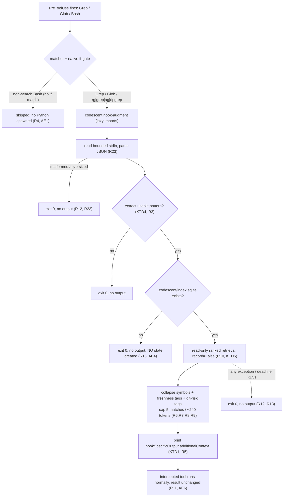
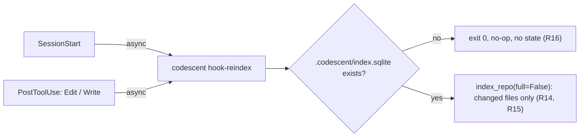

# Grep-Injection Hook - Plan

## Goal Capsule

- Objective: Deliver codescent's retrieval signal on the search path even when the agent skips codescent's MCP tools and searches with plain Grep/Glob or a Bash `rg`/`grep`, using a non-blocking Claude Code PreToolUse hook plus two companion hooks that keep the index fresh.
- Product authority: Robert Guss (repository owner).
- Open blockers: None. The planning-deferred questions (latency, shim form, read-only path) are resolved in Key Technical Decisions; remaining unknowns are scoped to implementation under Open Questions.

---

## Product Contract

**Product Contract preservation:** unchanged. Planning enriched HOW, not WHAT — no R/AE/F/A IDs were rewritten. The decisions below are implementation choices; product scope is identical to the brainstorm.

### Summary

Add a Claude Code PreToolUse hook that fires when the agent runs Grep/Glob or a Bash `rg`/`grep`, and injects a bounded, frecency-ranked, symbol-collapsed, freshness-tagged view of where the searched pattern lives. Register it — together with two incremental-reindex hooks (session start and after each edit) — through a new `codescent install-hook` command. This is v1: enrichment that rides alongside the search and never blocks, denies, or rewrites it.

### Problem Frame

Agents are told to use codescent's search tools, but they routinely fall back to plain Grep/Glob or a shell `rg`/`grep`. When they do, codescent contributes nothing: the agent gets a flat, path-ordered list of raw match lines with no ranking, no symbol orientation, and no freshness signal — codescent's whole value (bounding, ranking, freshness, health) is bypassed. The gap is silent, because the agent never learns it missed the better signal, so closing it has to be automatic rather than another tool the agent must remember to call. DeusData's codebase-memory-mcp solves the same problem with a PreToolUse grep-injection hook that adds graph context whenever the agent greps, and codescent already lists this approach on its roadmap as `FFF_MINING_REPORT.md` item 14.

### Key Decisions

- KD1. Non-blocking pre-hint, not replacement. The hook adds context alongside the search and never blocks, denies, or rewrites it; any failure, slow path, or unindexed repo is a silent no-op. This is parity with cbm and the lowest-risk shape for v1.
- KD2. Intercept structured tools and Bash searches. Match Grep and Glob, and also Bash commands that invoke `rg`/`grep`/`ag`/`ripgrep`, because agents search through Bash constantly and a Grep/Glob-only net would silently miss most real searches.
- KD3. A coarse search-detection gate runs before Python. The Bash matcher fires on every Bash command, so a lightweight gate decides "is this even a search?" and only wakes the Python entrypoint when it is, keeping ordinary Bash near-zero cost and protecting the never-block guarantee.
- KD4. Maintain freshness with reindex hooks, not query-time work. Incremental reindex runs at session start and after each edit, so the search hot path stays read-only and enrichment never lags the agent's own changes.
- KD5. Read-only enrichment. On the search path the hook reads and reports but never writes (no frecency recording); writes belong to the real tools and the reindex hooks.
- KD6. Per-repo install by default. `codescent install-hook` writes the current repo's `.claude/settings.json`, with `--global` as an opt-in, because a global hook would need `codescent init` in every repo first.
- KD7. Lean payload with targeted risk. Up to five ranked matches, each one line (enclosing symbol + `path:line` + freshness tag), with a risk/health tag only on git-modified matches, hard-capped near 240 tokens — maximum orientation per token without duplicating grep's raw lines.

### Requirements

**Interception and triggering**

- R1. The hook runs as a Claude Code PreToolUse hook matching the `Grep`, `Glob`, and `Bash` tools.
- R2. For a Bash invocation, the hook enriches only when the command is a content or file search (`rg`, `grep`, `ripgrep`, `ag`); for any other Bash command it produces no output and exits 0.
- R3. The hook extracts the pattern from the tool input (Grep/Glob `pattern`) or the parsed search command (Bash), and skips patterns that are not usable identifiers (for example too short or regex-only), producing no output when skipped.
- R4. The non-search Bash path is decided cheaply, before the Python entrypoint is invoked, so ordinary Bash commands incur negligible added latency.

**Enrichment payload**

- R5. When enrichment fires, the hook injects its result as PreToolUse `hookSpecificOutput.additionalContext`, alongside and never replacing the search's own output.
- R6. The payload contains up to five matches for the pattern, ranked by codescent's frecency and git signals.
- R7. Each match renders on one line as its enclosing function or class symbol plus a repo-relative `path:line`, with a freshness/staleness tag.
- R8. A risk/health tag is attached only to matches in git-modified files, not to every match.
- R9. The payload is bounded to a small fixed token budget (target ~240 tokens) and includes a short pointer to codescent's own search tools.
- R10. Building the payload is read-only: the hook does not record frecency or otherwise write to the index on the search path.

**Non-blocking guarantee**

- R11. The hook never blocks, denies, or alters the intercepted tool call; the search always executes and its result is unchanged.
- R12. Every failure mode — unindexed repo, parse error, timeout, missing pattern, any exception — results in exit 0 with no output.
- R13. The hook bounds its own runtime so it cannot delay a search beyond a small budget, independent of the Claude Code settings-level timeout.

**Index freshness**

- R14. A SessionStart hook runs an incremental `codescent index` for the repo without delaying session start (detached or backgrounded).
- R15. A PostToolUse hook on `Edit` and `Write` incrementally reindexes the touched files, coalescing bursts, without delaying the agent.
- R16. In a repo with no codescent index, every hook no-ops cleanly: no errors surfaced, and enrichment creates no `.codescent/` state implicitly.

**Install and lifecycle**

- R17. A new `codescent install-hook` command registers all three hooks by merging into a Claude Code `settings.json` non-destructively, preserving unrelated existing hooks and settings.
- R18. `install-hook` defaults to the current repo's `.claude/settings.json`, accepts `--global` for `~/.claude/settings.json`, and accepts `--remove` to cleanly uninstall codescent's hook entries.
- R19. `codescent init` prints a one-line hint pointing at `codescent install-hook` and does not register hooks itself.
- R20. The hook entrypoint is exposed as a codescent CLI subcommand (for example `codescent hook-augment`) that imports lazily, so a cold invocation does not pay codescent's full CLI import cost.

**Optionality and security**

- R21. The hook follows codescent's optional-with-fallback discipline: it depends on neither `fff` nor `codebase-memory-mcp` and works on a pure-Python install using the native backends.
- R22. The Bash-search detection inspects the command string only; it never executes or evaluates the intercepted command, and the extracted pattern is passed to codescent's search as data, never to a shell.
- R23. The hook bounds the stdin it reads (caps payload size) and tolerates malformed input with exit 0 and no output.

### Key Flows

- F1. Agent searches via a structured tool.
  - **Trigger:** Agent calls Grep or Glob with a pattern.
  - **Steps:** The matched hook passes stdin to `codescent hook-augment`; it extracts the pattern, confirms the repo is indexed, runs a read-only ranked search, formats up to five collapsed and tagged lines, and emits `additionalContext`; the Grep/Glob tool then runs normally.
  - **Outcome:** The agent sees the search's raw results plus codescent's ranked, symbol-oriented, freshness-tagged shortlist.
  - **Covers:** R1, R3, R5, R6, R7, R8, R9, R10, R11.
- F2. Agent searches via Bash.
  - **Trigger:** Agent calls Bash with a command.
  - **Steps:** The coarse gate cheaply checks whether the command is `rg`/`grep`/`ag`; if not, it exits 0 immediately without launching Python; if so, it extracts the pattern and proceeds as in F1; the Bash command then runs normally.
  - **Outcome:** Bash searches get the same enrichment; non-search Bash is untouched and near-instant.
  - **Covers:** R2, R4, R5, R11, R12, R22.
- F3. Index stays fresh.
  - **Trigger:** Session start, and each Edit or Write.
  - **Steps:** SessionStart runs a detached incremental reindex; Edit/Write triggers a coalesced incremental reindex of the touched files.
  - **Outcome:** Enrichment reflects the agent's own edits without adding work to the search path.
  - **Covers:** R14, R15, R16.
- F4. Unindexed or foreign repo.
  - **Trigger:** Any hook fires in a repo with no `.codescent/index.sqlite`.
  - **Steps:** Enrichment finds no index and exits 0 silently; the reindex hooks no-op without creating state.
  - **Outcome:** No errors, no output, and no surprise state in repos the user never onboarded.
  - **Covers:** R12, R16.

### Acceptance Examples

- AE1. **Covers R2, R4.** Given the agent runs `ls -la` through Bash, When the PreToolUse hook fires, Then it produces no `additionalContext`, the Bash command runs unchanged, and the Python entrypoint is not invoked.
- AE2. **Covers R6, R7, R8, R9.** Given an indexed repo and the agent greps `parseConfig`, When the hook fires, Then `additionalContext` lists up to five frecency-ranked matches, each one line with enclosing symbol, repo-relative `path:line`, and a freshness tag, within the token budget.
- AE3. **Covers R8.** Given two matches, one in a git-modified file and one in an unmodified file, When the hook fires, Then only the git-modified match carries a risk/health tag.
- AE4. **Covers R12, R16.** Given a repo with no codescent index, When the agent greps, Then the hook exits 0 with no output and creates no `.codescent/` directory.
- AE5. **Covers R10.** Given the hook builds enrichment for a pattern, When it runs codescent's search, Then no frecency record is written for that access.
- AE6. **Covers R11.** Given any state, When the hook runs, Then the intercepted Grep, Glob, or Bash call still executes and its result is unaltered.

### Success Criteria

- Non-search Bash commands incur negligible added latency, because the coarse gate resolves without launching Python.
- On a real search in an indexed repo, the hook adds enrichment within a small latency budget that does not noticeably delay the search.
- A forced failure (corrupt index, process killed mid-run, malformed stdin) yields exit 0 and the search proceeds unchanged.
- Installing and removing the hook leaves any pre-existing `settings.json` hooks and settings intact.
- A pure-Python install with neither fff nor cbm produces working enrichment.

### Scope Boundaries

Deferred for later:

- Post-enrich (v2): a PostToolUse hook that operates on the search's real results to collapse and annotate the actual matched lines.
- Pre-redirect (v3, opt-in): a blocking mode that replaces the search with codescent's bounded output for token savings, off by default.
- Grep-access-as-frecency: feeding the agent's grep activity into the frecency signal, which would require a write on the search hot path.
- Background watcher daemon: a persistent filesystem watcher to keep the index live, rejected because incremental reindex is cheap.
- Per-match health and quality on every result: v1 limits health to git-modified matches.

#### Deferred to Follow-Up Work

- Piped/embedded Bash searches (`cat x | grep y`, `find … -exec grep`) where the search binary is not the leading token: the native `if`-gate (KTD3) matches on command prefix, so these silently fall through to no-op in v1. Direct `rg`/`grep`/`ag`/`ripgrep` invocations — the dominant agent search form — are covered. Widening the gate is follow-up.
- A persistent helper/daemon for the enrichment entrypoint, kept as an escape hatch triggered only by a measured cold-start shortfall (KTD2).

### Dependencies / Assumptions

- Reuses existing codescent machinery: `collapse_line` (`src/codescent/core/symbol_formatter.py`), `ranking_signals_for` (`src/codescent/services/search_support.py`), freshness via `confidence_for_results` and `warnings_for_results` (`src/codescent/services/freshness.py`), changed-file risk via `get_changed_file_health` (`src/codescent/mcp/risk_tools.py`), native matching via `multi_grep` (`src/codescent/engine/search/multi_grep.py`), and incremental indexing via `RepoIndexService.index_repo(full=False)` (`src/codescent/services/repo_index.py`).
- `SearchService.search_files` and `search_content` record frecency unconditionally and have no read-only flag today (`src/codescent/services/search.py`); R10's read-only enrichment therefore needs a dedicated read-only retrieval path or a new no-record flag, not a direct call to those methods. **Confirmed by research** — see U1.
- The `codescent` CLI is Typer with console_script `codescent = codescent.cli.main:app`; `src/codescent/cli/main.py` imports heavy service modules at top level, so the `hook-augment` subcommand must avoid that import graph (lazy imports) to keep cold start fast.
- Repo root is resolved by walking up to `.git` (`resolve_repo_root`, `src/codescent/core/paths.py`); the persistent index is `.codescent/index.sqlite` (`src/codescent/storage/repository.py`).
- Claude Code PreToolUse `additionalContext` injection is **confirmed supported** against the current hooks reference (the "Add context for Claude" section lists PreToolUse — context appears next to the tool result). See Sources / Research and KTD1.

### Outstanding Questions

Resolve Before Planning:

- None block planning.

Deferred to Planning — **now resolved** (see Key Technical Decisions):

- Latency budget and lazy-import cold subprocess vs persistent helper → KTD2.
- Pattern-usability rule for skipping noisy patterns → KTD4.
- Shim form and entrypoint location across install layouts → KTD3.
- Read-only retrieval implementation → KTD5 / U1.
- SessionStart and PostToolUse capping/debouncing → KTD6 / U5.

### Sources / Research

- Roadmap origin: `FFF_MINING_REPORT.md` item 14, "fff behind the grep-injection hook".
- Reference implementation studied: DeusData codebase-memory-mcp PreToolUse grep-injection hook — matcher `Grep|Glob`, a shim that pipes stdin to a `hook-augment` subcommand, `hookSpecificOutput.additionalContext`, a never-block exit-0 contract, and non-destructive `settings.json` merge.
- fff (dmtrKovalenko/fff): a frecency-ranked search MCP and the source of the frecency and ranking concepts codescent mirrors.
- Claude Code hooks reference (`https://code.claude.com/docs/en/hooks`), verified during planning. Load-bearing facts: PreToolUse supports `hookSpecificOutput.additionalContext` (delivered next to the tool result); the native `if` field (e.g. `if: "Bash(grep *)"`) skips the process spawn when it does not match; `async: true` runs a hook detached without delaying the session/turn; PostToolUse input carries `tool_input.file_path` for Edit/Write; SessionStart `source` is one of `startup`/`resume`/`clear`/`compact`. The output JSON shape is `{"hookSpecificOutput": {"hookEventName": "PreToolUse", "additionalContext": "…"}}`.
- Related existing plan: `docs/plans/2026-06-29-001-feat-codescent-navigator-phases-0-3-plan.md`.

---

## Planning Contract

**Plan depth:** Deep — cross-cutting across the CLI surface, the search service, three hook lifecycle events, an external `settings.json` contract, and a command-string security boundary (R22).

**Execution posture:** Test-first for the pure-logic units (gate, pattern extraction, settings merge) where behavior is fully specified and cheap to characterize; integration tests against a copied fixture repo for the retrieval/payload path. Carried as per-unit `Execution note`s.

### Key Technical Decisions

- KTD1. **PreToolUse `additionalContext` is the injection channel.** Verified against the current hooks reference: PreToolUse hooks may return `{"hookSpecificOutput": {"hookEventName": "PreToolUse", "additionalContext": "…"}}` and the text is delivered to the model next to the tool result, without affecting whether the tool runs. This is the never-block channel (KD1, R5, R11). The hook does **not** return `permissionDecision` — omitting decision control means the tool always proceeds. (An earlier research pass claimed PreToolUse lacked `additionalContext`; the official reference contradicts it. Re-confirm against the installed Claude Code version during U4 as a smoke check.)

- KTD2. **Lazy-import cold subprocess for v1; daemon deferred.** The enrichment entrypoint is a normal `codescent hook-augment` subprocess that imports its heavy dependencies lazily inside the command body (R20). Budget: the hook bounds its own wall-clock to ~1.5 s via an internal deadline (R13), and `install-hook` sets the Claude Code per-hook `timeout` to a small ceiling (~5 s) as a backstop. A persistent helper/daemon is an escape hatch triggered only by a measured cold-start shortfall, not built now (ponytail: simplest shape that holds).

- KTD3. **Native `if`-gate, no custom bash shim.** Claude Code's `if` field on a hook handler (e.g. `if: "Bash(grep *)"`) is evaluated internally and skips the process spawn when it does not match. `install-hook` registers Bash handlers gated by `if` conditions for the search prefixes (`rg *`, `grep *`, `ripgrep *`, `ag *`), so non-search Bash never spawns Python (R4, KD3) with zero shipped shim code (ponytail rung 4: native platform feature). The Python entrypoint independently re-validates the command (defense-in-depth and because it must parse the pattern anyway). Prefix-only matching means piped/embedded greps fall through — accepted for v1 (Deferred to Follow-Up Work).

- KTD4. **Pattern-usability rule.** A pattern is usable when it contains an identifier-like token of length ≥ 3 (`[A-Za-z_][A-Za-z0-9_]{2,}`) after stripping search flags and quotes. Reject pure-regex/wildcard/punctuation patterns and tokens shorter than 3 chars — they produce noisy, low-value shortlists (R3). When no usable token is found, emit nothing and exit 0. For Grep/Glob the candidate is `tool_input.pattern`; for Bash it is the extracted search term.

- KTD5. **Read-only retrieval via a `record=False` flag on the search service.** Add an opt-out parameter (default `True`, preserving current behavior) to the frecency-recording path of `SearchService.search_content`/`search_files` so the hook can rank with full parity and write nothing (R10, AE5). Chosen over assembling from `ranking_signals_for` + `multi_grep` + `collapse_line` by hand because the flag is the smaller diff and inherits ranking parity for free; the hand-assembled path stays available if cold-start measurements force it. Lazy-importing `SearchService` inside `hook-augment` keeps R20 intact (the heavy import is paid once per invocation regardless of approach).

- KTD6. **Reindex hooks must guard on an existing index — they cannot register raw `codescent index`.** `codescent index` calls `initialize_storage`, which *creates* `.codescent/`; registering it directly would violate R16/AE4 (no implicit state in un-onboarded repos). Instead, a thin `codescent hook-reindex` subcommand resolves the repo root from `cwd`, no-ops with exit 0 when `.codescent/index.sqlite` is absent, and otherwise calls `RepoIndexService.index_repo(full=False)` — which is already incremental (changed-files by hash) and idempotent, so it doubles as both the session-start full-incremental pass and the post-edit touched-file pass. Both reindex hooks register this one command with `async: true` so neither delays the agent (R14, R15). Burst coalescing relies on the existing incremental hash diff; finer debouncing is deferred to implementation only if measured bursts warrant it.

**Alternatives considered:**
- *Grep/Glob-only matcher (skip Bash).* Rejected per KD2 — agents search through Bash constantly; this would miss most real searches.
- *Custom bash gate script piping to Python.* Rejected per KTD3 — the native `if` field covers the cheap-gate need with no shipped script to install, locate, or keep executable.
- *Exit-2 / stderr injection to surface context.* Rejected — exit 2 blocks the tool (violates R11). `additionalContext` is the non-blocking channel.

---

## High-Level Technical Design

The PreToolUse enrichment path, end to end. The `if`-gate and the matcher are Claude Code config (KTD3); everything from `codescent hook-augment` down is codescent code. Every leaf that is not "emit additionalContext" is a silent exit 0 — the never-block invariant (R11, R12).



**Index-freshness lifecycle (companion hooks).** SessionStart and PostToolUse(Edit|Write) both register `codescent hook-reindex` with `async: true`. The command guards on an existing index, then runs `index_repo(full=False)`. Because the reindex is incremental and idempotent, overlapping async fires from edit bursts converge harmlessly.



---

## Output Structure

New and touched files for the hook subsystem (per-unit `Files` are authoritative; this is orientation only):

```text
src/codescent/
├── cli/
│   ├── main.py            # MODIFY: register_hook_commands(app); init hint (U7)
│   ├── hooks.py           # NEW: hook-augment, hook-reindex, install-hook commands + registration
│   └── hook_support.py    # NEW: pure logic — search-command detection, pattern extraction, usability gate
├── services/
│   ├── search.py          # MODIFY: record=False read-only flag (U1)
│   ├── hook_payload.py     # NEW: enrichment payload builder (collapse + freshness + risk + cap)
│   └── hook_install.py     # NEW: non-destructive settings.json merge / remove
tests/
├── unit/test_hook_support.py          # NEW (U2)
├── integration/test_search_readonly.py # NEW (U1)
├── integration/test_hook_payload.py    # NEW (U3)
├── contract/test_hook_augment_cli.py   # NEW (U4)
├── contract/test_hook_reindex_cli.py   # NEW (U5)
├── contract/test_install_hook.py       # NEW (U6)
└── contract/test_cli.py                # MODIFY: init hint assertion (U7)
```

---

## Implementation Units

### U1. Read-only retrieval flag on the search service

- **Goal:** Let a caller run codescent's ranked search without recording frecency, so the hook can rank with full parity and write nothing on the search path.
- **Requirements:** R10; AE5.
- **Dependencies:** none.
- **Files:** `src/codescent/services/search.py`, `tests/integration/test_search_readonly.py`.
- **Approach:** Add a keyword-only `record: bool = True` parameter to `search_content` (and `search_files` if the hook uses file search) that gates the frecency/instrumentation write. Default `True` preserves every existing caller's behavior; the hook passes `record=False`. Keep the ranking/scoring path identical so read-only results match recorded results exactly. Locate the single write site that records frecency and wrap it in the flag check — do not branch the whole method.
- **Execution note:** Test-first — assert the no-write contract before wiring the flag.
- **Patterns to follow:** Existing `SearchService` dataclass signature and the `tests/integration/test_search.py` fixture-copy pattern (`shutil.copytree(..., ignore=shutil.ignore_patterns(".codescent"))`).
- **Test scenarios:**
  - Covers AE5. With `record=False`, a search over an indexed fixture returns the same ranked results as `record=True` but the frecency store is unchanged (assert the access table/row count is identical before and after).
  - With `record=True` (default), behavior is unchanged — an existing-shape search still records (guards against regressing current callers).
  - `record=False` on a pattern with zero matches returns empty and still writes nothing.

### U2. Search-command detection, pattern extraction, and usability gate

- **Goal:** Pure, side-effect-free logic that answers "is this Bash command a search?", "what is the pattern?", and "is the pattern usable?" — the cheap gate and the parser, with no shell execution.
- **Requirements:** R2, R3, R4 (Python-side validation), R22.
- **Dependencies:** none.
- **Files:** `src/codescent/cli/hook_support.py`, `tests/unit/test_hook_support.py`.
- **Approach:** Three pure functions. (a) `detect_search_command(command: str) -> bool` — string-only inspection for a leading `rg`/`grep`/`ripgrep`/`ag` token; never executes or evaluates the command (R22). (b) `extract_pattern(tool_name, tool_input) -> str | None` — for Grep/Glob returns `tool_input["pattern"]`; for Bash parses the search term out of the command string (handle quoting and common flags; ignore flag values). (c) `usable_pattern(pattern: str) -> str | None` — applies KTD4 (identifier-like token, length ≥ 3, reject pure-regex/wildcard) and returns the usable token or `None`. The extracted pattern is returned as data only — never interpolated into a shell.
- **Execution note:** Test-first — the rules are fully specified (KTD4) and table-test cleanly.
- **Patterns to follow:** `tests/unit/` conventions; keep functions importable without pulling the heavy service graph (supports R20).
- **Test scenarios:**
  - Covers R2/AE1. `detect_search_command("ls -la")` is `False`; `"grep -n foo src/"`, `"rg --hidden bar"`, `"ag baz"`, `"ripgrep qux"` are `True`.
  - Covers R3/KTD4. `usable_pattern` accepts `parseConfig`, `handle_request`; rejects `".*"`, `"\\d+"`, `"a"`, `"()"`, `"--"`; returns the identifier from a mixed token where one exists.
  - `extract_pattern` pulls `parseConfig` from a Grep `tool_input={"pattern": "parseConfig"}` and from Bash `grep -rn "parseConfig" src/` (quoted), and does not mistake a flag value (`grep -e foo`) for a path.
  - Covers R22. A command containing shell metacharacters (`grep "$(rm -rf /)" .`) is parsed as a literal string; no substitution or execution occurs and the returned pattern is inert text.
  - Edge: empty command, command with only flags, and non-Grep/Glob structured tool all return `None`/`False` without raising.

### U3. Enrichment payload builder

- **Goal:** Turn a usable pattern + repo root into the bounded, ranked, symbol-collapsed, freshness/risk-tagged `additionalContext` string.
- **Requirements:** R6, R7, R8, R9, R10.
- **Dependencies:** U1, U2.
- **Files:** `src/codescent/services/hook_payload.py`, `tests/integration/test_hook_payload.py`.
- **Approach:** `build_payload(repo_root, pattern) -> str | None`. Run the U1 read-only search (`record=False`), take up to five top-ranked matches. For each, render one line: enclosing symbol via `collapse_line` + repo-relative `path:line` + a freshness tag derived from `confidence_for_results`/`warnings_for_results`. Attach a risk/health tag **only** when the file is in `RankingSignals.git_modified` (reuse `ranking_signals_for`; pull health via `get_changed_file_health` for those files only — not every match) (R8). Append a one-line pointer to codescent's MCP search tools. Enforce the ~240-token ceiling by truncating the match list before the pointer (R9). Return `None` when there are zero matches so the caller emits nothing.
- **Technical design (directional):** payload shape, not a spec —
  ```text
  codescent · `parseConfig` (5 ranked, frecency+git):
    parseConfig()            src/config/loader.py:42   ~fresh
    ConfigLoader.parse()     src/config/loader.py:88   ~fresh  ⚠ modified (health: 2 smells)
    …
  → prefer codescent search tools for ranked, bounded results.
  ```
- **Execution note:** Integration test against a copied fixture repo (needs a real index).
- **Patterns to follow:** `collapse_line` (`src/codescent/core/symbol_formatter.py`), freshness helpers (`src/codescent/services/freshness.py`), `ranking_signals_for` (`src/codescent/services/search_support.py`), `get_changed_file_health` (`src/codescent/mcp/risk_tools.py`).
- **Test scenarios:**
  - Covers AE2. Greping a symbol present in the fixture yields ≤ 5 lines, each with enclosing symbol, repo-relative `path:line`, and a freshness tag; the rendered string is within the token budget.
  - Covers AE3/R8. With one match in a git-modified file and one in an unmodified file, only the modified one carries a risk/health tag.
  - Covers R9. A pattern with many matches is truncated to 5 and the total stays under the ~240-token ceiling; the codescent pointer is present.
  - Covers R10. The builder performs no frecency write (assert via the U1 read-only contract).
  - Zero matches returns `None`.

### U4. `hook-augment` entrypoint and never-block contract

- **Goal:** The lazy-importing CLI subcommand Claude Code invokes on every matched search — orchestrating gate → extract → index-check → payload → emit, exiting 0 on every failure.
- **Requirements:** R1, R5, R11, R12, R13, R16, R20, R23; AE1, AE2, AE4, AE6.
- **Dependencies:** U2, U3.
- **Files:** `src/codescent/cli/hooks.py` (command + `register_hook_commands`), `src/codescent/cli/main.py` (call the registrar), `tests/contract/test_hook_augment_cli.py`.
- **Approach:** `hook_augment()` reads a size-bounded slice of stdin (R23), parses the hook JSON, resolves repo root from `cwd`. For Bash, re-checks `detect_search_command` (U2); extracts and validates the pattern (U2); confirms `.codescent/index.sqlite` exists (no creation — R16/AE4); builds the payload (U3); prints the `{"hookSpecificOutput": {"hookEventName": "PreToolUse", "additionalContext": …}}` JSON (KTD1, R5). Wrap the whole body so that any exception, an empty/oversized stdin, a missing pattern, an absent index, or an internal ~1.5 s deadline (R13) results in exit 0 with no stdout. All heavy imports (`SearchService`, payload builder) are performed inside the function, not at module top (R20). Register via `register_hook_commands(app)` mirroring `register_admin_commands`/`register_reporting_commands`, called from `main.py`.
- **Execution note:** Start with a failing contract test that feeds a Bash `ls` JSON and asserts empty stdout + exit 0 (the AE1 non-invocation case, asserted at the entrypoint level since the native `if`-gate is config, not code).
- **Patterns to follow:** `register_admin_commands` (`src/codescent/cli/admin.py`), CLI contract tests via `typer.testing.CliRunner` (`tests/contract/test_cli.py`).
- **Test scenarios:**
  - Covers AE1. stdin for Bash `ls -la` → exit 0, empty stdout (the entrypoint self-gates even if invoked).
  - Covers AE2. stdin for Grep `parseConfig` in an indexed fixture → exit 0, stdout is valid JSON with `hookSpecificOutput.hookEventName == "PreToolUse"` and a non-empty `additionalContext`.
  - Covers AE4/R16. stdin for a grep in a fixture with no `.codescent/` → exit 0, empty stdout, and `.codescent/` is **not** created afterward.
  - Covers R12/R23. Malformed JSON, empty stdin, and an oversized (> cap) stdin each → exit 0, empty stdout, no traceback.
  - Covers R12. A forced internal error (e.g. monkeypatched payload builder raising) → exit 0, empty stdout.
  - Covers AE6/R11. The command never prints `permissionDecision` — output contains only `additionalContext` (or nothing), so the tool is never blocked or rewritten.

### U5. `hook-reindex` entrypoint (SessionStart + PostToolUse)

- **Goal:** One incremental-reindex command, guarded against creating state, that both freshness hooks register with `async: true`.
- **Requirements:** R14, R15, R16.
- **Dependencies:** none (shares `hooks.py`/registration with U4).
- **Files:** `src/codescent/cli/hooks.py`, `tests/contract/test_hook_reindex_cli.py`.
- **Approach:** `hook_reindex()` reads the hook JSON from stdin, resolves repo root from `cwd`. If `.codescent/index.sqlite` is absent, exit 0 immediately — no `initialize_storage`, no directory creation (R16). Otherwise call `RepoIndexService.index_repo(full=False)`, which reprocesses only changed files by hash (covers both the session-start incremental pass and the per-edit touched-file pass — R14, R15). Ignore the specific `tool_input.file_path` for v1; the hash diff already scopes the work. Swallow exceptions to exit 0 (a failed background reindex must never surface an error). Lazy imports per R20.
- **Execution note:** Test-first on the unindexed no-op (R16) — the highest-risk contract.
- **Patterns to follow:** `RepoIndexService.index_repo` (`src/codescent/services/repo_index.py`); CLI contract test pattern.
- **Test scenarios:**
  - Covers R16. Run against a fixture with no `.codescent/` → exit 0 and `.codescent/` is not created.
  - Covers R14/R15. Against an indexed fixture, after touching a file, the command reindexes and the changed file's new content is reflected in the index (assert via a follow-up search or `IndexResult.changed_files`).
  - A second consecutive run with no changes is a clean no-op (idempotent; supports burst coalescing).
  - A reindex that raises internally still exits 0 (background-safety).

### U6. `install-hook` command and non-destructive `settings.json` merge

- **Goal:** Register/remove all three hooks in a Claude Code `settings.json` without disturbing unrelated config.
- **Requirements:** R17, R18; success criterion "install/remove leaves pre-existing settings intact".
- **Dependencies:** U4, U5 (needs the command names and entrypoint resolution).
- **Files:** `src/codescent/services/hook_install.py` (merge logic), `src/codescent/cli/hooks.py` (`install_hook` command), `tests/contract/test_install_hook.py`.
- **Approach:** `install_hook(--global/--remove)` resolves the target file (`.claude/settings.json` in cwd, or `~/.claude/settings.json` with `--global`). Resolve the codescent entrypoint once at install time (prefer `shutil.which("codescent")`, fall back to `sys.executable -m codescent`) and write it into the command strings so the hook works regardless of how Claude Code's `sh -c` env is set up. Build codescent's hook entries: PreToolUse matcher `Grep|Glob` → `hook-augment`; PreToolUse matcher `Bash` with `if`-gated handlers (`rg *`/`grep *`/`ripgrep *`/`ag *`) → `hook-augment` with a small `timeout` (KTD2); SessionStart and PostToolUse `Edit|Write` → `hook-reindex` with `async: true`. Merge into existing JSON additively, tagging codescent's entries (e.g. a stable marker in the command or a known structure) so `--remove` can strip exactly codescent's entries and leave every other hook/matcher/key intact. Preserve unknown top-level keys and unrelated hook groups verbatim. Write atomically.
- **Technical design (directional):** registered shape, not a spec —
  ```jsonc
  // .claude/settings.json (codescent entries merged in)
  "hooks": {
    "PreToolUse": [
      { "matcher": "Grep|Glob", "hooks": [{ "type": "command", "command": "<codescent> hook-augment", "timeout": 5 }] },
      { "matcher": "Bash", "hooks": [
        { "type": "command", "if": "Bash(rg *)",   "command": "<codescent> hook-augment", "timeout": 5 },
        { "type": "command", "if": "Bash(grep *)", "command": "<codescent> hook-augment", "timeout": 5 }
        /* …ripgrep *, ag * … */
      ]}
    ],
    "PostToolUse":  [{ "matcher": "Edit|Write", "hooks": [{ "type": "command", "command": "<codescent> hook-reindex", "async": true }] }],
    "SessionStart": [{ "hooks": [{ "type": "command", "command": "<codescent> hook-reindex", "async": true }] }]
  }
  ```
- **Execution note:** Test-first on round-trip preservation — the merge must be provably non-destructive before it ships.
- **Patterns to follow:** existing JSON/config handling in the CLI; atomic write conventions in `src/codescent/storage/`.
- **Test scenarios:**
  - Covers R17. Installing into a `settings.json` that already has an unrelated `PreToolUse` hook and a top-level non-hook key preserves both and adds codescent's entries.
  - Covers R18 (--remove). After install then `--remove`, the file equals its pre-install state (codescent entries gone, unrelated entries and keys byte-stable enough to round-trip).
  - Covers R18 (--global). `--global` targets `~/.claude/settings.json` (assert path resolution via a patched home).
  - Install into a non-existent / empty settings file creates a valid file with only codescent's entries.
  - `--remove` on a file with no codescent entries is a clean no-op (idempotent).
  - The registered Bash entries carry `if` gates and the reindex entries carry `async: true` (asserts KTD3/KTD6 wiring).

### U7. `codescent init` hint

- **Goal:** Point users at `install-hook` from `init` without registering hooks there.
- **Requirements:** R19.
- **Dependencies:** none.
- **Files:** `src/codescent/cli/main.py`, `tests/contract/test_cli.py`.
- **Approach:** After the existing "Initialized CodeScent state…" line, print one line pointing at `codescent install-hook` (e.g. "Run `codescent install-hook` to enable search-enrichment hooks."). No hook registration in `init` (R19). Respect the existing `--json` path: do not pollute JSON output — emit the hint only in the human-readable branch.
- **Execution note:** none (trivial copy change).
- **Patterns to follow:** the existing `init` command body in `src/codescent/cli/main.py`.
- **Test scenarios:**
  - `codescent init` human output contains the `install-hook` hint and registers no hooks (assert no `hooks` key written to any settings file).
  - `codescent init --json` output is unchanged (hint absent, valid JSON).

---

## Verification Contract

- **Per-unit gates:** every unit's enumerated test scenarios pass.
- **Suite gate:** the full `pytest` suite stays green under the repo's `filterwarnings = ["error"]` config — no new warnings.
- **Lint/type gate:** the project's existing lint/type checks (ruff, and any type checker wired in CI) pass on the new modules.
- **Never-block invariant (R11/R12, manual or scripted):** with the hook installed, force each failure mode (corrupt index, killed mid-run, malformed stdin) and confirm the underlying Grep/Glob/Bash result is unchanged and exit is 0.
- **Pure-Python gate (R21):** the U3/U4 retrieval-and-payload tests pass in an environment with neither `fff` nor `codebase-memory-mcp` installed (native backends only). A smoke test asserts no import of those packages on the hook path.
- **Cold-start budget (KTD2/R13):** measure `hook-augment` wall-clock on a warm-ish indexed fixture; confirm it lands within the internal deadline. A measured shortfall is the only trigger for the deferred daemon.

## Definition of Done

- U1–U7 implemented with their test scenarios passing; the Verification Contract gates are green.
- `codescent install-hook` registers all three hooks; `--remove` cleanly reverses it; unrelated `settings.json` content survives both (R17, R18).
- A grep in an indexed repo yields ranked, symbol-collapsed, freshness/risk-tagged `additionalContext` within budget (AE2, AE3); the same grep in an un-onboarded repo produces nothing and creates no `.codescent/` (AE4); non-search Bash is untouched (AE1); the intercepted call always runs unchanged (AE6); no frecency is recorded on the search path (AE5).
- `codescent init` prints the hint and registers no hooks (R19).
- No dependency on `fff` or `cbm` on the hook path (R21).

---

## Open Questions (Implementation-Time)

- Exact stdin size cap for R23 — pick a generous-but-bounded value once the real hook JSON sizes are observed.
- Whether `search_files` (path search) also needs the `record=False` flag, or only `search_content` — determined by which retrieval the payload builder actually uses in U3.
- Final freshness-tag and risk-tag glyphs/wording — chosen against `collapse_line`/freshness output during U3 so the line stays within budget.
- Whether per-edit reindex needs debouncing beyond the incremental hash diff — only if measured edit bursts show redundant work (KTD6).
- Re-confirm PreToolUse `additionalContext` behavior against the installed Claude Code version during U4 (KTD1 smoke check), since hook contracts evolve.
