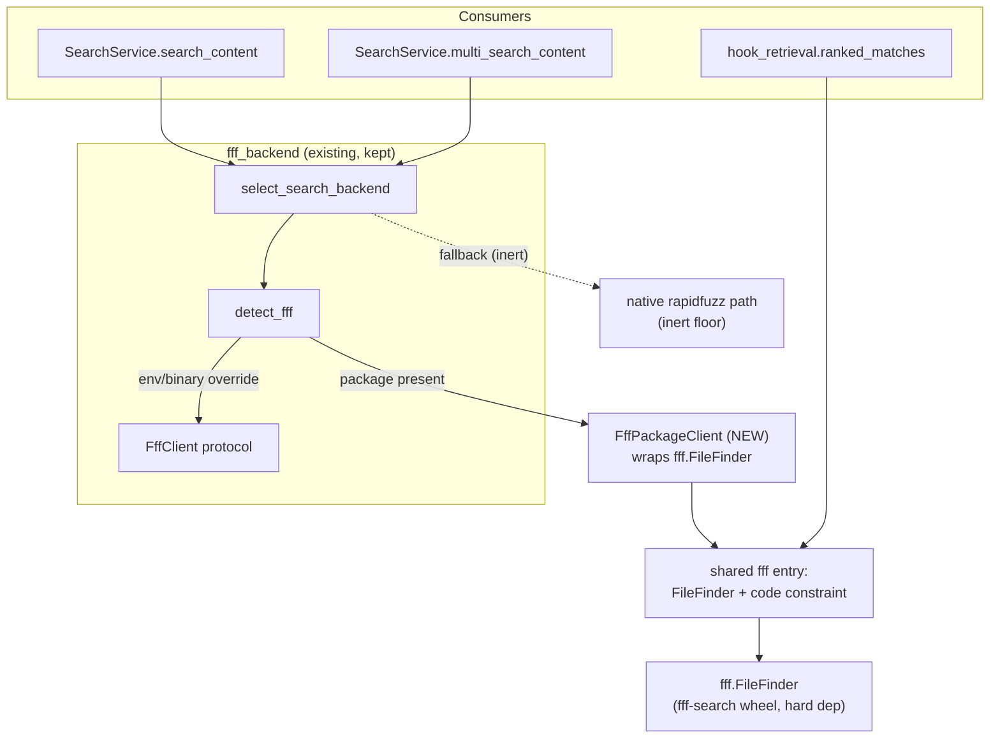

# feat: Complete the fff search backend (real client, full routing, fast cold-start)

Finish the fff-backed retrieval work the navigator plan deferred at U8. The
optional-backend seam (`fff_backend.py`, `search_run.py` routing,
`test_fff_routing.py`) is already built and tested with fake clients — the only
missing piece is a **real** `FffClient` backed by the `fff-search` wheel. This
plan implements that client, makes fff a hard dependency so it is always the
active backend, routes the one search path that still bypasses the seam
(`multi_search_content`) through it, reconciles the already-shipped hook fix
with the seam, and trims the CLI cold-start that sits in front of every hook
invocation.

**Product Contract preservation:** No upstream brainstorm; this is a
bootstrap plan derived from a same-session decision. The navigator plan's U8
intent ("route retrieval through `fff_backend`; rapidfuzz fallback; bounds
preserved") is carried forward and narrowed by two user decisions this session:
fff is now a **hard dependency** (not optional), and the native rapidfuzz path
is retained only as a dead-but-harmless floor, not a maintained fallback.

---

## Problem Frame

CodeScent's grep-injection hook was silently timing out because `ranked_matches`
re-read every source file and rebuilt full ranking signals on each call
(4.6–18s vs. a 1.5s deadline). That hook is now fixed by routing its content
scan through the `fff` engine directly (~0.1–0.4s in-deadline work). Two gaps
remain from that fix and the broader navigator U8 work:

1. **The seam has no real engine.** `detect_fff` returns an `FffCliClient` stub
   whose `_invoke` raises "fff retrieval is not wired until U8." So
   `SearchService.search_content` — which already dispatches to the backend —
   always falls back to native. The fast, frecency-aware fff path is dead for
   everything except the hook (which bypasses the seam with a direct import).

2. **The CLI is slow to start.** ~680ms of every hook invocation is
   `import codescent.cli.main` eagerly importing heavy service modules through
   `register_reporting_commands`/`register_admin_commands`. This sits *outside*
   the hook's in-process deadline but is real latency in front of every
   intercepted `Grep`/`Glob`.

The result: fff is installed and the routing is tested, but the product does not
actually use fff for its main search surface, and the hook carries avoidable
startup latency.

---

## Goal Capsule

Make fff the always-on retrieval engine across the hook **and** `SearchService`
by filling in the existing seam (not rebuilding it), and cut the CLI cold-start.
When this lands: `search_content`, `multi_search_content`, and the hook all run
through fff; `detect_fff` always returns a working client; and `codescent
hook-augment` wall time drops by roughly the ~680ms of eager CLI imports.

---

## Requirements

- **R1** — A real `FffClient` implementation backed by the `fff-search` wheel
  exposes the four protocol capabilities (`fuzzy_paths`, `grep_content`,
  `multi_grep`, `frecency`) plus `healthy`, returning the seam's existing
  `ContentHit`/path/frecency shapes. (Navigator U8.)
- **R2** — `detect_fff` returns the real client when the `fff-search` package is
  importable; the env/binary override path (`CODESCENT_FFF_CMD`) is preserved.
- **R3** — `fff-search` is a hard runtime dependency; CodeScent assumes the
  engine is present. The native rapidfuzz path remains in code as an inert floor
  but is no longer a maintained or independently fast fallback.
- **R4** — `SearchService.multi_search_content` routes through the backend when
  present, mirroring `search_content`. Native multi-grep stays as the floor.
- **R5** — The hook's retrieval (`ranked_matches`) and `SearchService` share a
  single source of truth for fff access (engine construction, language
  constraint), without regressing the hook's git-status/definition awareness.
- **R6** — `import codescent.cli.main` does not eagerly import heavy service
  modules (`services.ci`, `services.findings`, `services.precision`,
  `services.reports`, dashboard/MCP server); command bodies lazy-import them.
- **R7** — The full test suite has no *new* failures attributable to this work;
  search tests whose semantics change under fff are updated deliberately, not
  silently skipped. (Pre-existing `docs/*` and registration failures are out of
  scope.)

---

## Key Technical Decisions

- **KTD1 — Fill in the seam; do not retire it.** The optional-backend
  architecture (`detect_fff` → `select_search_backend` → `search_run` fff
  branches) is already wired and fake-tested. Implementing one real client is a
  smaller, lower-churn diff than deleting the seam and rebuilding always-fff
  paths. fff being a hard dependency makes the native branches unreachable in
  practice; we keep them rather than pay the deletion/test-rewrite cost.
- **KTD2 — The hook keeps direct `fff.FileFinder` access; it does not route
  through `FffClient`.** The seam's `ContentHit` is `(path, line, text)` only.
  The hook needs `git_status` and (optionally) `is_definition` from fff's
  richer `GrepMatch`, plus symbol collapse. Forcing the hook through
  `grep_content` would drop the git-modified signal a test asserts. Instead,
  both the hook and the real `FffClient` consume `fff.FileFinder` through one
  shared construction/constraint helper, so there is a single fff entry point
  without flattening the hook's richer needs into `ContentHit`.
- **KTD3 — `multi_search_content` gets a backend path via the client's
  `multi_grep`.** `search_content` already routes through `search_run`'s
  single-query `_fff_content_results`. The multi-query path reuses the backend's
  `multi_grep` capability and the same per-file collapse/ranking shaping, with
  `_native_content_results`-equivalent behavior as the floor.
- **KTD4 — `frecency()` may start as best-effort.** A repo-wide frecency map
  from fff is not required for correctness; the real client may return `{}` (a
  present-but-empty capability) initially. fff's per-match frecency can feed
  ranking later without blocking this plan. Directional, not a hard requirement.
- **KTD5 — Cold-start fix mirrors the existing `hooks.py` lazy-import pattern
  (R20).** `register_*_commands` import heavy services at module load today;
  move those imports inside the command bodies that use them, exactly as
  `cli/hooks.py` already does for its entrypoints.

---

## High-Level Technical Design

Retrieval routing after this plan. The hook and `SearchService` share one fff
entry point; `SearchService` flows through the existing seam, the hook reads
fff's richer match shape directly.

---

## Implementation Units

### U1. Real fff package client

- **Goal:** Implement an `FffClient` backed by the `fff-search` wheel.
- **Requirements:** R1.
- **Dependencies:** none.
- **Files:** `src/codescent/services/fff_backend.py` (new
  `FffPackageClient`), `src/codescent/services/fff_shared.py` (new — shared
  `FileFinder` construction + the indexed-language constraint, consumed by both
  this client and `hook_retrieval`), `tests/integration/test_fff_backend.py`.
- **Approach:** Add a client class implementing the `FffClient` protocol over a
  `fff.FileFinder`: `healthy()` → True once the finder constructs and its scan
  completes; `fuzzy_paths(query)` → `FileFinder.search` relative paths;
  `grep_content(pattern)` → `FileFinder.grep` mapped to `ContentHit(path, line,
  line_content)`; `multi_grep(patterns)` → `FileFinder.multi_grep` mapped the
  same; `frecency()` → `{}` (best-effort per KTD4). Construct the finder via the
  shared helper so the indexed-language constraint and scan-timeout live in one
  place. Reuse one finder per client instance.
- **Patterns to follow:** `cli/hooks.py` lazy native-import discipline (R20);
  the already-shipped `hook_retrieval.ranked_matches` fff usage as the reference
  for `FileFinder`/`multi_grep` call shape and the code-language constraint.
- **Test scenarios:**
  - `grep_content` on a fixture returns `ContentHit`s with correct path,
    1-based line, and matched text for a known symbol. Covers R1.
  - `multi_grep(["a","b"])` returns hits for both patterns; unknown pattern
    yields none.
  - `fuzzy_paths` returns repo-relative paths for a partial filename.
  - `healthy()` returns True after construction; returns False (not raise) if
    the finder cannot scan the path.
  - `frecency()` returns a mapping (may be empty) without raising.
  - Constructing the client writes nothing into the analyzed repo (read-only).
- **Verification:** New client passes its own tests; `probe_capabilities` on an
  instance reports all four capabilities.

### U2. Hard-dep detection: return the real client

- **Goal:** Make `detect_fff` return the real client when the wheel is present,
  and treat fff as a hard dependency.
- **Requirements:** R2, R3.
- **Dependencies:** U1.
- **Files:** `src/codescent/services/fff_backend.py`, `pyproject.toml`
  (dependency already added this session — verify it is in the runtime deps, not
  an extra), `tests/integration/test_fff_backend.py`.
- **Approach:** In `detect_fff`, the package-available branch returns the new
  `FffPackageClient` (built on `repo_root`) instead of the non-functional
  `FffCliClient(command=None)`. Preserve the `CODESCENT_FFF_CMD` env override and
  the PATH-binary branch as-is (they still yield `FffCliClient` with an injected
  runner for the binary/transport case). Keep `FffCliClient` — it serves the
  override/binary path; do not delete it.
- **Patterns to follow:** existing `detect_fff` resolution order; the
  navigator plan U8 description.
- **Test scenarios:**
  - Package present (probe stubbed True) → `detect_fff` returns the real
    `FffPackageClient`, and `select_search_backend` returns it. Covers R2.
  - `CODESCENT_FFF_CMD` set → still returns `FffCliClient` with the override
    command (existing test stays green).
  - Absent path (probe stubbed False, no env, no binary) → returns `None` and
    selection yields native. (Already updated this session.)
  - `select_search_backend` drops an unhealthy client to native.
- **Verification:** `test_fff_backend.py` and `test_fff_routing.py` pass with
  the real client wired; a default-constructed `SearchService` in an indexed
  repo selects the fff backend.

### U3. Route `multi_search_content` through the backend

- **Goal:** The multi-query content path uses fff when a backend is present,
  mirroring `search_content`.
- **Requirements:** R4.
- **Dependencies:** U1, U2.
- **Files:** `src/codescent/services/search.py`,
  `src/codescent/services/search_run.py` (add a multi-query fff content helper
  alongside `_fff_content_results`), `tests/integration/test_search.py`,
  `tests/integration/test_fff_routing.py`.
- **Approach:** `multi_search_content` currently iterates
  `build_file_inventory` + native `multi_grep` directly. Add a backend branch:
  when `self._backend(repo_root)` is non-None and exposes `multi_grep`, get
  candidate hits from `backend.multi_grep(queries)`, then run the existing
  per-file collapse/ranking/merge shaping (reuse the `_fff_content_results`
  machinery generalized to multiple queries). Keep the native loop as the
  fallback floor. Preserve the existing merge-by-path, `record_frecency`, and
  `_annotate_quality` behavior so result shape is unchanged.
- **Patterns to follow:** `search_run._fff_content_results` and
  `content_results`'s backend-vs-native dispatch.
- **Test scenarios:**
  - Multi-query search with a fake backend returns merged, ranked results
    covering both queries (extend `test_fff_routing.py`).
  - No backend (native floor) returns the same shape as today for a fixture
    multi-query search (regression guard against the existing native behavior).
  - Constraint filter (`constraints=`) is honored on the fff path.
  - Quality annotation and frecency recording still fire on the fff path.
- **Verification:** `multi_search_content` returns identical-shaped payloads on
  both paths; existing `test_search.py` multi-query expectations updated for fff
  ordering where they differ.

### U4. Reconcile the hook with the shared fff entry

- **Goal:** The shipped hook fix and the new client share one fff access point,
  without regressing the hook's git/definition awareness.
- **Requirements:** R5.
- **Dependencies:** U1.
- **Files:** `src/codescent/services/hook_retrieval.py`,
  `src/codescent/services/fff_shared.py`.
- **Approach:** Move the `FileFinder` construction and the
  indexed-language constraint (`_CODE_CONSTRAINT`, scan-timeout) out of
  `hook_retrieval` into the shared helper introduced in U1, and have
  `ranked_matches` call it. The hook keeps reading `GrepMatch` directly
  (`git_status`, `line_number`, symbol collapse) per KTD2 — it does **not**
  route through `FffClient`/`ContentHit`. Net effect: one place builds and
  configures fff; two consumers read it at the altitude each needs.
- **Patterns to follow:** the current `hook_retrieval.ranked_matches` (keep its
  behavior); extract, don't rewrite.
- **Test scenarios:**
  - All existing hook tests still pass unchanged (`test_hook_retrieval.py`,
    `test_hook_payload.py`, `test_hook_augment_cli.py`). Covers R5.
  - `git_modified` is still derived from fff `git_status` on a modified-file
    fixture (the health-tag path is preserved).
  - The shared helper applies the same code-only language constraint for both
    the hook and the client (a markdown/text match is excluded).
- **Verification:** Hook output is byte-identical to the shipped behavior for a
  known query; no duplicate constraint/finder-construction code remains.

### U5. Trim the CLI cold-start

- **Goal:** `import codescent.cli.main` stops eagerly importing heavy service
  modules, cutting ~680ms off each hook invocation.
- **Requirements:** R6.
- **Dependencies:** none.
- **Files:** `src/codescent/cli/reporting.py`, `src/codescent/cli/admin.py`,
  `src/codescent/cli/main.py`, `tests/contract/test_cli.py` (or a new
  `tests/unit/test_cli_import_cost.py`).
- **Approach:** Move module-level imports of `services.ci`, `services.findings`,
  `services.precision`, `services.reports`, and any dashboard/MCP-server imports
  out of module scope and into the command-function bodies that use them, so
  registering commands no longer triggers their import graph. Mirror the
  existing lazy pattern in `cli/hooks.py`. The MCP `serve` command already
  lazy-imports its server (`cli/main.py:serve`); apply the same to the
  reporting/admin registrations.
- **Patterns to follow:** `cli/hooks.py` (`# noqa: PLC0415 - lazy ... (R20)`);
  `cli/main.py:serve`'s in-body import.
- **Test scenarios:**
  - After `import codescent.cli.main`, assert heavy modules are absent from
    `sys.modules` (e.g., `codescent.services.reports`,
    `codescent.services.precision` not imported). Covers R6.
  - `codescent report`/`codescent ci`/`codescent precision` still execute
    correctly (the lazy import resolves inside the command).
  - `codescent --help` lists all commands (registration unaffected).
- **Verification:** The `sys.modules` guard test passes; a manual
  `codescent hook-augment` wall-time check shows the ~680ms import cost gone
  (recorded as evidence, not asserted in a unit test).

### U6. Search-semantics test reconciliation

- **Goal:** Update the search tests whose assertions change under fff so the
  suite is deliberately green, not silently skipped.
- **Requirements:** R7.
- **Dependencies:** U2, U3.
- **Files:** `tests/integration/test_search.py`,
  `tests/integration/test_frecency_ranking.py`,
  `tests/integration/test_quality_ranking.py`,
  `tests/integration/test_collapse_to_symbol.py`,
  `tests/contract/test_mcp_search_tools.py` (only those that actually churn).
- **Approach:** Run the suite, identify search tests whose expectations depend
  on native exact-match ordering or the native candidate set, and update each to
  the fff-backed behavior **with intent** — adjust the expected ordering/match
  set, not the assertion strength. Any test that cannot be made meaningful under
  fff is converted, not deleted, unless it tested native-only internals being
  retired. Record which tests changed and why.
- **Execution note:** Characterize first — capture current outputs for the
  churning tests before changing expectations, so the fff-vs-native delta is
  explicit and reviewable.
- **Test scenarios:**
  - The full suite has no new failures beyond the documented pre-existing set
    (`docs/*`, tool-registration drift, ts fixture). Covers R7.
  - Each changed assertion names the new expected fff behavior (ordering/match
    set), not a weakened check.
- **Verification:** `uv run pytest` shows only the known pre-existing failures;
  a short note lists every search test whose expectation changed and the reason.

---

## Scope Boundaries

**In scope:** the real fff client, hard-dep detection wiring,
`multi_search_content` routing, hook/seam reconciliation, CLI cold-start, and
the search tests that churn as a direct result.

**Deferred to Follow-Up Work:**
- Repo-wide `frecency()` from fff feeding ranking (KTD4) — best-effort `{}`
  now; real frecency map later.
- Deleting the native rapidfuzz retrieval path entirely — kept as an inert
  floor this round (KTD1); a later cleanup can remove it once fff-hard-dep has
  soaked.
- Lazy-loading the *entire* CLI command graph — U5 targets the heavy reporting/
  admin/service imports that dominate the 680ms, not every command.

**Out of scope (not this work):**
- The pre-existing failing tests unrelated to search (missing `docs/*.md`,
  tool-doc/registration drift, the TS fixture).
- Any change to fff's own behavior or the `fff-search` package.

---

## Risks & Dependencies

- **Search-test churn (medium).** fff's smart-case/candidate semantics differ
  from native exact `multi_grep`; U3/U6 absorb this. Mitigation: characterize
  before changing (U6 execution note); keep native shaping/collapse so only the
  candidate set and ordering move.
- **Per-call `FileFinder` construction cost (low).** `select_search_backend`
  builds a client per request; each constructs a `FileFinder` (cold scan
  ~30ms on this repo). Acceptable; if a large repo shows cost, cache the finder
  per `(repo_root, index-mtime)` — noted, not built now.
- **fff hard dependency (low, accepted).** CodeScent is no longer pure-Python
  installable without a native wheel; this is the user's accepted trade-off
  (R3). `fff-search` ships prebuilt wheels.
- **Read-only invariant (low).** The real client must not let fff write into the
  analyzed repo's `.codescent`/working tree; U1 includes a write-safety
  scenario. fff maintains its own cache outside the repo.

---

## Verification Contract

- New `FffPackageClient` unit tests pass; `probe_capabilities` reports the full
  surface (U1).
- `detect_fff`/`select_search_backend` return the real client when the wheel is
  present; `test_fff_routing.py` exercises the real path (U2).
- `search_content` and `multi_search_content` both run through fff in an indexed
  repo and return unchanged payload shapes (U3).
- All hook tests remain green; hook output is unchanged (U4).
- `import codescent.cli.main` leaves heavy service modules out of `sys.modules`
  (U5).
- `uv run pytest` shows only the documented pre-existing failures; lint
  (`ruff check`, `ruff format --check`) and `basedpyright` are clean on changed
  files (U6).

## Definition of Done

fff is the active retrieval engine for the hook, `search_content`, and
`multi_search_content`; `detect_fff` always returns a working client when the
wheel is present; the CLI no longer eagerly imports heavy services; and the test
suite is green except for the pre-existing, unrelated failures — with every
deliberately changed search assertion documented.

---

## Sources & Research

- `src/codescent/services/fff_backend.py` — existing detection seam, `FffClient`
  protocol, `ContentHit`, `FffCliClient` stub (`_invoke` raises "not wired until
  U8").
- `src/codescent/services/search_run.py` — `content_results` backend dispatch,
  `_fff_content_results`/`_fff_path_results`, native fallbacks.
- `src/codescent/services/search.py` — `SearchService._backend`,
  `search_content` (routes through seam), `multi_search_content` (native-only,
  the gap U3 fills).
- `src/codescent/services/hook_retrieval.py` — shipped fff hook fix (reference
  for `FileFinder`/`multi_grep` usage and the code constraint).
- `tests/integration/test_fff_routing.py`, `tests/integration/test_fff_backend.py`
  — fake-client routing coverage to extend with the real client.
- `docs/plans/2026-06-29-001-feat-codescent-navigator-phases-0-3-plan.md` — U8
  ("Route retrieval through `fff_backend`; rapidfuzz fallback; bounds
  preserved"), the deferred work this plan completes.
- `fff-search` 0.9.6 Python API (`fff.FileFinder.grep/multi_grep/search`,
  `GrepMatch` fields) — verified this session: cold scan+grep ~55ms, code
  constraint filters to indexed languages, returns empty on no-match, no repo
  writes.
