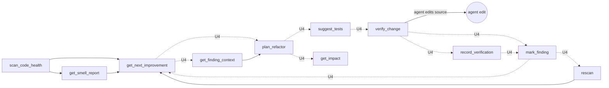
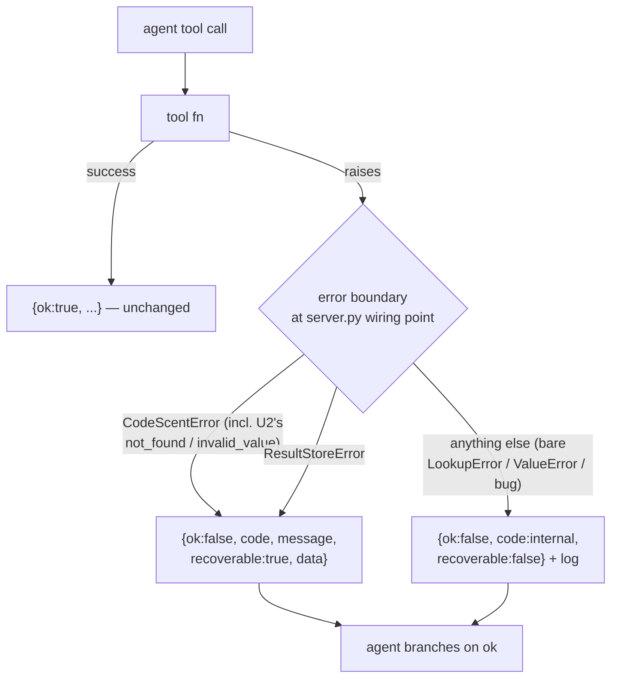

# feat: CodeScent MCP Agent-UX Contract Hardening — Audit Phase 1

**Origin:** `CODESCENT_MCP_UX_AUDIT.md` (findings F1, F2, F5, F6, F11)
**North Star (from `AGENTS.md`):** *does it get the right code into the model with fewer tokens and tighter focus?* Every unit below is scored against that sentence.
**Product Contract preservation:** no upstream `ce-brainstorm` contract exists; the audit is the origin. No product scope invented beyond the audit's Phase 1 roadmap.

This plan covers **only Phase 1** of the audit's three-phase roadmap — the all-additive, no-breaking-change slice that makes the tool contract uniform and closes the guided improvement loop. The consolidation (F4), envelope/`confidence` unification (F3), discovery resources/prompts (F7), and internals hardening (F8/F9/F10) are explicitly deferred to follow-up plans (see Scope Boundaries).

---

## Summary

CodeScent's MCP surface speaks two contradictory dialects: a rich, bounded, `next_tools`-chained *happy path*, and an *unhappy path* where the five most common agent mistakes escape as out-of-band FastMCP tool errors with no machine-readable shape. Phase 1 makes the whole surface behave like its own best cluster (the search tools' graceful `{ok, warnings, next_tools}` degradation is the model to copy):

- **One uniform error envelope** — every tool exception becomes `{ok:false, code, message, recoverable, data}` content, caught at a single choke point. The four bare-raise mistakes (unknown finding id, symbol, path, status) gain actionable recovery `data` (valid ids, near-match symbols via the already-present `rapidfuzz`, valid statuses); the fifth common mistake (bad repo) already raises a structured error the boundary now catches.
- **No more silent wrong-scope results** — a malformed `constraints` token (`size:banana`) surfaces as `constraint_warnings` instead of silently returning unfiltered results the model then trusts.
- **The guided loop closes** — six one-line `next_tools` additions reconnect the advertised `scan → next → plan → tests → verify → mark/record → rescan` spine, which is currently five consecutive dead ends.
- **The description layer earns its slot** — the `"Use CodeScent…"` prefix (currently on 42/48 tools) is deleted and the reclaimed space carries disambiguation, inline enums, discovery clauses, and one example per tool.
- **Two polish fixes** — `answer_pack` self-bounds even without a caller budget; the empty-result search warning stops recommending the tool the agent is already in.

The changes are additive to the public contract — no success or error field is removed or renamed. Success payloads gain keys (`constraint_warnings` on search tools, `next_tools` on six more tools, and `ok:true` on `retrieve_result`); error payloads gain `ok`/`recoverable`/`data` alongside their existing keys. `get_schema` surfaces the new success keys automatically. The four error-shape contract tests that assert the old error dict by exact equality are updated to include the added keys (see U1) — that is a test-fixture update, not a consumer-facing break.

---

## Problem Frame

The audit scored CodeScent against its own North Star and found a strong, idiomatic core wrapped in a surface with four cheap-to-fix gaps. Scoped to Phase 1, the concrete problems are:

1. **The error path is a different, unusable contract (F1).** ~30 tools hardcode `"ok": true` on success; the common mistakes (`raise LookupError`, bare `ValueError`) escape as FastMCP tool-error strings. Success and failure do not share a shape, so an agent cannot branch on one field, and no failure carries recovery data. Reproduced live: `get_finding("bogus-123") → Error calling tool 'get_finding': bogus-123`.
2. **A malformed `constraints` token is silently dropped (F2).** `parse_constraints` never raises — bad size/time tokens parse to `None`, unknown schemes are ignored, and the search runs *as if the token were absent* with `warnings: []` and `confidence: high`. This is the most dangerous finding because it is silent: the model reasons on data it believes was filtered.
3. **The guided improvement loop does not close (F6).** Only 12 of 48 tools are ever a `next_tools` target; `get_next_improvement`, `plan_refactor`, `suggest_tests`, `verify_change`, `mark_finding`, and `record_verification` emit nothing, so a hint-driven agent can never reach the action tools.
4. **The description layer is too thin (F5).** Every tool has an empty docstring, so the one-line `description=` is the entire contract — and 42/48 spend the highest-signal position on the `"Use CodeScent…"` boilerplate rather than disambiguation, enum values, or where a required id comes from.
5. **Two polish gaps (F11).** `answer_pack` applies no budget (and offers no `result_id`) unless the caller passes one; the shared empty-result warning recommends the current tool as an alternative.

**Success looks like:** an agent can (a) branch every tool result on a single `ok` field, (b) recover from the five common mistakes without a human, (c) never be silently handed unfiltered results, (d) walk the improvement loop end-to-end from `next_tools` hints alone, and (e) pick the right tool from its description without a `get_schema` round-trip.

---

## Requirements

Traced from the audit. Each maps to one or more implementation units.

| ID | Requirement | Origin | Units |
|---|---|---|---|
| R-F1 | Every tool failure returns a uniform `{ok:false, code, message, recoverable, data}` content payload (not an out-of-band tool error), and the five common mistakes carry actionable recovery `data`. | F1 | U1, U2 |
| R-F2 | Every search payload reports dropped/malformed `constraints` tokens in a `constraint_warnings` field; a dropped token no longer silently returns unfiltered results. | F2 | U3 |
| R-F6 | The `scan → next → plan → tests → verify → mark/record → rescan` spine is connected end-to-end via `next_tools`; `mark_finding` and `record_verification` are reachable from `scan_code_health`. | F6 | U4 |
| R-F5 | No tool description leads with `"Use CodeScent…"`; every id/name consumer names its source, every enum param lists its values inline, and every tool carries one example. | F5 | U6 |
| R-F11a | `answer_pack` self-bounds with a default budget when the caller passes none, and offers a `result_id` when it truncates. | F11 | U5 |
| R-F11b | The empty-result search warning never recommends the tool the agent is already calling. | F11 | U5 |
| R-NS | Every change preserves the North-Star invariants: facts stay deterministic, no network/LLM in fact paths, payloads stay bounded, engines stay optional. | `AGENTS.md` | all |

---

## High-Level Technical Design

Two shapes carry the plan: the closed improvement loop (F6) and the uniform error boundary (F1). Both are directional — the prose and per-unit fields are authoritative where they disagree.

### The improvement loop — current dead ends vs. wired chain (F6)

Solid arrows exist today; dashed arrows are the ten `next_tools` edges added across the six tools in U4. The `plan_refactor → verify_change` gap is a **mandatory agent-edit step** (the server never edits source), so there is deliberately no server-side "run the whole loop" macro.



### The error boundary — one choke point, one shape (F1)

Today only `retrieve_result` catches a domain error and converts it to a payload (`result_tools.py`); every other raise escapes FastMCP as an out-of-band error string. U1 installs one boundary at the single wiring point in `server.py`; U2 makes the raise sites carry recovery data.



---

## Key Technical Decisions

- **KTD1 — Error-boundary attach point: one FastMCP middleware, decorator as fallback.** `pyproject.toml` pins `fastmcp>=2.12`; `uv.lock` currently resolves **`fastmcp 3.4.0`**, whose server middleware exposes an `on_call_tool` hook (`middleware.py:168`) that wraps every tool invocation at the single wiring point (`server.py:17-30`). Prefer a middleware that `try/except`s the handler and returns the uniform payload as normal content — one place, all 48 tools. *Execution-time verification:* confirm the **resolved 3.4.0** build lets `on_call_tool` return a content payload for a *raised* exception from `call_next` (rather than the tool manager converting it to an error `ToolResult` before the middleware sees it); if not, fall back to a shared `guarded_tool()` wrapper applied inside each `register_*` (touches 12 files, same outcome). The fallback **must** preserve each tool's signature (`functools.wraps` + `__wrapped__`/`__signature__`) — FastMCP derives each tool's input JSON schema from the wrapped function's signature, so a naive `*args/**kwargs` wrapper would erase the param schema and make tools uncallable. This is the one genuine execution-time unknown; U1 is sequenced first to resolve it before the rest of the plan depends on the shape.
- **KTD2 — One uniform error shape, added additively over the two existing payloads.** Every error payload **gains** `ok:false`, `recoverable`, and `data` at the top level while **keeping its existing keys**: `CodeScentError.to_payload()` keeps `{code, message, severity, details}` and `StoredResultErrorPayload.to_payload()` keeps `{kind, code, message, result_id, retryable}`; `recoverable` mirrors `retryable`, and `severity`/`details`/`result_id` are also mirrored into `data`. Nothing is removed or renamed, so no consumer branching on the old keys breaks — but the four tests asserting the old error dict by exact equality must be updated to include the new keys (in U1's Files). The boundary catches **only `CodeScentError` and `ResultStoreError`** as structured/recoverable; a final generic clause maps every other exception — including bare `LookupError`/`ValueError` (whose subclasses `KeyError`/`IndexError`/`JSONDecodeError` are incidental-bug signals, *not* narrow types) — to `code:internal, recoverable:false`, logged, never swallowed. U2 converts the four legitimate input-mistake sites to `CodeScentError` so they surface as recoverable, while an internal `ValueError` (e.g. a corrupt-row `JSONDecodeError` inside `result_store`) correctly stays `internal` rather than a false "fix your input." Because that conversion is what makes the four sites recoverable, **U1 and U2 land in the same PR** (see U1 execution note) so agents never see an interim window where a real input mistake is labeled `internal`.
- **KTD3 — `constraint_warnings` has a single source of truth, captured before the empty short-circuit.** Drop-detection lives at the one parse site (extend the `parse_constraints` builder to collect ignored tokens). Critically, `build_constraint_filter` returns `None` when the parsed set `is_empty` — which is exactly the all-malformed case the F2 repro exercises (`size:banana` drops its only token → empty set → early `return None`). Warnings must therefore be surfaced on **both** branches: have `build_constraint_filter` return `(predicate | None, warnings)` and carry the warnings tuple through the real junction `services/search.py` (three call sites, ~`:87/:124/:176`, which today discard everything but the predicate) up to the tool payload. Rejected: a separate re-parsing helper — it would drift from the real parser. Adding the field to the search TypedDicts makes `get_schema` advertise it for free.
- **KTD4 — `next_tools` are static tuples (floor), deep-links where an id is in hand.** The six additions are static per the audit. Where a concrete id is already in the payload (`get_next_improvement`, `mark_finding`, `record_verification` all hold a `finding_id`), the implementer may use the codebase's `f"{tool}:{arg}"` deep-link convention (as `start_task`/`answer_pack` already do) — an ergonomic bonus, not required.
- **KTD5 — `answer_pack` default budget comes from `TokenBudgets`.** Fall back to a `TokenBudgets` default when the caller passes neither `budget` nor `max_tokens`. `TokenBudgets` (`core/models.py`) has no `answer_pack` field today — add one **only if** the pack needs tuning independent of the existing `context` budget (default `3000`); otherwise reuse `TokenBudgets().context` and add no new knob (a new field defaulting to the same `3000` would be a distinction without a difference). Confirm which at implementation against a real pack, along with the exact number.
- **KTD6 — No mega-macro for the loop.** The loop has a mandatory agent-edit step between `plan_refactor` and `verify_change`, and the server never edits analyzed source (a headline safety promise). Wiring `next_tools` is the correct, sufficient fix; a server-side "run the whole loop" tool is rejected.

---

## Implementation Units

### U1. Uniform tool error boundary

**Goal:** Every tool exception becomes a single `{ok:false, code, message, recoverable, data}` content payload caught at one choke point; success payloads are unchanged.

**Requirements:** R-F1, R-NS

**Dependencies:** none (sequenced first — resolves KTD1's execution-time unknown before U2–U6 build on the shape).

**Files:**
- `src/codescent/mcp/server.py` — attach the boundary at the wiring point (`:17-30`).
- `src/codescent/mcp/error_boundary.py` — **new**: the middleware/decorator + the uniform serializer mapping known exception types.
- `src/codescent/core/errors.py` — add `ok`/`recoverable` to `CodeScentError` serialization; add `NOT_FOUND` and `INVALID_VALUE` to `ErrorCode`.
- `src/codescent/services/result_store.py` — add `ok`/`recoverable`/`data` to `StoredResultErrorPayload` (keep existing keys); add `ok:true` to `RetrievedResultPayload` success.
- `tests/contract/test_mcp_error_contract.py` — **new** test file.
- `tests/unit/test_errors.py` — extend for the new codes and `ok` field.
- `tests/contract/test_mcp_retrieve_result.py`, `tests/integration/test_result_store_service.py`, `tests/security/test_runtime_safety.py`, `tests/contract/test_mcp_context_optimization_workflow.py` — update the error-shape assertions to accept the added `ok`/`recoverable`/`data` keys (these currently assert the old error dict by exact equality and would otherwise fail).

**Approach:** Install one boundary (KTD1) that catches **only** `CodeScentError` and `ResultStoreError` and returns the uniform payload (KTD2); a final generic clause maps every other exception — including any bare `LookupError`/`ValueError` not yet converted by U2 — to `code:internal, recoverable:false`, logged. Add `ok`/`recoverable`/`data` to both error payloads **and `ok:true` to `retrieve_result`'s success payload** (the one success shape lacking `ok`, so branch-on-`ok` works there too); no other success payload changes. `paths.py` already raises a structured `CodeScentError`, so `get_repo_status`'s bad-repo case is caught and structured at U1 without waiting on U2. Note the intended exception to "every tool exception becomes `ok:false`": the search tools wrap their service calls in `or_empty(..., _EMPTY_PAGE)`, so their exceptions degrade to empty results and never reach the boundary — that path is covered by U3's `constraint_warnings`, not the error envelope.

**Execution note:** Land U1 and U2 in the same PR (KTD2) — the boundary alone maps an unconverted input mistake to `code:internal`; U2's conversions are what make the four sites `recoverable`, so shipping them together avoids an interim window where a real input mistake looks like an internal bug.

**Technical design** (directional — the payload contract, not an implementation spec):
```json
{ "ok": false, "code": "not_found",
  "message": "No finding 'bogus-123'.",
  "recoverable": true,
  "data": { "available_options": ["python.large_file:cf58…", "…"],
            "fix_hint": "Get valid ids from get_next_improvement or list_findings." } }
```

**Patterns to follow:** the search cluster's graceful degradation (`search_tools._advisory_fields`, `freshness.warnings_for_results`) — the existing `{ok, warnings, next_tools}` shape is the target the error path adopts. Reuse `CodeScentError.to_payload()` / `StoredResultErrorPayload.to_payload()` rather than inventing new serialization.

**Test scenarios** (U1 delivers the envelope; the `not_found`/`invalid_value` *recoverable* outcomes for the four converted sites are asserted in U2, which lands in the same PR):
- Covers F1. `get_repo_status` on a bad repo (already raises `CodeScentError` via `paths.py`) → `ok:false` structured payload, not an out-of-band error string.
- `retrieve_result` with a bad `result_id` (`ResultStoreError`) → `ok:false` with the existing keys (`kind`, `result_id`, `retryable`) plus the new `ok`/`recoverable`/`data`.
- A bare `LookupError`/`ValueError` raised inside a tool before U2's conversion → `code:"internal"`, `recoverable:false`, logged — **not** mislabeled as a recoverable input mistake.
- A valid call (e.g. `get_repo_status` on an indexed repo) → payload unchanged, no `ok:false` regression.
- A successful `retrieve_result` → now carries `ok:true` (previously had no `ok` key), so branch-on-`ok` works.

**Verification:** The bad-repo and bad-`result_id` cases return structured `ok:false`; a bare internal raise is `code:internal, recoverable:false`; no success payload loses or renames a field (`retrieve_result` gains `ok:true`); the four error-shape contract tests are updated to accept the added keys. `uv run pytest tests/contract tests/unit/test_errors.py tests/integration/test_result_store_service.py tests/security/test_runtime_safety.py`.

---

### U2. Recoverable error data at the raise sites

**Goal:** Convert the four bare/uncaught raises into structured errors that carry recovery `data` — a bounded sample of valid ids, nearest symbol/path matches (`rapidfuzz`), and the valid status list. (The fifth common mistake — bad repo — already raises a structured `CodeScentError` via `core/paths.py`, so U1's boundary already gives it a structured payload; richer repo recovery is deferred with F8.)

**Requirements:** R-F1, R-NS

**Dependencies:** U1 (needs the uniform serializer + new `ErrorCode`s); lands in the same PR as U1 (KTD2).

**Files:**
- `src/codescent/storage/repositories/findings.py` — `get_finding` (`:152`): unknown finding → error with a bounded sample of real ids.
- `src/codescent/services/context.py` — `get_file_context` (`:104`): unknown path → nearest persisted paths.
- `src/codescent/services/symbols.py` — `read_persisted_symbol` (`:107`): unknown `qualified_name` → nearest `find_symbol` matches.
- `src/codescent/mcp/finding_payloads.py` — `status_from_string` (`:509`): invalid status → the nine valid `FindingStatus` values.
- `tests/contract/test_mcp_error_contract.py` — extend from U1.

**Approach:** Each site raises `CodeScentError(code=NOT_FOUND | INVALID_VALUE, …)` with `details`/`data` populated. For "did you mean", reuse the existing `rapidfuzz` usage pattern from `engine/search/ranking.py:115` (`fuzz.partial_ratio`) — **no new dependency** (`rapidfuzz>=3.0` is already declared). Valid statuses = `[s.value for s in FindingStatus]` (9 values). Keep id samples bounded (respect the North-Star bounding invariant).

**Patterns to follow:** `rapidfuzz` fuzzy matching at `src/codescent/engine/search/ranking.py:6,115`.

**Test scenarios:**
- Covers F1. Unknown `finding_id` → `data.available_options` is a bounded, non-empty sample of real ids plus a `fix_hint`.
- Unknown `qualified_name` that is a one-character typo of a real symbol → that real symbol is the top `data.suggestions` entry (proves `rapidfuzz` wired).
- Unknown `path` near a real file → nearest real path suggested.
- `status="banana"` → `data.valid_values` equals the nine `FindingStatus` values.
- Id sample is bounded (does not dump all 25k finding ids).

**Verification:** Each recovery payload contains actionable `data`; fuzzy suggestions are non-empty for close typos. `uv run pytest tests/contract/test_mcp_error_contract.py`.

---

### U3. Surface dropped constraint tokens

**Goal:** Every search payload carries `constraint_warnings` naming each ignored/malformed `constraints` token; a dropped token no longer silently returns unfiltered results.

**Requirements:** R-F2, R-NS

**Dependencies:** none.

**Files:**
- `src/codescent/engine/search/constraints.py` — extend the `parse_constraints` builder (`:151-163`, classifiers `:171-241`) to collect ignored tokens (single source of truth, KTD3).
- `src/codescent/services/search_run.py` — have `build_constraint_filter` (`:56-64`) return `(predicate | None, warnings)`, capturing warnings **before** the `if parsed.is_empty: return None` short-circuit so the all-malformed case still warns.
- `src/codescent/services/search.py` — the real surfacing junction (`SearchService.search_files`/`search_content` and their `_page` variants, ~`:87/:124/:176`): propagate the warnings tuple into the page payload the MCP tool reads. Today these call `build_constraint_filter` and return bare `_annotate_quality(...)` tuples with no warnings channel, so this is a return-shape change, not just a pass-through.
- `src/codescent/mcp/search_tools.py` — surface `constraint_warnings` via `_advisory_fields` (`:418-431`); add the key to the search TypedDicts (`AdvisoryToolFields:39-42`, `SearchToolPayload:67-77`, `MultiSearchToolPayload:80-89`, `TodoSearchToolPayload:92-99`, `TestSearchToolPayload:102-112`).
- `src/codescent/services/freshness.py` — optionally lower `confidence` when a constraint was dropped.
- `tests/integration/test_constraints_dsl.py` — extend (`test_malformed_token_is_ignored_not_raised:127` is the existing silent-drop test to grow).
- `tests/contract/test_mcp_search_tools.py` — extend for the new payload key.

**Approach:** Record ignored tokens where they are currently silently discarded (`_handle_size`/`_parse_size`/`_parse_time`/unknown-scheme guard), capture them **before** `build_constraint_filter`'s `is_empty` early return, thread them through `SearchService` to the tool payload, and emit a `constraint_warnings` list. Message shape: `"ignored 'size:banana' — expected size:<10kb (operators < <= > >=, units b/kb/mb)"`. Because the field is added to the return TypedDicts, `get_schema` advertises it automatically.

**Test scenarios:**
- Covers F2. `search_files(query="settings", constraints="size:banana")` → `constraint_warnings` names `size:banana`; results still returned (no raise, no silent drop). This is the all-malformed case: the only token drops, so the constraint set is empty and `build_constraint_filter` early-returns `None` — the warning must be captured before that short-circuit.
- Valid `constraints="size:<10kb"` → `constraint_warnings` empty.
- Unknown scheme `constraints="bogus:value"` → warned (also an empty-set case).
- Mixed `"src/ bogus:value size:notasize"` → warnings for the two bad tokens; the `src/` glob is still applied (non-empty set).
- `confidence` is lowered when a token is dropped (if the optional confidence-lowering path is taken).
- Contract: every search payload (`search_files`, `search_content`, `multi_search_content`, `search_changed_files`, `search_todos`, `search_tests`) includes the `constraint_warnings` key, and `get_schema` lists it in their `response_keys`.

**Verification:** The F2 repro now warns; `test_constraints_dsl` asserts warnings for malformed tokens (including the empty-set path). `uv run pytest tests/integration/test_constraints_dsl.py tests/contract/test_mcp_search_tools.py tests/integration/test_get_schema.py` — `test_get_schema.py` is a run-only check here (it passes unedited because `get_schema` auto-derives `response_keys` from the updated search TypedDicts).

---

### U4. Close the guided improvement loop

**Goal:** Wire the six missing `next_tools` so the improvement spine chains end-to-end, and add a connectivity test that fails if the loop breaks again.

**Requirements:** R-F6, R-NS

**Dependencies:** none.

**Files:**
- `src/codescent/mcp/finding_tools.py` — `get_next_improvement` (`:232-260`), `mark_finding` (`:333-351`), `record_verification` (`:354-375`) inline dicts.
- `src/codescent/mcp/finding_payloads.py` — add `next_tools: tuple[str, ...]` to `NextImprovementToolPayload` (`:168`), `MarkFindingToolPayload` (`:185`), `RecordVerificationToolPayload` (`:194`).
- `src/codescent/mcp/planning_tools.py` — `_plan_payload` (`:337-350`), `_tests_payload` (`:353-358`), `_verify_change_payload` (`:361-372`) and their TypedDicts.
- `tests/contract/test_next_tools_chain.py` — **new** connectivity test.
- `tests/contract/test_mcp_planning_tools.py`, `tests/contract/test_mcp_finding_tools.py` — extend for the new emissions.

**Approach:** Add the audit's static tuples (KTD4):

| Tool | `next_tools` |
|---|---|
| `get_next_improvement` | `(get_finding_context, plan_refactor)` |
| `plan_refactor` | `(suggest_tests, get_impact)` |
| `suggest_tests` | `(verify_change,)` |
| `verify_change` | `(record_verification, mark_finding)` |
| `mark_finding` | `(rescan, get_next_improvement)` |
| `record_verification` | `(mark_finding,)` |

Where a concrete `finding_id` is already in the payload, the deep-link form `f"get_finding_context:{finding_id}"` is allowed (KTD4). No server-side macro (KTD6).

**Patterns to follow:** the macro tools are the model — `start_task`/`resume_task`/`answer_pack` set service-computed `next_tools` with `f"{tool}:{arg}"` deep-links (`answer_pack_tools._next_tools:78-85`, `services/task_brief.py`, `services/session_resume.py`). The static emitters `get_smell_report` (`finding_tools.py:194`) and `scan_code_health` (`:161`) show the plain-tuple form.

**Test scenarios:**
- Covers F6. Each of the six tools emits exactly its expected `next_tools` tuple.
- Connectivity: a BFS from `scan_code_health` over `next_tools` (stripping any `:arg` deep-link suffix) reaches **both** `mark_finding` and `record_verification`.
- No `next_tools` entry names a tool absent from `registered_mcp_tool_names()`.
- If a deep-link form is used, the prefix before `:` resolves to a real registered tool.

**Verification:** The chain test passes; `get_next_improvement` is no longer a dead end. `uv run pytest tests/contract/test_next_tools_chain.py tests/contract/test_mcp_planning_tools.py tests/contract/test_mcp_finding_tools.py`.

---

### U5. `answer_pack` self-bounds + non-self-referential search-miss warning

**Goal:** `answer_pack` applies a token budget (and offers a `result_id` when it truncates) even when the caller passes none; the empty-result search warning never recommends the tool the agent is already calling.

**Requirements:** R-F11a, R-F11b, R-NS

**Dependencies:** none.

**Files:**
- `src/codescent/core/models.py` — add an `answer_pack` field to `TokenBudgets` (`:57-61`).
- `src/codescent/mcp/answer_pack_tools.py` — `effective_budget` falls back to `TokenBudgets().answer_pack` when both `budget` and `max_tokens` are `None` (`:45-58`).
- `src/codescent/services/freshness.py` — `no_result_warning` (`:123-127`) takes the current tool name and omits it from the suggestion list.
- `src/codescent/mcp/search_tools.py` — each search tool passes its own name to the warning helper.
- `tests/integration/test_answer_pack.py`, `tests/contract/test_mcp_search_tools.py` — extend.

**Approach:** Add the default budget (KTD5) and wire the fallback so the pack always self-bounds. Parameterize the shared `no_result_warning` f-string to exclude the calling tool from its `search_files, search_content, or get_repo_map` suggestion (the string is shared across all search tools, so the fix is one helper + per-caller name passing).

**Test scenarios:**
- Covers F11. `answer_pack` on a large query with **no** `budget`/`max_tokens` → `truncated:true`, `result_id` present, token estimate ≤ the default budget.
- `answer_pack` with an explicit `budget` → still honored (no regression).
- `answer_pack` on a small query → `truncated:false`, `result_id:null` (unchanged).
- `search_content` empty result → warning does **not** contain the substring `"search_content"`.
- `search_files` empty result → warning does **not** contain `"search_files"`.
- The other (non-self) suggestions remain present in the warning.

**Verification:** `answer_pack` self-bounds without a caller budget; no search-miss warning lists its own tool. `uv run pytest tests/integration/test_answer_pack.py tests/contract/test_mcp_search_tools.py`.

---

### U6. Tool description sweep

**Goal:** Rewrite all 48 tool descriptions (~46 inline `description=` strings plus the two `guide_tools` constants `_TOOL_DESCRIPTION`/`_SCHEMA_TOOL_DESCRIPTION`) — delete the `"Use CodeScent…"` prefix, add discovery clauses for id/name consumers, enumerate enum params inline, add one example per tool, and add prefer-sibling steers to confusable pairs.

**Requirements:** R-F5, R-NS

**Dependencies:** none (best landed after U1–U5 so descriptions can reference stable behavior, but not blocking).

**Files:**
- `src/codescent/mcp/{answer_pack_tools,architecture_tools,context_tools,finding_tools,guide_tools,planning_tools,repo_tools,result_tools,risk_tools,search_tools,session_stats_tools,subjective_tools}.py` — the inline `description=` strings (~46) and the `guide_tools` constants `_TOOL_DESCRIPTION` (`:13`) and `_SCHEMA_TOOL_DESCRIPTION` (`:20`).
- `tests/contract/test_mcp_tool_surface.py` — add description-quality assertions (the file currently asserts tool *names* only).

**Approach:** Pure text; no signature changes. `get_schema` has no `description` field, so the sweep does **not** ripple into `get_schema` output. Apply five rules: (1) drop the prefix, lead with the differentiator; (2) add a one-line discovery clause to every id/name consumer (`finding_id` ← `get_next_improvement`/`get_backlog`; `qualified_name` ← `find_symbol`; `result_id` ← the minting tool); (3) enumerate enum params inline — `mark_finding.status` (the 9 `FindingStatus` values), `get_impact.target_type` (`file`/`symbol`/`finding`); (4) one concrete example per tool; (5) a prefer-sibling steer on confusable pairs (e.g. `start_task` = fresh work vs `answer_pack` = token-budgeted pack; `scan_code_health` = first run vs `rescan` = subsequent).

**Execution note:** This is a large mechanical sweep — land it as its own atomic commit so the description diff is reviewable in isolation.

**Patterns to follow:** the two descriptions that already do this well — `search_content` (the only inline example on the surface) and `answer_pack` (the only tool that names where its ids come from).

**Test scenarios:**
- No tool description begins with `"Use CodeScent"` (currently 42/48 do).
- The `mark_finding` description names all nine `FindingStatus` values (or is asserted to contain each value string).
- The `get_impact` description enumerates `file`, `symbol`, `finding`.
- Every id/name consumer (`get_finding`, `get_symbol_context`, `plan_refactor`, `get_impact`, `mark_finding`, `retrieve_result`) names where its required id/name comes from.
- The confusable pair `start_task`/`answer_pack` each carry a prefer-sibling steer.
- `Test expectation:` structural assertions only — description prose quality (example presence) is asserted on the id-consumer subset to avoid brittle whole-surface string matching.

**Verification:** The new `test_mcp_tool_surface.py` assertions pass; `python evals/run_token_efficiency.py` stays at/near the committed baseline (ratio `0.53`) — the sweep changes the tool manifest, not payloads, so payload efficiency must not regress. `uv run pytest tests/contract/test_mcp_tool_surface.py`.

---

## Scope Boundaries

### In scope (audit Phase 1)
F1 (uniform error contract + recovery data), F2 (`constraint_warnings`), F5 (description sweep), F6 (`next_tools` loop closure), F11 (answer_pack default budget + self-referential warning).

### Deferred to Follow-Up Work (later audit phases / separate plans)
- **F4 — surface consolidation (48 → ~31 tools)** behind `mode`/`status`/`view`/`kind`, with one-release shims. Audit Phase 2; breaking; the biggest item.
- **F3 — one uniform success envelope + settle `confidence`** on one meaning (enum vs float). Audit Phase 2; breaking for two bare-dict tools.
- **F7 — discovery resources + prompt enrichment** (`codescent://finding/{id}`, `backlog`, `repo-map`, …; pre-fetching prompts; the three missing prompts). Audit Phase 2.
- **F8 — architecture leaks** (raw `sqlite3` in `mcp/repo_tools.py`, storage orchestration in transport, quadruplicated registry). Audit Phase 3. *Note:* the raw-sqlite `get_repo_status` bare exception is caught by U1's boundary as a safety net; the root-cause routing fix stays deferred.
- **F9 — `state_path()` write choke point.** Audit Phase 3.
- **F10 — index hygiene** (exclude nested worktrees / `.omo` / tool state; severity-gate the default finding view). Audit Phase 3.
- **Agent-UX eval** (tool-selection accuracy, error-recovery success, description token cost). Audit Phase 3.
- **F11 minor — the `limit` double-clamp** (`search_tools.py:193` vs `services/search_support.py:27`). Harmless; not in the Phase 1 roadmap.

### Non-goals
- No new MCP tools, prompts, or resources are added in Phase 1 (so `core/public_surface.py` is unchanged).
- The server continues to never edit analyzed source; no "run the whole loop" macro (KTD6).
- No new runtime dependency (`rapidfuzz` is already declared and used).

---

## System-Wide Impact

- **MCP response contract.** The error envelope becomes uniform (`ok:false` everywhere a tool currently throws) — error payloads gain `ok`/`recoverable`/`data` while keeping their existing keys; success payloads gain additive keys (`constraint_warnings` on search tools, `next_tools` on six more tools, `ok:true` on `retrieve_result`). Nothing is removed or renamed. `get_schema` auto-surfaces the new success `response_keys` — no separate schema edit. There is **no `docs/mcp-tools.md`** in this tree, so the contract is expressed through `tests/contract/` and the inline descriptions; those are the artifacts to keep in sync (per `AGENTS.md`, public MCP changes require contract-test coverage). One intended gap: search tools wrap service calls in `or_empty(...)`, so their internal exceptions degrade to empty results rather than reaching the error boundary.
- **Consumers.** External agents driving the server benefit immediately: single-field branching, machine-readable recovery, no silent wrong-scope results, a closed guided loop. Well-behaved existing calls see only additive keys.
- **North-Star invariants preserved.** No change touches indexing/scan/search/context fact paths with an LLM or network; payloads stay bounded (U2 samples are capped); engines stay optional. `rapidfuzz` is already in the deterministic search-ranking path, so its use in U2 is consistent with the floor.

---

## Risks & Dependencies

| Risk | Likelihood | Impact | Mitigation |
|---|---|---|---|
| FastMCP `on_call_tool` middleware (resolved `3.4.0`) can't return a payload for a *raised* exception (the tool manager may convert it to an error `ToolResult` first). | Medium | Medium | U1 is sequenced first to verify against the resolved build; fallback is a shared `guarded_tool()` wrapper in each `register_*` (12 files, same outcome) that **must** use `functools.wraps` to preserve each tool's signature/input schema (KTD1). |
| The error boundary catches too broadly and masks real bugs as "recoverable" (`LookupError`/`ValueError` are stdlib superclasses, not narrow types). | Medium | High | Catch **only** `CodeScentError` and `ResultStoreError` as recoverable; every other exception (incl. bare `LookupError`/`ValueError`/`KeyError`) falls to the generic `code:internal, recoverable:false` clause, logged. U2 converts the four legitimate input sites to `CodeScentError`, and U1+U2 land together so no interim window exists (KTD2). Flagged independently by two reviewers. |
| `constraint_warnings` drifts from the real parser if drop-detection is duplicated. | Low | Medium | Single source of truth in the `parse_constraints` builder; no re-parse helper (KTD3). |
| Description sweep introduces inconsistency across 48 hand-edited strings. | Medium | Low | Contract-test assertions in U6 enforce the five rules mechanically. |
| A `next_tools` addition names a tool that is later renamed/removed. | Low | Medium | U4's connectivity test asserts every target is in `registered_mcp_tool_names()`. |

**Dependencies:** `rapidfuzz>=3.0` (already declared and used); FastMCP `>=2.12` pinned, `3.4.0` resolved in `uv.lock` (already present). No new dependencies.

---

## Verification Contract

Gates (run from repo root with `uv run`):
- `uv run pytest` — full suite green, including the new `tests/contract/test_mcp_error_contract.py` and `tests/contract/test_next_tools_chain.py`.
- `uv run ruff check .` and `uv run ruff format --check .` — clean.
- `uv run basedpyright` — clean (new TypedDict fields and error codes type-check).
- `python evals/run_token_efficiency.py` — stays at/near the committed baseline (`evals/token_baselines.json`, overall ratio `0.53`); no payload-efficiency regression from the additive keys or the description sweep.

Per-unit acceptance:
- **U1/U2 (same PR):** the four live F1 repros (`get_finding`, `get_file_context`, `get_symbol_context`, `mark_finding`) return `{ok:false, …}` with actionable `data`; a bare internal raise is `code:internal, recoverable:false`; no success payload loses or renames a field (`retrieve_result` gains `ok:true`).
- **U3:** `search_files(constraints="size:banana")` returns non-empty `constraint_warnings`; `get_schema` lists the key for every search tool.
- **U4:** BFS from `scan_code_health` over `next_tools` reaches `mark_finding` and `record_verification`.
- **U5:** `answer_pack` with no budget truncates and offers a `result_id`; no search-miss warning lists its own tool.
- **U6:** no description leads with `"Use CodeScent"`; enum params and id sources are named inline.

---

## Definition of Done

- All six units implemented and their test scenarios pass; the full Verification Contract is green.
- Every tool failure returns a uniform `{ok:false, code, message, recoverable, data}` payload; the four bare-raise mistakes carry recovery `data` and the fifth (bad repo) is caught structured; internal bugs surface as `code:internal, recoverable:false`, never a false "fix your input."
- No search result is silently unfiltered — dropped constraint tokens always warn.
- The improvement loop is connected end-to-end and guarded by a connectivity test.
- No tool description leads with the boilerplate prefix; enum values and id sources are inline.
- `answer_pack` self-bounds without a caller budget; the search-miss warning is non-self-referential.
- No new MCP tool/prompt/resource, no new dependency, no change to the source-read-only or deterministic-fact invariants.

---

## Sources & Research

- **Origin:** `CODESCENT_MCP_UX_AUDIT.md` — findings F1, F2, F5, F6, F11; Prioritized Roadmap Phase 1; Appendix A (per-tool doc grades); Appendix C (evidence index).
- **North Star & invariants:** `AGENTS.md` — "NAVIGATOR NORTH STAR", anti-drift checklist, conventions (thin adapters; public MCP changes require contract coverage).
- **Codebase grounding (verified during planning):**
  - Registration is `mcp.tool(description=…)(fn)` with a single wiring point at `src/codescent/mcp/server.py:17-30`; boundary attaches there.
  - Error types `CodeScentError.to_payload()` (`src/codescent/core/errors.py:47`) and `StoredResultErrorPayload.to_payload()` (`src/codescent/services/result_store.py:77`) — neither carries `ok`.
  - Raise sites: `storage/repositories/findings.py:152`, `services/context.py:104`, `services/symbols.py:107`, `mcp/finding_payloads.py:509`; `core/paths.py:10` already raises structured. `FindingStatus` (9 values) at `core/models.py:16`.
  - `rapidfuzz` already imported and used at `src/codescent/engine/search/ranking.py:6,115` — F1 "did you mean" needs no new dependency.
  - `parse_constraints` silently drops tokens (`engine/search/constraints.py:151-241`); `search_run.build_constraint_filter:61` discards the `ConstraintSet` and early-returns `None` when the set `is_empty`; the surfacing junction (which must carry the warnings up) is `services/search.py` (~`:87/:124/:176`).
  - FastMCP: `pyproject.toml` pins `>=2.12`; `uv.lock` resolves `3.4.0`, whose `on_call_tool` middleware hook exists (`middleware.py:168`). The decorator fallback must preserve tool signatures (`functools.wraps`) or FastMCP's derived input schema drifts.
  - The six `next_tools` dead ends and their payload builders/TypedDicts confirmed (`finding_tools.py`, `planning_tools.py`, `finding_payloads.py`); deep-link convention `f"{tool}:{arg}"` in `answer_pack_tools.py:78-85`.
  - Descriptions are ~46 inline strings + 2 `guide_tools` constants; `"Use CodeScent"` prefix on **42/48** (audit said 36 — descriptions revised since); `get_schema` has no `description` field (`mcp/schema.py`).
  - `answer_pack` accepts `budget` but `TokenBudgets` (`core/models.py:57-61`) has no `answer_pack` default; self-referential warning is the shared `no_result_warning` (`services/freshness.py:123-127`).
  - Eval baseline: `evals/run_token_efficiency.py` + `evals/token_baselines.json` (overall ratio `0.53`).
- **External research:** none — the audit provides exhaustive `file:line` citations and the codebase already contains the pattern to copy (the search cluster's graceful degradation). No `docs/solutions/` exists in this repo.
