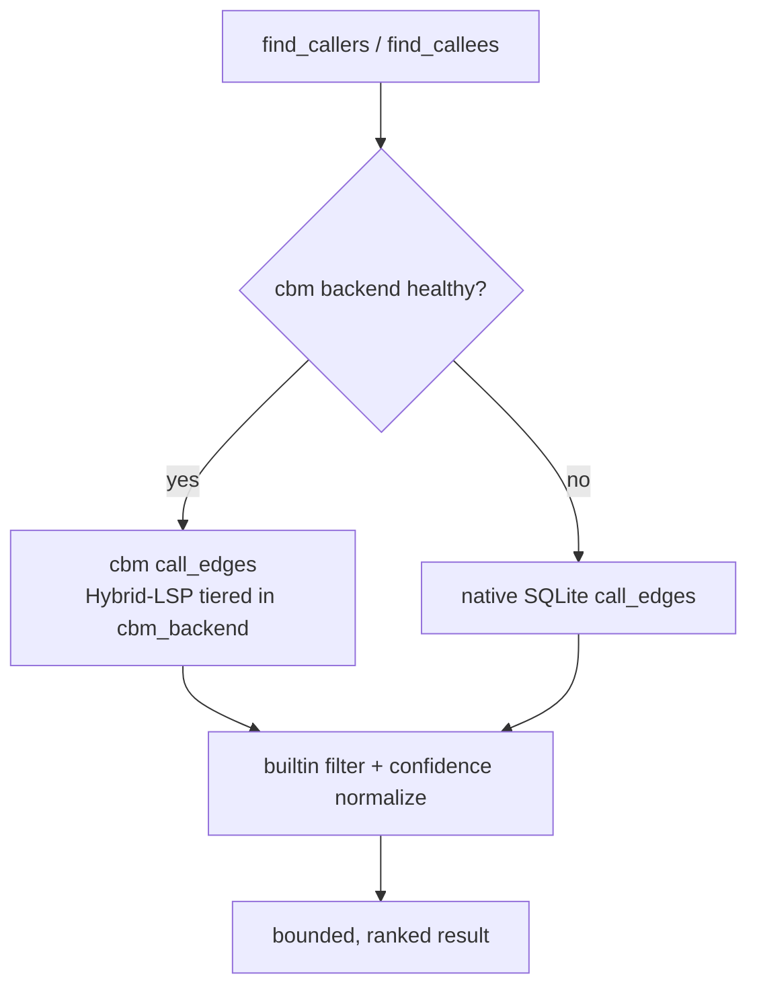
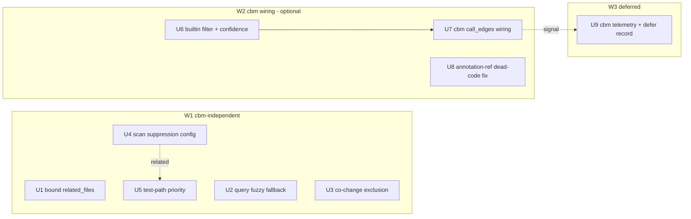

# CodeScent Retrieval Quality & cbm Integration - Plan

## Goal Capsule

**Objective:** Fix the retrieval and scan-quality bugs surfaced by dogfooding CodeScent's own MCP surface, and resolve the open question of promoting `codebase-memory-mcp` (cbm) to a hard dependency — by decoupling "wire cbm deeper" (a quality win) from "require cbm" (an operational/identity change), keeping cbm optional.

**Product authority:** Origin brainstorm (this same file, requirements-only revision). Behavior, scope, and success criteria in the Product Contract are the source of truth.

**Definition of Done:** see [Definition of Done](#definition-of-done).

**Product Contract preservation:** Product Contract unchanged. The four Open Questions (R2, R4, R9, R12) are resolved into Key Technical Decisions below; no requirement text was rewritten.

---

## Problem Frame

Dogfooding CodeScent's MCP against its own repo surfaced two overlapping problems:

1. **A cluster of retrieval/scan bugs that mislead agents.** Natural-language queries return `ok:true` with empty results; `get_file_context` dumps ~230 files (nearly the whole repo) into `related_files`; blast-radius tools rank `.beads/issues.jsonl` first because it churns every commit; the health scan reports ~25,690 findings dominated by duplicate-literal/missing-test noise in test files and by the intentional-smell `precision_corpus` eval fixtures; `find_callees` lists language builtins; `next_improvement` recommends splitting a test file.

2. **An open architectural question:** should cbm become a hard dependency "like fff"?

Investigation reframed the second problem and connected it to the first:

- **"Like fff" does not transfer.** `fff-search` is an in-process pip wheel — cheap, pinned, deterministic, always importable. cbm is an out-of-process **server** reached over subprocess IPC (5s timeout) with a native fallback. You cannot `pip install` and import a running server.
- **The hard-dep idea is really two orthogonal levers.** (a) *Wire cbm deeper* — route callers/callees/dead-code through cbm's real call graph. (b) *Require cbm* — drop the native fallback so every install must run the binary. fff could take both at once because a wheel is cheap; cbm cannot.
- **Half the bugs are cbm-irrelevant.** The call-graph subset (builtins as callees, weak caller confidence, possibly the dead-code false-positive) can be structurally improved by cbm's LSP-grade graph. The rest — bounding, query routing, co-change exclusion, scan scope, prioritization — are plain bugs cbm will never touch.
- **cbm's current footprint is tiny.** It feeds exactly one tool today (`get_architecture` clusters, via `select_graph_backend` in `src/codescent/services/cbm_backend.py`, consumed only by `src/codescent/services/architecture.py`). `find_callers`/`find_callees` do **not** use it — they query the SQLite `call_edges` table directly. So "make cbm a hard dep" alone fixes zero bugs; the value is in the wiring, and the wiring does not need the hard requirement.

The plan splits into three workstreams (W1 cbm-independent bug fixes, W2 optional cbm call-graph wiring, W3 deferred hard-dep decision) and keeps cbm optional.

---

## Product Contract

### Requirements

#### W1 — Retrieval & scan correctness (cbm-independent)

- **R1** — `get_file_context` returns a **bounded** `related_files` set (today ~230 entries, roughly the entire repo, defeating the tool's "cheaper than reading the file" purpose). Bound and rank it the way `get_related_files` already does, with pagination for the tail.
- **R2** — A natural-language `query` that finds nothing via the literal pass **silently falls back to fuzzy/token matching** across `search_content`, `search_files`, and `answer_pack`, so a reasonable query no longer returns `ok:true` with empty results. Fallback results carry a reason tag indicating reduced precision.
- **R3** — Co-change / blast-radius signals (`get_related_files`, `get_impact`, `refactor_preflight`) **exclude high-churn artifacts** such as `.beads/issues.jsonl` that change on nearly every commit, so real coupling is not buried.
- **R4** — The **default** health scan excludes noise: the `precision_corpus` intentional-smell fixtures entirely, and the `duplicate_literal` + `missing_nearby_test` + `large_file` rules in test scope. Test-quality rules (`no_op_test`, `over_mocked_test`, `assertion_free_test`, etc.) **continue** to scan tests. The precision eval harness can still opt in to scanning the corpus.
- **R5** — Improvement prioritization stops surfacing low-value or nonsensical actions (e.g. "split a test file into smaller modules"), and `get_next_improvement` agrees with the ROI ordering from `get_improvement_plan` rather than contradicting it.
- **R6** — (minor) Confidence and tier labels are internally consistent: callers are not uniformly stamped `0.4 / "low"` including the true definition-site caller; a `"verified"` tier is not displayed alongside `confidence: 0.6`; `changed_file_health` does not return `ok: false` for a file that is simply unchanged.

#### W2 — cbm call-graph wiring (cbm stays optional)

- **R7** — `find_callers`, `find_callees`, and the dead-code rule use cbm's call graph **when a local cbm process is present**, and the native backend when it is not — extending the existing optional `cbm_backend` seam (which today feeds only `get_architecture`).
- **R8** — `find_callees` no longer returns language builtins (`len`, `set`, `sorted`, `append`, `float`, `tuple`, …) as callees. Filtered on the native path as a floor; cbm's real call graph avoids them when present.
- **R9** — The dead-code candidate rule stops false-positiving on **annotation-only references** (a class/`TypedDict`/type alias used only in a return or parameter annotation, e.g. `AnswerPackToolPayload`).
- **R10** — **Graceful degradation:** with cbm absent, every W2 tool behaves exactly as it does today. No new hard requirement, no regression, no cold-start penalty on the cbm-absent path.

#### W3 — Hard-dependency decision (deferred, with a trigger)

- **R11** — cbm **remains optional**. The plan records an explicit decision *not* to make cbm a hard dependency now, with rationale: (i) latency — a required IPC handshake with a 5s timeout in front of tools, especially the `hook-augment` path that runs before every grep, works against the cold-start reduction (~680ms→~275ms) landed in PR #9; (ii) identity — CodeScent advertises "local, deterministic, bounded, zero network," and a required external server with its own drifting index dents "zero-setup" and "deterministic"; (iii) the native backend must be kept as a real path regardless, because cbm's call graph is dropped for non-Hybrid-LSP languages; (iv) external release cadence — cbm is a separately released project (DeusData), adding version-skew and IPC-contract-drift risk that a pinned wheel does not have.
- **R12** — A **written revisit-trigger** is recorded: define the signal (the rate at which real sessions run with cbm present vs falling back to native) that would justify revisiting the hard-dep decision.

### Success Criteria

- Re-running the same dogfooding pass shows the P1/P2 issues gone: `get_file_context.related_files` is bounded; no search/answer tool returns `ok:true` with empty on a reasonable query; `.beads/issues.jsonl` no longer tops blast-radius.
- Finding count drops to signal: no test-file duplicate-literal flood, no `precision_corpus` fixture smells in the default scan — while test-quality findings on real tests are retained.
- With cbm present, callers/callees/dead-code are higher quality (no builtins as callees, no uniform 0.4 confidence, no annotation-only dead-code FP). With cbm absent, behavior is identical to today.
- cbm installation remains optional; cold-start latency for the cbm-absent path is unchanged.
- The plan carries an explicit, revisitable "why not hard yet" record and the measured signal that would flip it.

---

## Key Technical Decisions

- **KTD1 — Builtin filter at query time, not parse time (R8).** Callees are stored in the SQLite `call_edges` table with confidence hard-set to `0.4` at parse time (`engine/parsers/python.py`). Filter builtins in the `find_callees` query path (`services/context.py`) against a known-builtins set, so the fix lands immediately with **no reindex**. A parser-level skip (never store builtin edges) is a deferred cleanup, not this plan.
- **KTD2 — Fuzzy fallback reuses rapidfuzz, fires only on empty (R2).** The literal pass is unchanged; when it returns zero, a second pass runs. Paths reuse `rank_path` (`engine/search/ranking.py`, `fuzz.partial_ratio`, threshold 60). Content needs a new sibling `rank_content` helper in `services/search_support.py` mirroring `rank_path`. Fallback rows carry a `fuzzy` reason tag so agents see precision dropped. No cost on the hit path. `answer_pack` inherits the fix for free — it calls `SearchService.search_files`/`search_content`.
- **KTD3 — cbm wiring extends the existing seam; native stays the floor (R7, R10).** `find_callers`/`find_callees` try `select_graph_backend(...).call_edges()` when the backend resolves to cbm (health + Hybrid-LSP tiering already enforced inside `cbm_backend.py`), else fall back to the current SQLite query. With cbm absent the code path is byte-for-byte today's behavior — no cold-start cost, no new requirement.
- **KTD4 — Dead-code fixed at the root, not with a kind band-aid (R9).** `AnswerPackToolPayload` parses as `kind=class`, so kind-based suppression would not target it and would miss regular classes used only in annotations. The fix makes the Python parser emit references for type annotations (return, parameter, variable), so the name-use index (`engine/rules/dead_code.py:build_name_use_index`) counts annotation-only usage as a use. Fixes the whole FP class; **requires a reindex** to repopulate references.
- **KTD5 — Scan noise handled by a scan-time per-(rule, path-glob) suppression config (R4, R5).** Today only inline-comment suppression exists (`engine/suppression.py`) and the scan (`services/code_health.py`) has no scope parameter. Add a default suppression config: `precision_corpus/**` for all rules; `tests/**` for `duplicate_literal`, `missing_nearby_test`, `large_file`. Suppress at scan/store time so finding counts actually drop; keep it overridable so the precision eval harness can still scan the corpus. Mirrors the existing `scripts/dogfood_allowlist.json` pattern. Prioritization down-weighting for test paths (`services/findings.py:_finding_priority`) is the complementary lever for anything the suppression config does not remove.
- **KTD6 — Generalize the co-change exclusion (R3).** `services/git.py` hardcodes a `.codescent` skip in `_add_co_change_counts`. Replace it with a churn-exclusion helper backed by a small constant set (`.codescent`, `.beads/`, `*.jsonl` state, lockfiles) applied everywhere co-change paths are collected.

---

## High-Level Technical Design

**Caller/callee resolution after W2 (U6 + U7).** The builtin filter and native-confidence floor apply on every path; cbm is an optional enhancement layered on top.

**Unit dependency graph.**

W1 units (U1–U5) are mutually independent and can land in any order. U6 is independent; U7 depends on U6 (same query path). U8 is independent. U9 is soft-ordered after U7 (needs the cbm-vs-native signal).

---

## Implementation Units

### U1. Bound `get_file_context.related_files`

**Goal:** Cap and paginate the `related_files` list so `get_file_context` returns a bounded set instead of ~230 entries.

**Requirements:** R1.

**Dependencies:** none.

**Files:**
- `src/codescent/services/context.py` — `_related_rows` (~:650), consumed by `get_file_context` (~:94/:118).
- `src/codescent/mcp/context_tools.py` — `get_file_context` tool (~:178), surface the bound/next-cursor.
- `tests/integration/test_context.py` — tests.

**Approach:** `_related_rows` assembles reasons for all files with no limit; `get_related_files` already paginates the same reason map at ~:287. Add a `limit` (and cursor) to `_related_rows`, slicing after the existing sort so the top-ranked related files survive. Reuse the pagination shape `get_related_files` uses rather than inventing a second one.

**Patterns to follow:** `get_related_files` pagination in `services/context.py` (~:287) and its MCP wrapper.

**Test scenarios:**
- Happy path: `get_file_context` on a well-connected file returns `len(related_files) <= DEFAULT_LIMIT` (match `get_related_files`' cap), highest-ranked reasons retained.
- Edge: file with fewer related files than the cap returns them all, `next_cursor` null.
- Edge: file with more than the cap returns exactly the cap and a non-null cursor; following the cursor returns the next page with no duplicates.
- Regression: the ranking/reasons for the top page match what `get_related_files` returns for the same file (shared reason map, consistent order).

**Verification:** `get_file_context` on `src/codescent/services/hook_retrieval.py` returns a bounded list (not the whole repo); token estimate drops accordingly.

---

### U2. Fuzzy fallback when a natural-language `query` returns empty

**Goal:** When the literal pass yields zero results, run a fuzzy/token second pass so `search_content`, `search_files`, and `answer_pack` stop returning `ok:true` with empty results on reasonable NL queries.

**Requirements:** R2.

**Dependencies:** none.

**Files:**
- `src/codescent/services/search_run.py` — `_native_file_results` (~:180), `_native_content_results` (~:201): add the zero-result fallback.
- `src/codescent/services/search_support.py` — add a `rank_content` helper mirroring `rank_path`.
- `src/codescent/engine/search/ranking.py` — `rank_path` (~:115), `FUZZY_MATCH_THRESHOLD` (~:11): reuse for paths and as the model for content.
- `src/codescent/core/defensive.py` — `resolve_query` (~:25): no behavior change, but the fallback keys off the resolved query text.
- `tests/integration/test_search.py`, `tests/integration/test_answer_pack.py`, `tests/unit/test_search_support.py` (add if absent) — tests.

**Approach:** Keep the literal pass first (no cost on hits). On zero results, tokenize the query and run a fuzzy pass — paths via `rank_path`, content via the new `rank_content` (same `rapidfuzz.fuzz.partial_ratio`, same threshold). Tag fallback rows with a `fuzzy` reason so downstream agents see reduced precision. `answer_pack` calls `SearchService.search_files`/`search_content`, so it inherits the fix — assert that rather than duplicating logic.

**Technical design (directional, not a spec):** `results = literal(query); if not results and looks_like_nl(query): results = fuzzy(tokenize(query)); tag(results, reason="fuzzy")`.

**Patterns to follow:** `rank_path` fuzzy branch in `engine/search/ranking.py`; existing reason-tagging in search results.

**Test scenarios:**
- Happy path (content): `search_content(query="hook augment payload")` returns non-empty results including the hook payload builder, each tagged `fuzzy`.
- Happy path (files): `search_files(query="hook payload builder")` returns the hook payload module, tagged `fuzzy`.
- No-cost-on-hit: a query with literal matches returns only literal (untagged) results — the fuzzy pass does not run (assert via absence of the `fuzzy` tag and, if feasible, that `rank_content` is not called).
- answer_pack: `answer_pack(query="grep injection hook never-block enrichment")` returns non-empty `top_files`/`related_tests` (inherits U2).
- Edge: a genuinely absent term (e.g. random uuid) still returns empty with the existing low-confidence warning — fuzzy must not fabricate matches.
- Regression: `pattern=` literal search behavior is unchanged.

**Verification:** the three NL queries from the dogfooding session that returned empty now return relevant, `fuzzy`-tagged results.

---

### U3. Exclude high-churn artifacts from co-change / blast radius

**Goal:** Stop `.beads/issues.jsonl` and similar every-commit churn files from dominating co-change signals.

**Requirements:** R3.

**Dependencies:** none.

**Files:**
- `src/codescent/services/git.py` — `_add_co_change_counts` (~:466-474) and the other co-change path collectors (~:55/:91/:130/:170/:345/:404/:452/:461).
- `tests/unit/test_git_co_change.py` — tests.

**Approach:** Replace the hardcoded `changed_path.startswith(".codescent")` skip with a `_is_excluded_cochange_path` helper backed by a small constant set: `.codescent`, `.beads/`, `*.jsonl` runtime state, common lockfiles. Apply the helper everywhere co-change paths are gathered, not just one call site, so `get_impact` and `refactor_preflight` (which compose the same counts) benefit.

**Patterns to follow:** the existing `.codescent` exclusion this generalizes.

**Test scenarios:**
- Happy path: co-change for a source file no longer lists `.beads/issues.jsonl` even when git history shows they changed together.
- Edge: a real source-to-source coupling (two modules that co-change) is still reported and ranks above nothing.
- Edge: `.codescent` state remains excluded (no regression on the existing behavior).
- Integration: `get_impact` on the dead-code finding no longer lists `.beads/issues.jsonl` among `affected_files`.

**Verification:** `get_related_files` / `get_impact` / `refactor_preflight` on a source file no longer surface `.beads/issues.jsonl` at the top.

---

### U4. Scan-time suppression config for noise rules

**Goal:** Drop the default-scan noise (`precision_corpus` fixtures; `duplicate_literal`/`missing_nearby_test`/`large_file` in tests) at scan/store time while keeping test-quality rules scanning tests, and keeping the corpus scannable by the eval harness.

**Requirements:** R4.

**Dependencies:** none (relates to U5).

**Files:**
- `src/codescent/services/code_health.py` — `scan` (~:99), `is_test_path` (~:36): add an optional scope/suppression config with a sane default; apply before findings are stored.
- `src/codescent/engine/suppression.py` — extend beyond inline directives with a per-(rule, path-glob) config layer.
- `scripts/dogfood_allowlist.json` — prior-art pattern to mirror for the default config shape.
- `tests/integration/test_scan_code_health.py`, `tests/unit/test_suppression.py` — tests.

**Approach:** Introduce a default suppression config mapping rule → excluded path globs: `precision_corpus/**` → all rules; `tests/**` → `{duplicate_literal, missing_nearby_test, large_file}`. Apply it in the scan before findings are persisted so counts drop. Make it overridable (a parameter / config key) so `evals/` harnesses opt back in. Do **not** touch test-quality rules — they must keep scanning tests.

**Execution note:** Add a failing test that asserts test-quality findings survive while the noise rules are suppressed, before changing the scan — the retention guarantee is the risky part.

**Patterns to follow:** `scripts/dogfood_allowlist.json`; the inline suppression flow in `engine/suppression.py`.

**Test scenarios:**
- Happy path: a default scan of the repo emits zero `python.duplicate_literal` and zero `python.missing_nearby_test` findings under `tests/`, and zero findings of any rule under `evals/precision_corpus/`.
- Retention: a test file with a real test-quality smell (e.g. an assertion-free test) still produces its `assertion_free_test` finding.
- Override: the precision eval harness path scans `precision_corpus` and still sees its intentional smells (config override works).
- Regression: source-tree findings (e.g. `dead_code_candidate` in `src/`) are unchanged in count.
- Count check: total finding count drops substantially from the ~25,690 baseline, driven by the suppressed rule×scope pairs.

**Verification:** `get_progress` total drops to signal; `get_smell_report` no longer led by test duplicate-literals; test-quality findings still present.

---

### U5. Down-weight test-path findings in prioritization

**Goal:** Stop `get_next_improvement` recommending "split a test file" and align it with `get_improvement_plan`'s ROI ordering.

**Requirements:** R5.

**Dependencies:** none (complements U4).

**Files:**
- `src/codescent/services/findings.py` — `_finding_priority` (~:259-273), `_hotspot_score` (~:276-280).
- `src/codescent/services/improvement_plan.py` — effort/priority weighting (~:37-54/:90-91) for consistency.
- `tests/integration/test_findings.py`, `tests/integration/test_improvement_plan.py` — tests.

**Approach:** In `_finding_priority`, lower the rank of structural rules (`large_file`, and any remaining size rules) when the finding path is a test file (`is_test_path`). Align `improvement_plan`'s cluster ordering so `get_next_improvement` and `get_improvement_plan` agree on the top item. Anything U4 already suppresses needs no down-weighting; this catches the residue (e.g. `large_file` on a big test file that U4 leaves in scope).

**Test scenarios:**
- Happy path: with a large source file and a large test file both present, `get_next_improvement` returns the source file, never the test file.
- Consistency: the top item from `get_next_improvement` matches the top ROI cluster from `get_improvement_plan` for the same finding set.
- Edge: when only test-file structural findings exist, prioritization returns a low-priority/empty next-improvement rather than recommending a test split.
- Regression: source-file prioritization order is unchanged.

**Verification:** `get_next_improvement` no longer points at `tests/contract/test_mcp_finding_tools.py`.

---

### U6. Filter builtins from callees + normalize native confidence

**Goal:** `find_callees` stops returning language builtins, and caller/callee confidence stops being a uniform `0.4/"low"` — on the native path, with no reindex.

**Requirements:** R8, R6.

**Dependencies:** none.

**Files:**
- `src/codescent/services/context.py` — `find_callees` (~:225/:240-258), `find_callers` (~:191/:206-222): add a builtin exclusion to the callee query and a confidence normalization.
- `src/codescent/services/context_support.py` — `graph_payload` (~:254), `certainty` (~:284-289): confidence→label mapping.
- `tests/integration/test_context.py`, `tests/unit/test_context_support.py` (add if absent) — tests.

**Approach:** Filter callees against a known-Python-builtins set in the query path (`context.py`), keeping the fix immediate and reindex-free (KTD1). For confidence (R6): raise the label for references resolved to a definition that exists in the index (same-file / resolvable) above the flat `0.4`, so a real definition-site caller is not stamped `"low"`. Also correct the two cosmetic mismatches: do not render tier `"verified"` alongside `confidence: 0.6`, and do not return `ok: false` from `changed_file_health` for an unchanged file (return a clear not-changed status instead).

**Patterns to follow:** the existing callee/caller SQL and `certainty` mapping in `context_support.py`.

**Test scenarios:**
- Happy path: `find_callees("ranked_matches")` returns real callees (`build_finder`, `multi_grep`, `quality_flags_for_paths`) and **no** builtins (`len`, `set`, `sorted`, `append`, `float`, `tuple`, `enumerate`).
- Confidence: `find_callers("build_payload")` gives the true definition-site caller a confidence/label above `0.4/"low"`.
- Cosmetic: a finding with `confidence: 0.6` does not report tier `"verified"`; `changed_file_health` on an unchanged file returns `ok: true` with a not-changed marker.
- Edge: a symbol that genuinely calls only builtins returns an empty callee list, not a list of builtins.
- Regression: callee/caller results for a symbol with normal user-defined calls are otherwise unchanged.

**Verification:** the `find_callees("ranked_matches")` output from the dogfooding session no longer contains builtins.

---

### U7. Wire cbm `call_edges` into callers/callees (optional, native fallback)

**Goal:** When a cbm process is healthy, resolve callers/callees from cbm's call graph; otherwise use the native path from U6. cbm stays optional.

**Requirements:** R7, R10.

**Dependencies:** U6.

**Files:**
- `src/codescent/services/context.py` — `find_callers`/`find_callees` query paths (~:206-258): try cbm first.
- `src/codescent/services/cbm_backend.py` — `select_graph_backend`, `call_edges` (already language-tiered).
- `src/codescent/services/graph_backend.py` — `GraphBackend.call_edges` contract.
- `tests/integration/test_context.py`, `tests/unit/test_graph_backend.py` — tests.

**Approach:** Route callers/callees through `select_graph_backend(repo_root).call_edges()` when the resolved backend is cbm and healthy (Hybrid-LSP tiering is already enforced inside `cbm_backend`), applying the same builtin filter and confidence normalization from U6 to the result. When cbm is absent/unhealthy, execute today's SQLite query unchanged — byte-for-byte behavior, so R10 holds and there is no cold-start cost on the common path.

**Execution note:** Start with a test that runs both branches — a fake healthy cbm client (the repo already has cbm test doubles for `graph_backend`) and cbm-absent — asserting identical shape and that absent == today.

**Patterns to follow:** `architecture.py`'s use of `select_graph_backend` and `backend.name() == "cbm"` gating; existing cbm test doubles.

**Test scenarios:**
- Happy path (cbm present): with a healthy fake cbm client, `find_callees`/`find_callers` return cbm-sourced edges (no builtins), shape identical to the native payload.
- Fallback (cbm absent): with no cbm client, results are exactly the native U6 results (assert equality against the native path).
- Language tiering: for a non-Hybrid-LSP file, cbm edges are not used (cbm_backend drops them) — native is used, no cross-language contamination.
- Integration: enabling/disabling the cbm client changes only quality, never the response schema.
- Regression: cbm-absent latency is unchanged (no subprocess spawned on the fallback path).

**Verification:** with `codebase-memory-mcp` running, callers/callees show cbm-grade quality; with it stopped, output matches U6.

---

### U8. Capture type-annotation references so dead-code stops FP-ing on annotation-only symbols

**Goal:** A class/`TypedDict`/type alias used only in a type annotation is counted as used, eliminating the annotation-only dead-code false-positive class.

**Requirements:** R9.

**Dependencies:** none.

**Files:**
- `src/codescent/engine/parsers/python.py` — reference extraction (~:230-245 and annotation-handling sites): emit references for return, parameter, and variable annotations.
- `src/codescent/engine/rules/dead_code.py` — `build_name_use_index` (~:45-69), `_candidate_symbols` (~:112-150): consume the new annotation references (no change if references flow through the existing `parsed.references`).
- `tests/unit/test_python_parser.py`, `tests/unit/test_dead_code.py` — tests.

**Approach:** The name-use index already unions `parsed.references` and `parsed.imports`; the gap is that the parser does not emit references for annotation identifiers. Extend the Python parser to emit a reference for each name used in a return annotation, parameter annotation, and variable annotation. The dead-code rule then counts annotation-only usage as a use with no rule change. Requires a reindex to repopulate references (KTD4).

**Execution note:** Add a characterization test pinning current parser reference output before extending it, so the annotation additions are visible as a diff and nothing else shifts.

**Patterns to follow:** existing reference emission in `engine/parsers/python.py`; `tests/unit/test_dead_code.py` fixtures.

**Test scenarios:**
- Happy path: a `TypedDict` used only as a function return annotation is **not** flagged `dead_code_candidate` (covers the `AnswerPackToolPayload` case).
- Class-in-annotation: a regular class used only as a parameter annotation is not flagged dead.
- Variable annotation: a class used only in a `x: MyType` variable annotation is not flagged.
- True positive retained: a class with no references anywhere (not even annotations) is still flagged dead.
- Parser unit: return/param/var annotations each produce a reference entry for their type name(s), including nested generics (e.g. `tuple[Foo, ...]` references `Foo`).
- Regression: non-annotation reference counts are unchanged (characterization test holds).

**Verification:** after reindex, `get_finding` on the former `AnswerPackToolPayload` dead-code finding shows it resolved/absent; no new false negatives in `test_dead_code.py`.

---

### U9. Record cbm availability + the deferred hard-dep decision

**Goal:** Make W3 concrete: capture the cbm-present-vs-native signal so the revisit trigger is measurable, and record the "not hard yet" decision and trigger in the repo.

**Requirements:** R11, R12.

**Dependencies:** soft — after U7 (the cbm/native branch is the signal source).

**Files:**
- `src/codescent/services/session_stats.py` — record a per-session cbm-present/absent flag (the backend already knows `backend.name()`).
- `src/codescent/mcp/session_stats_tools.py` / `context_stats` — surface the counter.
- `docs/` (an ADR or a short decision note) — the deferred-hard-dep decision and revisit trigger.
- `tests/integration/test_session_stats.py` — tests.

**Approach:** When a structural backend is resolved, record whether it was cbm or native for the session (sanitized, no source). Expose the aggregate via `context_stats` so the cbm-present rate is observable. Write the decision: cbm stays optional; revisit hardening only if the cbm-present rate across real sessions is high enough that the native fallback is rarely exercised (name a concrete threshold, e.g. a strong majority of sessions), and re-weigh against the latency/identity costs in R11.

**Test scenarios:**
- Happy path: a session that resolved the cbm backend records `cbm`; a session that fell back records `native`; `context_stats` reports the split.
- Privacy: the recorded event contains no source content or file paths beyond what session stats already store (reuse the existing sanitization).
- Edge: sessions that never touch a structural tool record neither / are excluded from the rate denominator.
- Doc check: the decision note states the optional-by-default decision, the four-part rationale, and a concrete revisit threshold.

**Verification:** `context_stats` shows a cbm-present rate; the decision note is discoverable and names the trigger.

---

## Risks & Dependencies

- **Reindex required for U8 (and any parser-level follow-up to U6).** Emitting annotation references changes stored data; the fix only takes effect after a reindex. Call this out in the change so users re-run indexing. Mitigation: `detect_changes`/auto-refresh already exist; verify they repopulate references.
- **U4 over-suppression risk.** Suppressing rules by path glob could hide real findings if the globs are too broad. Mitigation: the retention test (test-quality rules keep firing on tests) and keeping the config overridable and small.
- **U7 fallback fidelity.** The cbm-absent path must equal today's behavior exactly. Mitigation: the equality test in U7 asserts native == today.
- **cbm test doubles.** U7 relies on existing cbm fakes in `tests/unit/test_graph_backend.py`; if they don't cover `call_edges` health/tiering, extend them first.
- **External:** `codebase-memory-mcp` (DeusData) is the optional runtime for U7's cbm path; not required for any unit to land or pass with cbm absent.

---

## Verification Contract

- `uv run pytest` — all new unit/integration/contract tests pass; the 16 pre-existing docs/ts-fixture failures remain the only failures (unchanged baseline).
- `uv run ruff check` / `ruff format` — clean on changed files.
- `uv run basedpyright` — no new errors on changed files.
- `scripts/dogfood_scan.py` — dogfood gate passes; the post-U4 default finding count is materially lower than the ~25,690 baseline and test-quality findings are retained.
- Manual dogfood re-run: the P1/P2 issues from the origin session are gone (bounded `related_files`; NL queries return `fuzzy`-tagged results; `.beads` off the top of blast radius; no builtins in callees).
- U7 dual-mode check: run the callers/callees tests once with a healthy fake cbm client and once cbm-absent; assert cbm-absent output equals the native path.

---

## Definition of Done

- All nine units landed with their test scenarios green and the Verification Contract satisfied.
- cbm remains optional: with `codebase-memory-mcp` absent, every tool behaves as before (no new dependency, no cold-start regression); with it present, callers/callees/dead-code show higher quality.
- Default scan finding count is signal-level; test-quality coverage on tests is retained; the precision eval harness can still scan `precision_corpus`.
- The deferred hard-dep decision and its measurable revisit trigger are recorded and discoverable, and `context_stats` reports the cbm-present rate.

---

## Sources & Research

- Dogfooding session (origin) — the P1/P2/P3 findings.
- `src/codescent/services/context.py` — `_related_rows` (R1), `find_callers`/`find_callees` (R6/R7/R8).
- `src/codescent/services/search_run.py`, `search_support.py`, `engine/search/ranking.py`, `core/defensive.py` — literal-vs-fuzzy search path (R2).
- `src/codescent/services/answer_pack.py` — reuses `SearchService` (R2 inheritance).
- `src/codescent/services/git.py` — `_add_co_change_counts` hardcoded exclusion (R3).
- `src/codescent/services/code_health.py`, `engine/suppression.py`, `scripts/dogfood_allowlist.json` — scan scope / suppression (R4).
- `src/codescent/services/findings.py`, `improvement_plan.py` — prioritization (R5).
- `src/codescent/engine/parsers/python.py`, `engine/rules/dead_code.py` — annotation references / name-use index (R9).
- `src/codescent/services/cbm_backend.py`, `graph_backend.py` (`HYBRID_LSP_LANGUAGES` ~:26), `architecture.py` — cbm seam, only current consumer (R7/R10/R12).
- PR #9 (fff hard-dep precedent, cold-start ~680ms→~275ms), PR #8 (grep-injection hook) — latency context for R11.
- `pyproject.toml` — `fff-search` is a dependency; cbm is not.
