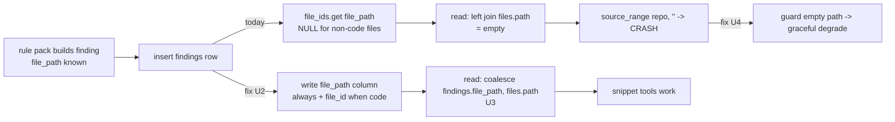
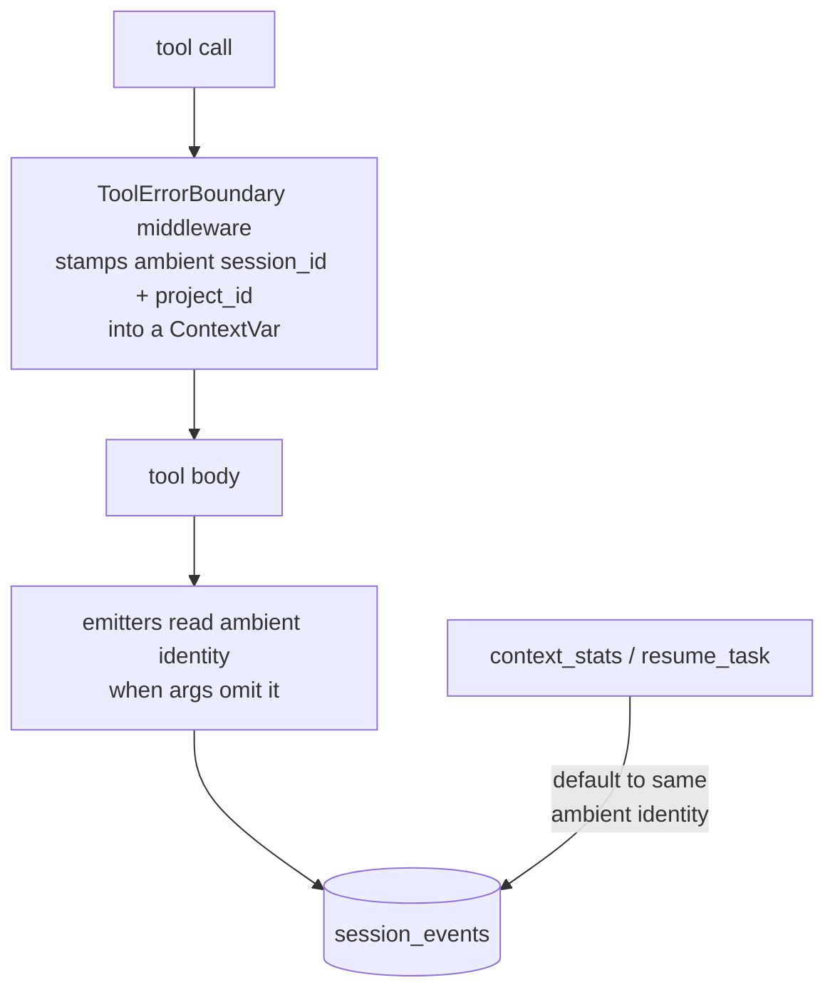

# fix: Finding path persistence, snippet-tool crashes, and session telemetry

Fixes three defects found by dogfooding CodeScent against its own repo (see `CODESCENT_DOGFOOD_REPORT.md` §3.1, §3.2, §3.3). Two are P0 (a reproducible crash class and a broken first-run experience); one is P1 (dead telemetry). All three are corrected at root cause. Analyzed source stays read-only — every write remains confined to `.codescent/`.

**Product Contract preservation:** No product scope changed; this plan bootstraps directly from the dogfood report. Bug fixes only, no new user-facing capability.

---

## Summary

- **§3.1 (P0)** — Findings on non-indexed files (`.md`/`.html`/`.json`) persist with `file_id = NULL`, so `file_path` reads back empty and `explain_finding` / `plan_refactor` / `get_finding_context` hard-crash with `{"code":"internal","recoverable":false}`. Fix: persist the finding's known `file_path` string directly on the row (new column + backfill), read it authoritatively, and guard the snippet path so an unresolvable location degrades gracefully instead of crashing.
- **§3.2 (P0)** — Stale findings had `file_id = NULL` for every row while `get_repo_status` reported `index_fresh:true`, so an agent had no signal to rescan and every finding tool returned empty paths until a manual rescan. Fix: backfill resolvable rows during migration (covered by §3.1's migration), and have `get_repo_status` surface an unresolved-findings signal with a rescan hint.
- **§3.3 (P1)** — Tool-call telemetry writes nothing: `_record_tool_called` early-returns when `session_id is None` (which agents never pass), and even a recorded event would be keyed under `project_id="repo:<path>"` while `context_stats`/`resume_task` read `project_id="default"`. Fix: give tool calls an ambient session/project identity so telemetry records without the agent supplying one, and align the read-side defaults.

Scope excludes the §4 noise/UX items from the report (count inflation, sample ordering, fuzzy symbol lookup, calibration signal) — those are separate follow-up work.

---

## Problem Frame

A finding's location lives in two places that drifted apart. At scan time the rule packs build each finding with a correct repo-relative `file_path` string (`FindingSpec.file_path`). At persist time (`src/codescent/services/code_health.py:237`) that string is thrown away and replaced by a foreign key: `file_ids.get(finding.file_path)` looks the path up in a `{files.path → id}` map. The `files` table only contains the 364 indexed **code** files, so any finding on a non-code file (the generic pack legitimately fires on docs, HTML reports, and JSON) resolves to `None` → `file_id = NULL`. On read (`src/codescent/storage/repositories/findings.py:93`, `left join files`) that becomes `file_path = ""`, and the three snippet tools call `source_range(repo_root, "")` on an empty path, which raises and is surfaced by the error boundary as a non-recoverable internal error.

The same NULL-`file_id` mechanism produced a stale-state trap: a database written by older logic carried NULL for *every* finding, yet `index_fresh` stayed `true`, so the tools were broken with no signal to rescan.

Telemetry is dead for an orthogonal reason: emission is gated on a caller-supplied `session_id` that agents don't pass, and the read defaults don't match the write keys.

---

## Requirements

- **R1** — A finding on any file type (code or non-code) round-trips through the database with a non-empty, correct `file_path`.
- **R2** — `explain_finding`, `plan_refactor`, and `get_finding_context` never return `recoverable:false` for a valid finding id; when a finding has no resolvable source location they degrade gracefully (return the finding without a snippet, or a `recoverable:true` error).
- **R3** — Existing persisted findings whose location is resolvable are backfilled on migration; no manual rescan is required to make them usable.
- **R4** — When open findings cannot resolve a path, `get_repo_status` surfaces that instead of implying a clean, fresh index — including an actionable rescan hint.
- **R5** — Tool calls record session telemetry without the agent supplying a `session_id`; `context_stats` and `resume_task` reflect real activity for the live session.
- **R6** — The analyzed-source read-only invariant holds; all writes stay in `.codescent/`. Outputs stay deterministic and bounded.
- **R7** — Each defect gets a regression test that fails against current `main` and passes after the fix. The existing suite does not regress.

---

## High-Level Technical Design

### Finding location lifecycle (§3.1 / §3.2)

The column write (U2) is the forward fix; the migration backfill (U1) repairs resolvable existing rows; the snippet guard (U4) is defense-in-depth so any residual empty path (e.g. a stale non-code finding not yet rescanned) degrades instead of crashing.

### Session telemetry identity (§3.3)

Today the emitter early-returns on `session_id is None` and the read-side defaults (`project_id="default"`) don't match the write key (`project_id="repo:<path>"`); the ambient identity closes both gaps at once.

---

## Key Technical Decisions

- **KTD1 — Store `file_path` on the finding row (chosen over indexing non-code files or read-time parsing).** The path string is already known at build time and is the authoritative location for every rule, including multi-location and non-code findings. Adding a column is the smallest change that fixes all finding types without expanding what "indexed files" means (which would shift `file_count`, `get_repo_map`, `get_architecture`, and language stats). `file_id` is retained for code files so existing joins and FK indexes still serve graph reads.
- **KTD2 — Reuse the `RECONCILED_COLUMNS` mechanism for the new column.** `src/codescent/storage/schema.py` already has an idempotent "add a column that shipped late, with a default" path (`_reconcile_columns`). Adding `("findings", "file_path", "file_path text not null default ''")` there — plus the column in the base `create table findings` — avoids a bespoke `ALTER`. A `SCHEMA_VERSION` bump to 11 carries the one-time **backfill** UPDATE for resolvable existing rows.
- **KTD3 — Read via `coalesce(findings.file_path, files.path, '')`.** Prefer the stored column; fall back to the join for any row written before the column existed and not yet backfilled/rescanned. Keeps the read correct during the transition window.
- **KTD4 — Graceful snippet degradation returns `ok:true` without a snippet.** For a valid finding with no resolvable source location, the explanation/context is still useful (message, evidence, fix). Returning the finding minus the snippet (with a short note) beats a `recoverable:true` error, and both beat today's `recoverable:false` crash. The guard lives at the lowest shared point (`_bounded_snippet` / the `source_range` call sites) so all three tools inherit it.
- **KTD5 — Ambient session identity via the error-boundary middleware + a `ContextVar`.** `ToolErrorBoundary.on_call_tool` is the one choke point wrapping every tool. It stamps a session id (the FastMCP session/connection id when available, else a stable per-process default) and the repo-derived `project_id` into a `ContextVar` for the duration of the call. Emitters read that ambient identity when their `session_id` arg is `None`, so telemetry records without the agent passing anything. `context_stats`/`resume_task` default their reads to the same ambient identity and repo-derived `project_id`, fixing the read/write key mismatch. Rich per-tool metrics (`large_result_summarized`, `result_retrieved`) stay in the tool bodies; only the identity source changes.

---

## Implementation Units

Grouped by defect. Within §3.1, U1→U2→U3 are the data path (ordered); U4 is independent defense-in-depth.

### U1. Add `file_path` column to `findings` + backfill migration

**Goal:** Persist a durable `file_path` on every finding row and repair resolvable existing rows.
**Requirements:** R1, R3, R6.
**Dependencies:** none.
**Files:**
- `src/codescent/storage/schema.py` (add column to base `create table findings`; add `RECONCILED_COLUMNS` entry; bump `SCHEMA_VERSION` to 11; add `MIGRATION_STATEMENTS[11]` backfill)
- `tests/integration/test_storage_migrations.py` (migration + backfill test)
**Approach:** Add `file_path text not null default ''` to the base `findings` DDL and to `RECONCILED_COLUMNS` so pre-existing databases gain the column idempotently. `MIGRATION_STATEMENTS[11]` backfills: `update findings set file_path = (select path from files where files.id = findings.file_id) where (file_path is null or file_path = '') and file_id is not null`. Stale non-code findings (NULL `file_id`) remain empty until their next rescan — that residual case is covered by U4 (no crash) and U5 (rescan hint).
**Patterns to follow:** the existing `RECONCILED_COLUMNS` entries and the versioned `MIGRATION_STATEMENTS` blocks (e.g. migration 9/10) in the same file.
**Test scenarios:**
- A pre-migration DB with findings that have a valid `file_id` but no `file_path` column: after `migrate`, the column exists and those rows have `file_path` equal to their `files.path`. Covers R3.
- A finding whose `file_id` is NULL (non-code file) stays empty after backfill (no crash, no bogus path).
- `migrate` is idempotent: running it twice does not error or duplicate the column, and `pragma user_version` = 11.
- Fresh DB created at version 11 has the column with the `''` default.

### U2. Write `file_path` at finding insert/upsert

**Goal:** Every newly persisted finding carries its known `file_path`.
**Requirements:** R1, R6.
**Dependencies:** U1.
**Files:**
- `src/codescent/services/code_health.py` (the `insert into findings (...)` at ~`:195-250`)
- `tests/integration/test_scan_code_health.py` (assert persisted `file_path`)
**Approach:** Add `file_path` to the insert column list and bind `finding.file_path` (keep `file_ids.get(finding.file_path)` for `file_id`). Add `file_path = excluded.file_path` to the `on conflict(stable_key) do update set` clause so a rescan repairs older rows. Non-code findings now persist a correct `file_path` even though `file_id` stays NULL.
**Patterns to follow:** the sibling `file_id = excluded.file_id` line already in the on-conflict block.
**Test scenarios:**
- Scan a fixture repo containing a non-code file (e.g. a `.md` large-file finding); the persisted row has the correct `file_path` and NULL `file_id`. Covers R1.
- Scan producing a code-file finding: row has both `file_path` and a resolved `file_id`.
- Re-scan an existing finding that previously had empty `file_path`: the on-conflict update populates it.

### U3. Read `file_path` authoritatively from the column

**Goal:** The finding read path returns the stored `file_path`, falling back to the join only for un-backfilled rows.
**Requirements:** R1, R3.
**Dependencies:** U1.
**Files:**
- `src/codescent/storage/repositories/findings.py` (`list_findings` SELECT)
- `tests/integration/test_findings.py` (read-path assertion)
**Approach:** Change the projected path expression from `files.path` to `coalesce(findings.file_path, files.path, '')`. `FindingRow.file_path` and all downstream serialization (`finding_payloads.py`, `get_finding`, `get_backlog`, `get_smell_report`) already read `finding.file_path`, so no payload changes are needed — they simply stop being empty.
**Patterns to follow:** the existing `coalesce(...)` projections already used for `suggested_action`, `confidence_tier`, `provenance_json` in the same query.
**Test scenarios:**
- A finding persisted with a `file_path` and NULL `file_id` reads back with the correct non-empty `file_path`. Covers R1.
- A legacy row with empty `file_path` but a valid `file_id` still resolves via the join fallback. Covers R3.
- `get_backlog`/`get_smell_report` inline items expose non-empty `file_path` for non-code findings (integration-level guard against the original symptom).

### U4. Guard the empty-path case in the snippet tools

**Goal:** `explain_finding`, `plan_refactor`, `get_finding_context` degrade gracefully on an unresolvable location instead of crashing.
**Requirements:** R2.
**Dependencies:** none (independent hardening; also protects residual stale rows).
**Files:**
- `src/codescent/services/explain.py` (`_bounded_snippet` / the `source_range` call)
- `src/codescent/services/refactor_planning.py` (`get_finding_context` calls `ContextService.get_file_context(finding.file_path)` — must tolerate empty path)
- `tests/unit/test_explain.py`, `tests/integration/test_refactor_planning.py`
**Approach:** When `finding.file_path` is empty, skip source-range reading and return the explanation/context without a `snippet`/`source_ranges` block, plus a short note ("no resolvable source location; see message/evidence"). Keep `ok:true`. Ensure `plan_refactor`'s `context.affected_files[0]` access (`refactor_planning.py:109`) is safe when `affected_files` is empty (guard against IndexError). Verify `ContextService.get_file_context("")` returns cleanly or is short-circuited before the call.
**Execution note:** Add a failing test first that calls each tool on a finding with an empty `file_path` and asserts no `recoverable:false` — this pins the current crash before fixing.
**Test scenarios:**
- `explain_finding` on a finding with empty `file_path` returns `ok:true` with no snippet and a note, not an internal error. Covers R2.
- `get_finding_context` on the same returns `ok:true` with empty/absent `source_ranges`.
- `plan_refactor` on the same returns `ok:true` and does not raise IndexError on `affected_files[0]`.
- Regression: the same three tools on a normal code-file finding still return their full snippet/context (no behavior change for the happy path).

### U5. Surface unresolved findings in `get_repo_status`

**Goal:** An agent sees a rescan hint when open findings can't resolve a path, instead of a misleading `index_fresh:true`.
**Requirements:** R4.
**Dependencies:** U3 (so the signal reflects post-fix reality).
**Files:**
- `src/codescent/mcp/repo_tools.py` (`get_repo_status`, ~`:206`)
- `src/codescent/services/freshness.py` if a shared signal helper fits there
- `tests/contract/test_mcp_repo_tools.py`
**Approach:** Add a bounded count of open/regressed findings with an empty `file_path` (e.g. `unresolved_finding_count`) and, when non-zero, a warning plus a `next_tools`/hint recommending `rescan`. Do not flip `index_fresh` (index freshness and finding staleness are distinct axes); add the finding-staleness signal alongside it. Keep the payload change additive so the tool's declared output schema stays backward-compatible.
**Test scenarios:**
- A repo with ≥1 open finding lacking a resolvable path: `get_repo_status` reports a non-zero unresolved count and a rescan hint. Covers R4.
- A repo where every open finding resolves: unresolved count is 0 and no rescan hint appears.
- The added field is present and typed even when zero (schema stability).

### U6. Ambient session identity for tool telemetry

**Goal:** Tool calls record session events without the agent supplying `session_id`, keyed consistently for reads.
**Requirements:** R5, R6.
**Dependencies:** none.
**Files:**
- `src/codescent/mcp/error_boundary.py` (stamp ambient identity in `on_call_tool`)
- `src/codescent/mcp/context_tools.py` (`_record_tool_called` / `_record_large_result_summarized`: read ambient identity when arg is `None` instead of early-returning)
- `src/codescent/mcp/result_tools.py` (same identity resolution for `result_retrieved`)
- a small shared `ContextVar` module (new, e.g. `src/codescent/mcp/session_context.py`) or a helper on an existing mcp module
- `tests/integration/test_session_stats.py`
**Approach:** In `ToolErrorBoundary.on_call_tool`, resolve a session id (FastMCP session/connection id when exposed by the middleware `context`; else a stable per-process default such as `"live"`) and set it — with the repo-derived `project_id` — into a `ContextVar` for the call's duration (reset in `finally`). Replace the `if session_id is None: return` guards in the emitters with `session_id = session_id or ambient_session_id()`; likewise default `project_id`. Emission must remain best-effort: never let a telemetry write failure surface as a tool error (wrap in a narrow try/except that logs).
**Execution note:** Start with a failing integration test that calls a tool through the middleware without a `session_id` and asserts a `session_events` row appears.
**Test scenarios:**
- A tool invoked with no `session_id` records a `tool_called` event under the ambient session/project. Covers R5.
- An explicit `session_id` argument still overrides the ambient one (back-compat).
- A telemetry write failure (e.g. simulated) does not turn the tool call into an error — the tool result is unaffected. Covers R6.
- Payload sanitization still strips source/paths (existing `sanitize_event_payload` behavior unchanged).

### U7. Align `context_stats` / `resume_task` read defaults with the write identity

**Goal:** The read side reflects real activity for the live session.
**Requirements:** R5.
**Dependencies:** U6.
**Files:**
- `src/codescent/mcp/session_stats_tools.py` (default `project_id`/`session_id` resolution)
- `src/codescent/services/session_stats.py`, `src/codescent/services/session_resume.py` (accept the resolved identity)
- `tests/integration/test_session_stats.py`, `tests/integration/test_resume_task_e2e.py`
**Approach:** Default `context_stats` and `resume_task` to the ambient session id (from U6) and the repo-derived `project_id` (`repo:<path>`) rather than the literal `"default"`, so a caller that passes nothing reads the same bucket the emitter wrote. Preserve explicit `session_id`/`project_id` arguments.
**Test scenarios:**
- After emitting events via U6, `context_stats` with no explicit `session_id` returns non-zero `tool_calls` and `most_used_tools`. Covers R5.
- `resume_task` with no explicit `session_id` shows a non-empty `recent_tools` trail after tool activity.
- An explicit `session_id`/`project_id` still selects that bucket (back-compat).

---

## Scope Boundaries

**In scope:** the three defects above, their regression tests, and the additive `get_repo_status` field.

### Deferred to Follow-Up Work
- §4 report items: finding-count inflation from resolved history, hash-ordered inline samples (severity-first ordering), `search_files` frecency-vs-confidence conflation, `find_symbol` fuzzy fallback, degenerate calibration accept-rate. Separate PR.
- Broadening uniform `tool_called` emission to all 48 tools via the middleware (this plan fixes identity + the already-instrumented tools; full per-tool coverage is an enhancement).
- Pruning/rotating resolved `finding` history to shrink `total_count`.

---

## Risks & Dependencies

- **Migration on a large existing DB.** The backfill UPDATE touches every findings row once. Bounded and one-time; the FK index on `findings.file_id` (migration 9) keeps the correlated subquery cheap. Verify on the dogfood DB (~28k rows) that migrate stays sub-second.
- **Output-schema stability.** 45/48 tools declare strict output schemas validated by client and server (see `error_boundary.py` docstring). The `get_repo_status` addition (U5) must be purely additive; run the repo-tools contract test to confirm no schema break.
- **FastMCP session id availability.** KTD5 prefers the real session id but must fall back to a stable default if the middleware `context` doesn't expose one. The plan does not depend on a specific FastMCP API; the fallback keeps telemetry working regardless. Confirm the available handle at implementation time (execution-time detail).
- **Best-effort telemetry.** Emission must never fail a tool call (U6) — this is the guardrail that keeps a telemetry regression from becoming a functional one.

---

## Verification Contract

- `explain_finding` / `plan_refactor` / `get_finding_context` return `ok:true` (never `recoverable:false`) for both code-file and non-code-file findings.
- `get_backlog` / `get_smell_report` / `get_finding` expose non-empty `file_path` for non-code findings after a scan.
- `get_repo_status` reports a non-zero unresolved count + rescan hint when open findings lack a path, and zero otherwise.
- `context_stats` (no explicit `session_id`) returns non-zero `tool_calls` after tool activity; `resume_task` shows a non-empty `recent_tools`.
- Full suite green: `pytest` (targeted: `tests/integration/test_storage_migrations.py`, `test_scan_code_health.py`, `test_findings.py`, `tests/unit/test_explain.py`, `tests/integration/test_refactor_planning.py`, `tests/contract/test_mcp_repo_tools.py`, `tests/integration/test_session_stats.py`, `test_resume_task_e2e.py`, `tests/contract/test_mcp_error_contract.py`).
- Read-only invariant holds: `scripts/prove_source_read_only.py` (or equivalent) passes; all writes confined to `.codescent/`.

## Definition of Done

- R1–R7 satisfied, each defect covered by a regression test that fails on current `main` and passes after the change.
- No `recoverable:false` for any valid finding id across the three snippet tools.
- Telemetry non-zero for the live session with no agent-supplied `session_id`.
- Existing suite does not regress; migration is idempotent and sub-second on the dogfood DB.
- No source files outside `.codescent/` written at runtime; tool output schemas unchanged except the additive `get_repo_status` field.

---

## Sources & Research

- `CODESCENT_DOGFOOD_REPORT.md` §3.1, §3.2, §3.3 (origin).
- Persistence: `src/codescent/services/code_health.py:186-250` (insert + `file_ids.get`), `src/codescent/storage/repositories/findings.py:58-116` (read/LEFT JOIN), `src/codescent/storage/schema.py` (`RECONCILED_COLUMNS`, `MIGRATION_STATEMENTS`, `SCHEMA_VERSION`).
- Snippet crash path: `src/codescent/services/explain.py:54-98`, `src/codescent/services/refactor_planning.py:82-133`.
- Telemetry: `src/codescent/mcp/context_tools.py:383-443` (gated emission), `src/codescent/mcp/error_boundary.py` (choke point), `src/codescent/services/session_stats.py`, `src/codescent/storage/repositories/session_events.py`, `src/codescent/mcp/session_stats_tools.py:24-31` (read defaults).
- Empirical: DB inspection confirmed 28,689/28,689 findings with NULL `file_id`; a fresh rescan resolved 927 (code files) and left 67 open non-code findings unresolved; `session_events` table = 0 rows.
