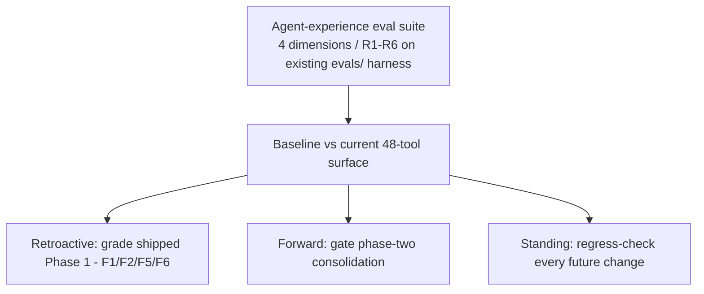
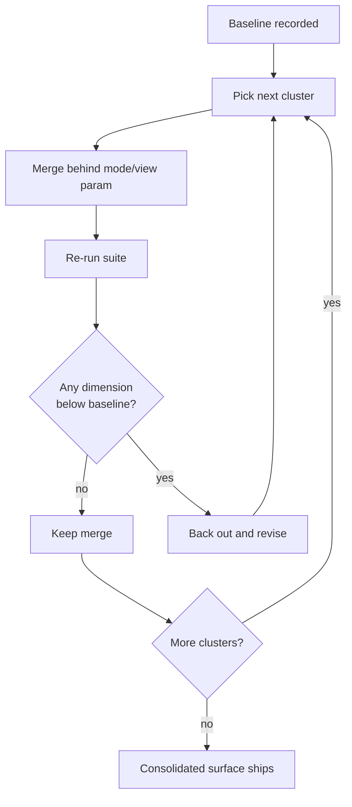
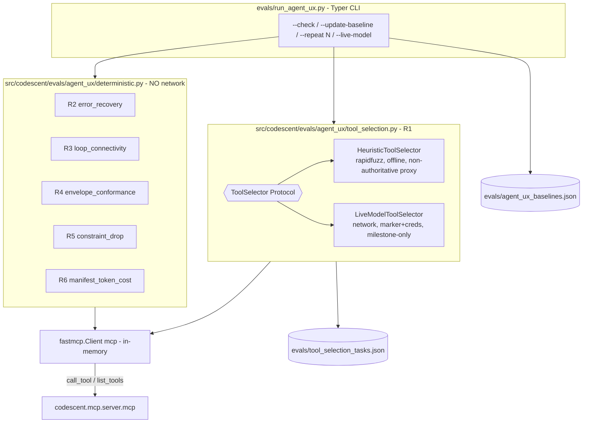
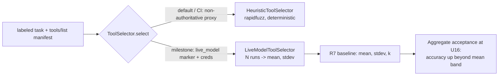
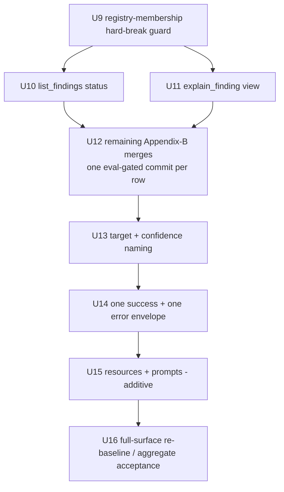

# Agent-Experience Evals & Surface Consolidation - Plan

## Goal Capsule

- **Objective:** Build a robust agent-experience eval suite for CodeScent's MCP surface, baseline it against the current 48-tool surface (which also grades Phase 1's already-shipped work), then run the audit's Phase-2 consolidation to ~31 tools — landed incrementally and gated against that baseline.
- **Product authority:** Robert Guss (owner). Grounded in `CODESCENT_MCP_UX_AUDIT.md` and its North Star — *get the right code into the model with fewer tokens and tighter focus*.
- **Open blockers:** none block planning. The eval harness fork is settled (hybrid: deterministic floor + model-driven behavioral). Early planning work: author the labeled task set and set per-dimension thresholds from the baseline. See Outstanding Questions.

---

## Product Contract

### Summary

Build an agent-experience eval suite — tool-selection accuracy, error-recovery and guided-loop completion, envelope conformance and constraint-drop detection, and manifest/description token cost — on the existing `evals/` harness, and baseline it against the current 48-tool surface. Then run the audit's F4/F3/F7 consolidation to ~31 tools, landed incrementally and gated against that baseline.

### Problem Frame

CodeScent's UX audit graded thirteen agent-experience dimensions and drove Phase 1 (error contract, guided loop, doc cleanup, constraint warnings) to completion — all on heuristic and reviewer judgment, with no runtime measurement of agent behavior. The North Star is asserted across the surface but never measured against an agent actually driving it.

The next audit step is a large, breaking consolidation of a 48-tool surface, justified by the ~7-tools-per-cluster heuristic and the smell of overlap rather than any observed tool-selection failure. Changing a surface that size on judgment alone leaves two questions unanswerable: whether 31 tools actually beat 48 for an agent, and whether the Phase 1 work already shipped moved the needle or only felt right. The existing harness measures retrieval precision and retrieval/answer token cost — not the `tools/list` manifest and description-layer cost, and not tool-selection, error-recovery, or loop-completion, the dimensions the scorecard grades lowest.

### Key Decisions

- **Evals before changes (measurement-first).** Build and baseline the suite before any consolidation lands. A heuristic-driven refactor of a pre-1.0 surface with no observed failure has no anchor otherwise; measurement makes the win provable and retroactively grades Phase 1.



- **One plan, two phases.** The eval suite and the consolidation share this contract; phase two is gated by phase one's baseline.
- **Deterministic floor, one model-driven dimension.** Only tool-selection (R1) needs a live model as the agent-under-test. Error-recovery (R2) reduces to a payload-content check and guided-loop completion (R3) to a `next_tools` graph-connectivity assertion (the audit's own F6 test), so both run deterministically alongside envelope conformance, constraint-drop, and token cost. This keeps the deterministic floor wide and the model surface minimal.
- **The model-driven dimension is net-new infrastructure.** R1's agent-under-test is a harness-side model driver — network, credentials, cost, run-to-run variance — which the existing deterministic `evals/` harness does not have and which the repo's stated "no runtime network access; local and deterministic" principle keeps out of the fact paths. Planning must name how the harness obtains a model (a hosted model, or a local / recorded-transcript surrogate) and reconcile it with that principle. The in-memory MCP client already used in tests supplies the tool-call plumbing; only the model driver is new.
- **Gate the model dimension against a measured noise band.** Because R1 carries run-to-run variance and a per-cluster task set is small, the baseline records R1 over repeated runs and stores its variance; a merge is backed out only when its score falls below baseline by more than that band (a minimum detectable effect), never on a single dip.
- **Hard break, no forwarding shims.** Pre-1.0 plus dynamic MCP tool discovery (`tools/list`) means a rename is invisible to a well-behaved client, so shims are carrying cost with no consumer to protect. Rests on the no-pinned-consumers assumption below.
- **Adopt audit Appendix B as the baseline consolidation mapping.** 48→31, seven groups each ≤7. It is a starting map, not a frozen spec — planning refines the specific merges.
- **`confidence` settles on the enum.** The `high`/`medium`/`low` sense wins; the numeric sense is renamed. Removes the triple-meaning overload.
- **Incremental, eval-gated landing.** One cluster per step, each measured against baseline, regressions backed out. Big-bang cannot isolate which merge hurt.
- **Eval task labels are the disambiguation spec.** The "task → correct tool" dataset defines which tool owns which job; wherever the correct tool is hard to name under the current 48, that is precisely the confusability the merge should resolve — so phase one steers phase two's priorities.

### Requirements

**Eval suite (phase one)**

The four measurement dimensions decompose into six requirements: tool-selection (R1); error-recovery + guided-loop (R2, R3); envelope conformance + constraint-drop (R4, R5); manifest/description token cost (R6). Only R1 is model-driven; R2–R6 run deterministically.

- R1. The suite measures tool-selection accuracy: given a labeled task, whether an agent picks the intended tool — scored against the current 48-tool surface as baseline and re-scored against the consolidated surface. This is the one model-driven dimension (see Key Decisions).
- R2. The suite measures error-recovery readiness: given a malformed input (unknown `finding_id`, invalid status, bad path or symbol), whether the returned error payload carries enough to reach a valid next call. A deterministic payload-content check — no model in the loop.
- R3. The suite measures guided-loop connectivity: whether the improvement spine (`plan → tests → verify → mark → rescan`) forms a connected chain via emitted `next_tools`, asserted deterministically as a graph over the registry (the audit's F6 test) — no model traversal required.
- R4. The suite measures envelope conformance: the share of tool responses that validate against exactly one success shape or one error shape.
- R5. The suite measures constraint-drop detection: whether a malformed constraint token (e.g. `size:banana`) is surfaced to the caller rather than silently applied as no filter.
- R6. The suite measures manifest and description token cost: the token size of the `tools/list` payload and the description layer — a new slice not covered by the existing retrieval/answer token baselines, recorded alongside them in the same baselines file.
- R7. The suite records a baseline snapshot of every dimension against the current 48-tool surface before any phase-two change lands — including R1's score over repeated runs and its variance — and is repeatable so any later change can be compared to that baseline.
- R8. Baselining checks Phase 1's shipped work (F1/F2/F5/F6) against its intended end-state — error payloads carry recovery data, the `next_tools` spine connects, malformed constraints surface — and reports any dimension whose contract is not met at baseline. Because the suite is built after Phase 1 shipped, this is an absolute end-state check, not a before/after delta.

**Surface consolidation (phase two)**

- R9. The surface consolidates from 48 to ~31 tools, every group ≤7, capability preserved behind `mode`/`status`/`view`/`kind` parameters (baseline mapping: audit Appendix B).
- R10. The locator parameter is standardized to `target` across the surface; `query` is reserved for free-text search.
- R11. Responses adopt one success envelope and one error envelope, and `confidence` resolves to the single enum meaning, with the numeric sense renamed.
- R12. Six `codescent://` resources expose browsable nouns — `finding/{id}`, `backlog`, `repo-map`, `architecture`, `improvement-plan`, `progress` — backed by existing services.
- R13. Prompts pre-fetch their context, and three prompts are added: `improve_top_finding`, `resume_session`, `review_diff`.
- R14. The consolidation is a hard break: old tool names are removed, with no forwarding shims. A registry-membership test guards the break, failing the build on any `next_tools` edge or prompt body that references a removed tool name.
- R15. Consolidation lands incrementally, one cluster per step; each step is compared to the eval baseline and backed out only when a dimension falls below baseline by more than its measured noise band. Per-cluster gating is a non-regression floor; the acceptance evidence for 48→~31 is a full-surface re-baseline at the end of phase two showing measurable aggregate improvement (see Success Criteria).

### Key Flows

- KF1. Eval-gated cluster merge
  - **Trigger:** Phase-one baseline is recorded and a consolidation cluster is ready to merge.
  - **Steps:** Merge one cluster behind its `mode`/`view` parameter; re-run the suite; compare each dimension to baseline; if nothing regresses and the target dimension holds or improves, keep the merge and take the next cluster; if a dimension regresses, back out and revise.
  - **Outcome:** Every landed tool-merge cluster is measured against baseline, and no cluster ships a dimension below its noise band. Resources and prompts (R12, R13) are additive and measurement-exempt — see Scope Boundaries.
  - **Covered by:** R7, R15.



### Acceptance Examples

- AE1. Regression back-out. **Given** the baseline tool-selection accuracy for a cluster's tasks, **when** merging that cluster drops accuracy below baseline, **then** the merge is backed out rather than shipped. **Covers** R15.
- AE2. Constraint-drop caught. **Given** a search call with `constraints="size:banana"`, **when** the suite runs the constraint-drop dimension, **then** it passes only if the response surfaces the dropped token — validating F2. **Covers** R5.
- AE3. Retroactive finding. **Given** the guided-loop connectivity check at baseline, **when** the `next_tools` graph has no path from `plan_refactor` through `mark_finding` to `rescan`, **then** the suite reports it as a finding even though F6 is marked shipped. **Covers** R3, R8.
- AE4. Error recovery. **Given** a call with an unknown `finding_id`, **when** the suite runs the error-recovery dimension, **then** it passes only if the error payload lets the agent reach a valid id without an out-of-band failure. **Covers** R2.

### Success Criteria

| Signal | Bar |
|---|---|
| Baseline coverage | A baseline snapshot exists for all six requirements (R1–R6 — the four dimensions decompose into these) against the 48-tool surface before any phase-two change, including R1's variance across repeated runs. |
| Per-cluster gate | No cluster merge drops any dimension below its 48-tool baseline by more than the measured noise band. |
| Aggregate acceptance | An end-of-phase-two full-surface re-baseline shows measurable tool-selection improvement and lower manifest/description token cost for 48→~31 — not merely non-regression. This is the evidence that 31 beats 48. |
| Envelope conformance | 100% of responses validate against one success or one error shape after phase two. |
| Standing harness | The suite is repeatable and gates any subsequent surface change, not just this one. |

Threshold values themselves are unset — see Outstanding Questions.

### Scope Boundaries

**Deferred for later**

- Phase 3 hardening: the single guarded `state_path()` write choke, removing raw `sqlite3` from the transport layer, and index hygiene (exclude nested worktrees / `.omo`, severity-gate the finding firehose).

**Outside this effort**

- A general agent-quality benchmark beyond the four chosen dimensions.
- Retrieval precision — already covered by the existing precision eval; extend it, do not rebuild.
- Resources (R12) and prompts (R13) are measurement-exempt: purely additive, with no prior behavior to regress, so no eval dimension covers them and the per-cluster gate does not apply to them.

### Dependencies / Assumptions

- The existing `evals/` harness (`run_precision.py`, `run_token_efficiency.py`, `token_baselines.json`) is the foundation the deterministic dimensions (R2–R6) extend. R1's model-driven agent-under-test is net-new infrastructure, not an extension (see Key Decisions).
- `rapidfuzz` is already a declared dependency (the F1 recovery payloads use it).
- **Assumption — no *external* pinned consumers.** No external client pins the current tool names (agents discover via `tools/list`), which is what makes the hard break safe for them. Internal consumers do pin names as strings — `next_tools` chains and prompt bodies reference tool names literally — so R14's registry-membership test guards the break. If a pinned external config or saved script exists, revisit shims.
- **Assumption — Phase 1 shipped as reported.** F1/F2/F5/F6/F11 are landed (confirmed against source during brainstorm grounding). R8 re-checks the end-state of the four graded findings (F1/F2/F5/F6); F11 (`answer_pack` budget) is taken as landed and is not one of the graded dimensions.
- Consolidation will repoint work shipped in Phase 1: the F5 descriptions and F6 `next_tools` chains for every merged tool are rewritten (e.g. a `next_tools` pointing at `get_finding_context` must repoint to the merged `explain_finding(view="context")`).

### Outstanding Questions

**Deferred to planning**

- What defines "correct tool" per task, and who authors the labeled task set? This dataset is the disambiguation spec — its first pass should land early in planning, since it steers which phase-two merges matter most.
- Per-dimension pass/fail thresholds (accuracy floor, token-cost delta target, conformance percentage) — set from what the baseline reveals.
- Task-case count and coverage per dimension.
- Where baselines are stored and whether the suite runs in CI.
- Per-cluster merge order within phase two.

### Sources / Research

- `CODESCENT_MCP_UX_AUDIT.md` — findings F1–F11, the 13-dimension scorecard, Appendix A (per-tool doc table), Appendix B (48→31 consolidation mapping), and roadmap item 16 (the agent-UX eval this plan promotes to first).
- `core/public_surface.py` — authoritative 48-tool grouping (repository 6 / search 6 / context 8 / health 15 / planning 9 / risk 2 / guidance 2).
- `evals/` — existing precision and token-efficiency harness and `token_baselines.json` the suite builds on.
- Recent commits (#12 recoverable errors + guided loop; #14 finding-path persistence + telemetry) — the Phase 1 shipped state the baseline will grade.

---

## Planning Contract

**Product Contract preservation:** Product Contract unchanged in scope, with one label clarification — the Key Flow formerly "F1. Eval-gated cluster merge" is renamed **KF1** to stop it colliding with the audit findings' `F1`–`F11` namespace (a coherence fix, no behavior change). No R/A/F/AE ID, scope boundary, or success criterion was altered. Planning resolved the five *Deferred to planning* questions into decisions (below) and enriched the artifact with implementation units, a technical design, a verification contract, and a definition of done. Two Product Contract decisions are *operationalized* (not rewritten) in the Planning Contract after review surfaced they were under-specified: (a) the per-cluster "measured noise band" back-out (R15/AE1/KF1) is realized as the deterministic dims + R6, with R1 a milestone signal — the Product Contract text stands and the residual is flagged to the product authority in Open Questions; (b) the "no network in eval paths" reconciliation for R1 is corrected to an explicit owner carve-out rather than a silent assumption. The *review* open question (F10 pull-forward) remains a product-authority decision — carried to Open Questions, not resolved unilaterally.

**Depth:** Deep (cross-cutting, two-phase, a breaking public-surface consolidation, one net-new network-touching dimension, high blast radius on `mcp/*_tools.py` and contract tests).

### Resolved planning questions

The five *Deferred to planning* questions from the Product Contract, resolved from research (headless mode — Inferred bets that the owner may still overturn are also listed under **Assumptions**):

1. **"Correct tool" definition + task-set authorship (R1).** A task's *correct tool* is the single tool whose documented job the task names; a task is *confusable* when two or more current tools could plausibly own it — and those confusable pairs are exactly the phase-two merge targets. The labeled set is a committed JSON file `evals/tool_selection_tasks.json` (`[{task, intended_tool, cluster, confusable_with, rationale}]`), seeded from the existing scripted spine in `evals/agent_task.md` plus the confusability pairs implied by audit Appendix B. Authored by the product authority in a first pass (U8), reviewed as the disambiguation spec. Every `intended_tool` must resolve against `registered_mcp_tool_names()`.
2. **Per-dimension thresholds and the per-cluster vs milestone split.** Deterministic dimensions (R2, R3, R4, R5) are contract checks — their gate is *no regression* against the committed baseline with a tiny tolerance, mirroring `check_regression`'s `REGRESSION_TOLERANCE = 1e-9`. R6 records absolute token counts and gates on *no increase* (phase two must lower them). These five run offline and deterministically, so **they are the per-cluster gate** — the enforceable back-out signal for every merge (this is how the Product Contract's R15/KF1/AE1 "measured noise band" back-out is operationalized). R1 is scored as accuracy in `[0,1]` and its baseline stores `{mean, stdev, k}` (`k` default `2`, tunable via the baseline file). But **R1 is NOT a per-cluster gate**: its authoritative score comes only from live-model runs, a per-cluster task set is ~2–3 near-binary outcomes (stdev not reliably estimable, so `mean − k·stdev` is meaningless at that granularity), and live runs are costly and off-by-default. R1 is therefore measured authoritatively at **milestones only** — baseline (U8) and end-of-phase-two (U16) — as the aggregate-acceptance signal (Success Criteria "Aggregate acceptance"), with the offline heuristic selector giving a non-authoritative per-cluster proxy that gates nothing. This operationalizes the Product Contract faithfully (R6's token band is a clean per-cluster noise band; R1's band is a milestone band) without rewriting it — see the residual flagged to the product authority in Open Questions. Absolute thresholds are recorded from the first baseline, not guessed here.
3. **Task-case count / coverage per dimension.** R2: the four recovery sites × ≥2 variants each (≥8 cases). R3: the full eight-edge spine (single deterministic graph). R4: every one of the 48 tools sampled once for its success shape plus a representative error, so the conformance share is over the whole surface. R5: the three constraint-accepting search tools × four malformed-token families (`size:`, `mtime:`, `git:`, unknown scheme). R6: one whole-manifest measurement plus a per-group breakdown. R1: ≥2–3 tasks per phase-two merge cluster (~20–30 tasks total), because the labels steer which merges matter.
4. **Baseline storage + CI.** One committed file `evals/agent_ux_baselines.json` holding the deterministic-dimension scores, R6 token counts, and R1's recorded mean/stdev/`k`. The deterministic dimensions (R2–R6) wire into `.github/workflows/ci.yml` as one `run_agent_ux.py --check` gate step, mirroring the precision gate. **CI today triggers on `workflow_dispatch` only** — the gate exists but is not auto-enforced on PRs; this is a known repo posture, not a plan gap. R1's live-model path is **not** in the default gate (it is marker-gated and credential-gated); a separate opt-in dispatch runs it to (re)record the baseline and measure variance.
5. **Per-cluster merge order (phase two).** Highest-value / lowest-risk first, per audit F4: `list_findings(status=…)`, then `explain_finding(view=…)`, then `code_relations(target, kind=…)`, `search(queries, output_mode=…)`, `scan_code_health(compare=…)`, `plan_tests(mode, scaffold=…)`, `review_diff_risk(path=…)`, `get_repo(view=…)`, the `verify_change`→`record_verification` merge, then the two pure regroups. Cross-cutting work (`target` standardization, `confidence` resolution, envelope unification) lands after the two anchor merges prove the harness; additive resources/prompts land last. The registry-membership guard (R14) lands **first** so every merge is protected.

---

## High-Level Technical Design

### Suite architecture — the no-network boundary is a module boundary

The deterministic dimensions (R2–R6) stay inside the pure-Python floor and reuse the existing in-memory `Client(mcp)` plumbing. R1's model driver is the single network-touching component, isolated in its own module, reached only through a `ToolSelector` Protocol, and never imported by the deterministic path or the default CI gate.



*Directional guidance for reviewers, not an implementation spec.* The load-bearing invariant: `deterministic.py` imports neither `tool_selection.py` nor any network client, so the default `--check` path stays green offline and network-free. **Caveat (owner policy):** `AGENTS.md:37` forbids "LLM/network in indexing, scan, search, context, or **eval** paths" *unqualified*; only `AGENTS.md:110` narrows it to "deterministic eval paths." The opt-in `--live-model` R1 path is an eval path that calls an LLM, so the module boundary keeps the *default* path compliant but does not by itself grant the live path a carve-out — that carve-out is an explicit owner decision (see Open Questions), not something this plan silently assumes.

### R1 selector strategy — two implementations, one Protocol

R1's authoritative score comes from a live model (the only source of real run-to-run variance, which R7's noise band needs). It is measured at **milestones only** — baseline (U8) and end-of-phase-two (U16) — never as a per-cluster gate (a per-cluster task set is too small to estimate stdev; see Resolved Q2). The offline heuristic selector keeps the default suite deterministic and CI-green as a non-authoritative proxy that gates nothing; the per-cluster gate is the deterministic dims + R6, not R1.



The live selector reaches a model through a thin `ModelClient` seam the owner wires (hosted endpoint over the already-present `httpx`, or a local model). The exact provider is an Open Question; the Protocol and the deterministic proxy are not. `RecordedToolSelector` was considered and dropped: a replay is valid only for the surface hash it was recorded on, so every phase-two merge invalidates it, and the heuristic proxy already covers the offline slot — a second offline selector plus a committed transcript earned no keep (scope-guardian, review round 1).

### Phase-two dependency shape



---

## Output Structure

New and touched files (phase one creates a new eval subpackage + committed data files):

```text
src/codescent/evals/
  agent_ux/                     # NEW subpackage — the suite
    __init__.py                 # build_agent_ux_report() aggregator + dimension registry
    _client.py                  # in-memory Client(mcp) helpers + tmp-repo builder (kills _json dup for new code)
    _graph.py                   # shared next_tools graph collect + BFS (R3; imported by contract test)
    models.py                   # frozen Pydantic result models: DimensionResult, AgentUxReport
    schemas.py                  # R4 target success + error JSON schemas (jsonschema)
    deterministic.py            # R2–R6 scorers (NO network)
    tool_selection.py           # R1: ToolSelector Protocol + Heuristic (offline) + LiveModel (milestone) impls
evals/
  run_agent_ux.py               # NEW Typer CLI runner (--check/--update-baseline/--repeat/--live-model/--phase1-report)
  agent_ux_baselines.json       # NEW committed baseline (deterministic + R6 tokens + R1 mean/stdev/k)
  tool_selection_tasks.json     # NEW labeled task set (the disambiguation spec)
tests/evals/
  test_agent_ux_harness.py      # runner + models + client plumbing
  test_agent_ux_token_cost.py   # R6
  test_tool_selection.py        # R1 heuristic (deterministic) + marker-gated live smoke
  test_tool_selection_tasks.py  # task-set schema + coverage validation
  test_agent_ux_baseline_gate.py# R7 + AE1 gate math
  test_agent_ux_phase1_report.py# R8 retroactive report
tests/contract/
  test_agent_ux_envelope.py     # R4
  test_agent_ux_error_recovery.py# R2 (AE4)
  test_agent_ux_constraint_drop.py# R5 (AE2)
  test_no_dangling_tool_refs.py # NEW (U9) — no next_tools/prompt refs a removed tool
```

The tree is a scope declaration, not a constraint; per-unit **Files** lists are authoritative.

---

## Implementation Units

U-IDs are stable. Phase one (U1–U8) builds and baselines the suite; phase two (U9–U16) consolidates the surface, gated against that baseline.

### Phase One — Eval suite & baseline

### U1. Suite scaffolding, in-memory-client plumbing, and runner skeleton

- **Goal:** Stand up the `agent_ux` subpackage, the shared in-memory MCP-client helpers, the frozen result models, and the Typer runner — so later units add one dimension each against a working harness.
- **Requirements:** foundation for R1–R8.
- **Dependencies:** none.
- **Files:** `src/codescent/evals/agent_ux/__init__.py`, `src/codescent/evals/agent_ux/_client.py`, `src/codescent/evals/agent_ux/models.py`, `evals/run_agent_ux.py`, `tests/evals/test_agent_ux_harness.py`.
- **Approach:** `_client.py` exposes `call_tool_json(client, name, args)` (calls with `raise_on_error=False`, asserts a single `TextContent`, `json.loads` its `.text`), `list_tools_manifest(client)` (name/description/inputSchema), and `build_indexed_repo(tmp_path)` (copy `tests/fixtures/python-basic` to scratch, `ConfigService(repo).save(STRICT_CONFIG)`, `scan_code_health`) — one shared home for the helper duplicated across ~18 test files (new code only; do not refactor existing tests). `models.py`: `DimensionResult{name, score, detail}` and `AgentUxReport{repo, dimensions, tokens, tool_selection}` as frozen Pydantic (`ConfigDict(frozen=True)`), mirroring `TokenEfficiencyReport`. `run_agent_ux.py`: Typer `main` with `--check`, `--update-baseline`, `--repeat`, `--live-model`, JSON to stdout, `raise typer.Exit(code=1)` on regression — a thin copy of `evals/run_precision.py`. The aggregator reads a dimension registry that later units append to.
- **Patterns to follow:** `evals/run_precision.py` (CLI + gate shape), `src/codescent/evals/token_efficiency.py` (frozen report models, deterministic tmp-repo recipe), `tests/contract/test_mcp_error_contract.py:258` (`_json` helper being centralized).
- **Test scenarios:**
  - `call_tool_json` returns a parsed dict for a known good call (`get_repo_status`).
  - `call_tool_json` returns the error payload dict (not a raise) for a failing call.
  - `list_tools_manifest` returns 48 entries, each with a non-empty description.
  - `build_indexed_repo` yields a repo whose `.codescent` state exists and `scan_code_health` returns findings.
  - Runner with an empty dimension registry exits 0 and emits valid JSON.
- **Verification:** `uv run python evals/run_agent_ux.py` emits a JSON report; `uv run pytest tests/evals/test_agent_ux_harness.py` green; `basedpyright` + `ruff` clean.

### U2. R4 — envelope conformance dimension

- **Goal:** Measure the share of tool responses that validate against exactly one target success schema or the one error schema. Baseline it honestly — it is below 100% today (multiple success shapes coexist), and driving it to 100% is phase two's job.
- **Requirements:** R4; feeds R7, R8.
- **Dependencies:** U1.
- **Files:** `src/codescent/evals/agent_ux/schemas.py`, `src/codescent/evals/agent_ux/deterministic.py`, `tests/contract/test_agent_ux_envelope.py`.
- **Approach:** Define the target success schema `{ok, kind, data|items, warnings, confidence, next_tools, result_id?, retrieval_*?}` and the error schema `{ok:false, code, message, recoverable, data}` (from `ToolErrorBoundary`) as `jsonschema` documents (`jsonschema` is an installed dev dep). `envelope_conformance()` drives every one of the 48 tools once for a representative success call plus one representative error, validates each response against the two schemas, and scores `validates_exactly_one / total`. Record which tools fail so the number is explainable, not a bare fraction. **Arg orchestration (feasibility review):** a representative success call for some tools needs state from a prior call — a `result_id` (for `retrieve_result`), a valid `finding_id` (for the finding/planning family), an active task. The driver builds this state per-tool via the existing contract-test recipes (scan → capture a finding id / result id), so `envelope_conformance()` needs a per-tool valid-args map, not a single generic call. Reuse the arg-construction patterns from `tests/contract/test_mcp_finding_tools.py` / `test_mcp_retrieve_result.py` rather than inventing them.
- **Patterns to follow:** `tests/contract/test_mcp_tool_surface.py` (`list_tools` introspection), `src/codescent/mcp/error_boundary.py:50` (error shape), `core/models.py:321` `ResponseEnvelope` and `finding_payloads.py:252` `bounded_finding_list` (the two dominant success shapes to reconcile against).
- **Test scenarios:**
  - A response matching the target success schema counts as conforming.
  - The uniform error envelope validates against the error schema.
  - A known ad-hoc payload (e.g. `retrieve_result`, `context_stats` — bare dicts lacking `ok`) counts as non-conforming.
  - A response matching *both* schemas (should be impossible) counts as non-conforming (exactly-one).
  - Conformance share equals conforming-count / 48 for a fixed manifest.
- **Verification:** dimension appears in the report with a share in `[0,1]`; `tests/contract/test_agent_ux_envelope.py` green.

### U3. R2 — error-recovery dimension

- **Goal:** Deterministically verify that each of the four malformed-input sites returns a *recoverable* error carrying enough to reach a valid next call.
- **Requirements:** R2; feeds R7, R8 (F1). **Covers AE4.**
- **Dependencies:** U1.
- **Files:** `src/codescent/evals/agent_ux/deterministic.py`, `tests/contract/test_agent_ux_error_recovery.py`.
- **Approach:** `error_recovery()` builds an indexed repo, then for each site issues the malformed call via `call_tool_json` and asserts: `result.is_error`, payload `ok is False`, a *domain* `code` (not `internal`), and site-appropriate recovery data under `data` — unknown `finding_id`→`available_options` + `fix_hint` (`storage/repositories/findings.py:256`), invalid `mark_finding` status→`valid_values` + `fix_hint` (`finding_payloads.py:518`), bad symbol→`suggestions` + `fix_hint` (`services/symbols.py:117`), bad path→`suggestions` + `fix_hint` (`mcp/context_tools.py:239`). Score = share of cases that are recoverable with actionable data.
- **Patterns to follow:** `tests/contract/test_mcp_error_contract.py` (the exact assertions, lifted into a scorer).
- **Test scenarios:**
  - `get_finding` unknown id → recoverable, `available_options` non-empty, `code == not_found`.
  - `mark_finding status="banana"` → recoverable, `valid_values` lists the enum, `code == invalid_value`.
  - `get_symbol_context` one-char typo → `suggestions` leads with the near name.
  - `get_file_context` bad path → `suggestions` non-empty.
  - An unhandled/internal error (simulated) scores as non-recoverable, proving the metric distinguishes the two axes.
- **Verification:** dimension scores 1.0 at baseline (all four sites shipped in Phase 1) or reports which site fell short (R8 retroactive value).

### U4. R5 — constraint-drop dimension

- **Goal:** Deterministically verify that a malformed constraint token is surfaced to the caller, not silently applied as no-filter.
- **Requirements:** R5; feeds R7, R8 (F2). **Covers AE2.**
- **Dependencies:** U1.
- **Files:** `src/codescent/evals/agent_ux/deterministic.py`, `tests/contract/test_agent_ux_constraint_drop.py`.
- **Approach:** `constraint_drop()` calls the three constraint-accepting search tools (`search_files`, `search_content`, `multi_search_content`) with malformed tokens from four families (`size:banana`, `mtime:soon`, `git:nonsense`, `bogus:1`) and asserts the token appears in the response's `constraint_warnings` and that `confidence` is downgraded (not `high`). Score = share of (tool × token) cases surfaced. Note the three non-constraint search tools (`search_changed_files`/`search_todos`/`search_tests`) never receive `constraints` and are excluded.
- **Patterns to follow:** `src/codescent/mcp/search_tools.py:447` `_advisory_fields`, `engine/search/constraints.py:172` `constraint_warnings`, `tests/integration/test_constraints_dsl.py`.
- **Test scenarios:**
  - `search_content(query="parse", constraints="size:banana")` → `constraint_warnings` names the token; results are NOT silently unfiltered-as-success with `confidence:"high"`.
  - Each of the four token families surfaces on each of the three tools (12 cases).
  - A *well-formed* constraint (`size:<10kb`) produces no warning and is applied — proving the metric does not false-positive.
- **Verification:** dimension scores 1.0 at baseline; a regression to silent-drop would drop the share.

### U5. R3 — guided-loop connectivity dimension

- **Goal:** Deterministically assert the improvement spine forms a connected `next_tools` chain and every target is a registered tool — the audit's F6 test, promoted from a single contract test to a scored, reusable dimension.
- **Requirements:** R3; feeds R7, R8 (F6). **Covers AE3.**
- **Dependencies:** U1.
- **Files:** `src/codescent/evals/agent_ux/_graph.py`, `src/codescent/evals/agent_ux/deterministic.py`, `tests/contract/test_next_tools_chain.py` (refactor to import the shared helper).
- **Approach:** Extract `collect_next_tools(client)` and `bfs(start, graph)` from `tests/contract/test_next_tools_chain.py` into `_graph.py` so both the existing contract test and the new dimension call one implementation (reuse, not duplication). `loop_connectivity()` builds the live graph, runs BFS from `scan_code_health`, and scores 1.0 iff `mark_finding` and `record_verification` are reachable AND every `next_tools` target (after stripping `:arg`) resolves against `registered_mcp_tool_names()`; otherwise it reports the dead-ends/dangling targets as findings.
- **Patterns to follow:** `tests/contract/test_next_tools_chain.py` (`_EXPECTED`, `_collect_next_tools`, `_bfs`), `core/public_surface.py:271` `registered_mcp_tool_names()`.
- **Execution note:** Preserve the existing contract test's assertions when extracting the helper — the refactor must leave `test_next_tools_chain.py` green.
- **Test scenarios:**
  - Baseline graph: BFS from `scan_code_health` reaches `mark_finding` and `record_verification` → score 1.0.
  - A synthetic graph with a spine dead-end (empty `next_tools` on `plan_refactor`) scores < 1.0 and names `plan_refactor`.
  - A synthetic `next_tools` target not in the registry is reported as dangling (guards the phase-two hard break at eval level too).
  - `answer_pack`'s deep-link form (`get_symbol_context:<qn>`) resolves after `:arg` stripping.
- **Verification:** `uv run pytest tests/contract/test_next_tools_chain.py` green (the refactor leaves it passing); dimension in report.

### U6. R6 — manifest & description token-cost dimension

- **Goal:** Measure the token size of the `tools/list` payload and the description layer, recorded alongside the existing token baselines — the metric that will prove 48→~31 lowers manifest cost.
- **Requirements:** R6; feeds R7, R8 (F5).
- **Dependencies:** U1.
- **Files:** `src/codescent/evals/agent_ux/deterministic.py`, `tests/evals/test_agent_ux_token_cost.py`.
- **Approach:** `manifest_token_cost()` runs `list_tools()` and sums `estimate_tokens` over each tool's name + description + serialized `inputSchema` (JSON), reporting a total and a per-group breakdown (groups from `core/public_surface.py`). Reuse `src/codescent/core/token_estimate.py:28` `estimate_tokens` — the same heuristic the token-efficiency benchmark uses; do **not** add a tokenizer library.
- **Patterns to follow:** `src/codescent/evals/token_efficiency.py` (counting via `estimate_tokens`, frozen report), `tests/contract/test_mcp_tool_surface.py:258` (`_descriptions`).
- **Test scenarios:**
  - Total token count is a positive int and equals the sum of per-group counts.
  - Count is deterministic across two runs on a fixed manifest.
  - Removing a tool from a synthetic manifest lowers the count (monotonic — the property phase two relies on).
- **Verification:** dimension records absolute token counts in the report; number is stable run-to-run.

### U7. R1 — tool-selection dimension (pluggable selector infra)

- **Goal:** Build the one model-driven dimension with the no-network boundary as a module boundary: a `ToolSelector` Protocol with a deterministic offline proxy and a milestone-only live-model path that produces the run-to-run variance R7 needs.
- **Requirements:** R1; feeds R7.
- **Dependencies:** U1.
- **Files:** `src/codescent/evals/agent_ux/tool_selection.py`, `pyproject.toml` (register a `live_model` pytest marker), `tests/evals/test_tool_selection.py`.
- **Approach:** `ToolSelector` Protocol: `select(task: str, manifest: list[ToolInfo]) -> str`. Two impls — `HeuristicToolSelector` (rank tools by `rapidfuzz` overlap of task text vs description; offline, deterministic, explicitly non-authoritative proxy that scores on any surface) and `LiveModelToolSelector` (calls a `ModelClient` seam over the owner-wired provider; network; behind the `live_model` marker + `skipif` on a credentials env var; runs `--repeat N` times to yield a mean and stdev). `tool_selection()` scores accuracy = share where `select(...) == intended_tool`. The live selector's module never imports the deterministic path and is never imported by `--check`; it runs only at milestones (U8/U16). `RecordedToolSelector` was dropped in review — a replay is valid only for the recorded surface hash, so every merge invalidates it (see HTD).
- **Patterns to follow:** `services/subjective_review.py:115` `SamplingChannel` Protocol + `tests/unit/test_subjective_sampling.py._Channel` (the injected-fake idiom), `src/codescent/core/fuzzy.py:nearest_matches` (rapidfuzz usage), `evals/precision_harness.py` (frozen models, baseline shape).
- **Execution note:** The default suite path is the deterministic heuristic proxy; the live path is opt-in only and must never run in the default CI gate or emit warnings offline (`filterwarnings=["error"]`, `--strict-markers`).
- **Test scenarios:**
  - `HeuristicToolSelector` picks the intended tool for an unambiguous task (`"search for the string TODO in files"` → a search tool) deterministically.
  - `HeuristicToolSelector` scores against a mutated manifest without error (unlike a recorded replay) — it must survive every phase-two surface.
  - `tool_selection()` computes accuracy correctly for a fixture task set with a known selector.
  - Live selector test is collected only under the `live_model` marker and `skip`s cleanly with no credentials (no network attempted, no warning emitted).
- **Verification:** `uv run pytest tests/evals/test_tool_selection.py` green offline (live skipped); accuracy score present in the report via the heuristic proxy.

### U8. Labeled task set, baseline snapshot (R7), retroactive Phase-1 report (R8), gate, CI wiring

- **Goal:** Author the disambiguation task set, wire all six dimensions into one aggregated report, record the committed baseline (including R1 mean/stdev over repeated live runs), implement the non-regression + noise-band gate (the AE1 back-out mechanism), add the R8 retroactive Phase-1 end-state report, and wire the deterministic gate into CI.
- **Requirements:** R7, R8; the task set completes R1. **Covers AE1, AE3.**
- **Dependencies:** U2, U3, U4, U5, U6, U7.
- **Files:** `evals/tool_selection_tasks.json`, `src/codescent/evals/agent_ux/__init__.py`, `evals/run_agent_ux.py`, `evals/agent_ux_baselines.json`, `.github/workflows/ci.yml`, `tests/evals/test_tool_selection_tasks.py`, `tests/evals/test_agent_ux_baseline_gate.py`, `tests/evals/test_agent_ux_phase1_report.py`.
- **Approach:** Author `tool_selection_tasks.json` with ≥2–3 tasks per phase-two merge cluster, each labeled with `intended_tool`, `cluster`, and `confusable_with`. `build_agent_ux_report()` aggregates R1–R6. `--update-baseline` writes `agent_ux_baselines.json` (deterministic scores, R6 token counts, and — when run with `--live-model` — R1 `{mean, stdev, k}` from `--repeat N` live runs). The **default offline `--check` is the per-cluster gate**: it compares the deterministic dims (regression-tolerance vs baseline) and R6 (no-increase), and treats a vanished dimension as a full regression (per `check_regression` semantics). R1 is **not** in the default `--check` — it is scored only when `--live-model` is passed (milestones U8/U16), and its `score >= mean − k·stdev` comparison is a milestone aggregate check, not a per-cluster gate (see Resolved Q2 for why small per-cluster task sets make the band un-estimable). `--phase1-report` runs R2/R3/R4/R5/R6 against the current 48-tool surface and flags any Phase-1 finding (F1/F2/F5/F6) whose contract is unmet — an absolute end-state check. Add one CI step to `.github/workflows/ci.yml` running `run_agent_ux.py --check` (offline, deterministic) after the precision gate.
- **Patterns to follow:** `evals/run_precision.py` (`--check`/`--update-baseline`, `Exit(1)`, `check_regression`), `.github/workflows/ci.yml:56-57` (the precision gate step to mirror).
- **Test scenarios:**
  - Every `intended_tool` in the task set resolves against `registered_mcp_tool_names()`; every phase-two cluster has ≥1 task (coverage assertion).
  - `--update-baseline` then `--check` on an unchanged surface exits 0.
  - **AE1 (per-cluster):** a synthetic deterministic-dimension (or R6 token-cost) regression makes the offline `--check` exit 1 and name the dimension — this is the enforceable per-cluster back-out signal.
  - **R1 milestone check:** with `--live-model`, an R1 aggregate below `mean − k·stdev` is reported at the milestone; a score within the band passes (a single dip does not fail). Not exercised by the default `--check`.
  - A vanished baseline dimension fails `--check` (can't bypass the gate by deleting a dimension).
  - **AE3:** `--phase1-report` reports any spine dead-end even though F6 is marked shipped.
  - **R8:** the phase-1 report names F1/F2/F5/F6 dimensions and their pass/fail against end-state.
- **Verification:** `uv run python evals/run_agent_ux.py --update-baseline` writes the baseline; `--check` exits 0; CI step present; `uv run pytest tests/evals` green (beyond the 16-red docs baseline).

### Phase Two — Surface consolidation (eval-gated, incremental)

Every phase-two unit lands as its own commit, re-runs the offline `run_agent_ux.py --check` (deterministic dims + R6 — the per-cluster gate), and is backed out if any dimension regresses beyond its band (R15, KF1). Each also updates `core/public_surface.py`, the FastMCP registration, and contract tests.

**The per-merge repoint discipline must include the eval instrument itself** (feasibility review round 1). A merge that removes a tool name breaks not only `next_tools`/prompt bodies/descriptions but the name-pinned eval scorer — so each merge unit repoints, in the same commit: (a) `next_tools`, prompt bodies, and description prose for merged tools; (b) the R2 site map in `src/codescent/evals/agent_ux/deterministic.py` (e.g. the unknown-`finding_id` recovery call moves from `get_finding` to `explain_finding`); (c) `intended_tool` values in `evals/tool_selection_tasks.json` (a task whose intended tool is merged is repointed to the merged name — this is the designed confusability resolution); (d) the R3 `_EXPECTED` edge map. Otherwise the gate meant to protect the merge fails *on* the merge.

**Measurement-validity note.** Because `intended_tool` labels are repointed as tools merge, the U16 aggregate R1 accuracy is compared to the U8 baseline **on the evolved label set, by design** — "R1 up beyond the noise band" is a claim about the consolidated surface's tool-selection, not a frozen 48-tool label set. R6 token cost, by contrast, is compared on identical measurement code across surfaces, so it is the surface-invariant headline metric.

### U9. Registry-membership hard-break guard (lands first)

- **Goal:** Fail the build on any string-pinned reference to a removed tool name — the guard that makes the shim-free hard break safe (R14) before any merge lands. The guard net must cover the whole string-pinned internal surface, not just `next_tools`.
- **Requirements:** R14.
- **Dependencies:** U8 (baseline recorded).
- **Files:** `tests/contract/test_no_dangling_tool_refs.py`, `tests/contract/test_public_surface_registry.py` (extend).
- **Approach:** A contract test that collects every string-pinned tool reference and asserts each resolves against `registered_mcp_tool_names()`. Sources to scan (feasibility + adversarial review round 1 flagged that `next_tools` + prompts alone is too narrow): (a) `next_tools` targets (live via `Client(mcp)`, `:arg` stripped); (b) tool-name literals in `src/codescent/mcp/prompts.py`; (c) **tool names named in prose inside every tool `description` string** (descriptions cross-reference siblings, e.g. `finding_tools.py:83` "Use scan_code_health"); (d) the R1 seed `evals/agent_task.md`'s required-tool sequence and `intended_tool` values in `evals/tool_selection_tasks.json` (validated against the registry by U8's coverage test — this guard makes that failure a build gate, not a surprise). Extend `test_public_surface_registry.py` so the `ABSENT`/`REGISTERED` frozenset split is the single source of truth the merges flip.
- **Patterns to follow:** `tests/contract/test_public_surface_registry.py`, `tests/contract/test_next_tools_chain.py:62` (target-is-registered assertion), `src/codescent/mcp/prompts.py`, `src/codescent/mcp/finding_tools.py:83` (a description that names a sibling tool).
- **Test scenarios:**
  - Current surface passes (all references resolve).
  - A synthetic `next_tools` pointing at a removed name fails.
  - A prompt body naming a removed tool fails.
  - A tool description naming a removed sibling tool in prose fails.
  - `agent_task.md` / `tool_selection_tasks.json` naming a removed tool fails.
- **Verification:** `uv run pytest tests/contract/test_no_dangling_tool_refs.py` green now, red under any dangling reference in `next_tools`, prompts, descriptions, or the eval seed docs.

### U10. Merge → `list_findings(status=…)`

- **Goal:** Merge `get_smell_report`, `get_backlog`, `get_regressions`, `get_progress` into `list_findings(status="all|open|backlog|regressed")` (default `all` == old `get_smell_report`). Audit's highest-value, lowest-risk merge.
- **Requirements:** R9, R15.
- **Dependencies:** U9.
- **Files:** `src/codescent/mcp/finding_tools.py`, `src/codescent/core/public_surface.py`, `docs/mcp-tools.md` (see Risks — currently absent), `tests/contract/test_mcp_finding_tools.py`, `tests/contract/test_public_surface_registry.py`.
- **Approach:** Introduce `list_findings` behind a `status` enum routing to the four existing services; remove the four old registrations; repoint every `next_tools` edge and description that named them. Re-run the suite; keep only if no dimension regresses and R6 token cost does not rise.
- **Patterns to follow:** existing bounded-list assembly `finding_payloads.py:252` `bounded_finding_list`; enum-param precedent `normalize_output_mode` (`public_surface.py:13`).
- **Test scenarios:**
  - `list_findings(status="all")` returns the old `get_smell_report` payload shape.
  - Each `status` value routes to the correct service output.
  - An invalid `status` returns a recoverable `invalid_value` error with `valid_values` (keeps R2 green).
  - Registry/registry-membership tests pass with the four names removed and one added.
  - Suite `--check` stays within baseline bands post-merge.
- **Verification:** `uv run pytest tests/contract` (minus the known 16-red baseline) green; `run_agent_ux.py --check` green.

### U11. Merge → `explain_finding(view=…)`

- **Goal:** Merge `get_finding`, `explain_score`, `explain_finding`, `get_finding_context` into `explain_finding(view="summary|score|fix|context")` (default == current `explain_finding`), unifying across the health/planning group boundary. Audit's second anchor merge.
- **Requirements:** R9, R15.
- **Dependencies:** U9 (independent of U10; may land in either order).
- **Files:** `src/codescent/mcp/planning_tools.py`, `src/codescent/mcp/finding_tools.py`, `src/codescent/core/public_surface.py`, `tests/contract/test_explain_finding_tool.py`, `tests/contract/test_public_surface_registry.py`.
- **Approach:** Route `view` to the four existing code paths; remove the three merged registrations; repoint `next_tools` (notably `get_next_improvement`→`get_finding_context` becomes →`explain_finding` with `view="context"`, per the Product Contract's repoint note) and descriptions.
- **Patterns to follow:** `mcp/planning_tools.py` existing `explain_finding` + `get_finding_context`; the `next_tools` repoint discipline from `tests/contract/test_next_tools_chain.py`.
- **Test scenarios:**
  - Each `view` returns the corresponding old tool's payload.
  - `get_next_improvement`'s `next_tools` now names `explain_finding` (view-context), and R3 connectivity stays 1.0.
  - Invalid `view` → recoverable `invalid_value`.
  - Registry-membership guard passes.
- **Verification:** `run_agent_ux.py --check` green; R3 dimension unchanged.

### U12. Remaining Appendix-B cluster merges & regroups

- **Goal:** Land the rest of the consolidation, one eval-gated commit per row, following the resolved merge order.
- **Requirements:** R9, R15.
- **Dependencies:** U10, U11 (harness proven on the anchor merges).
- **Files:** `src/codescent/mcp/context_tools.py`, `search_tools.py`, `finding_tools.py`, `planning_tools.py`, `risk_tools.py`, `repo_tools.py`, `session_stats_tools.py`, `subjective_tools.py`; `src/codescent/core/public_surface.py`; matching `tests/contract/test_mcp_*.py`.
- **Approach:** Each row below lands independently, gated:

  | Merge | Disambiguating param | Old tools |
  |---|---|---|
  | `code_relations(target, kind=…)` | `kind` + locator `target` | `find_symbol`, `find_references`, `find_callers`, `find_callees`, `get_related_files` |
  | `search(queries=[…], output_mode=…)` | `output_mode` + `queries` list | `search_files`, `search_content`, `multi_search_content` |
  | `scan_code_health(compare=bool)` | `compare` | `scan_code_health`, `rescan` |
  | `plan_tests(mode=…, scaffold=bool)` | `mode` + `scaffold` | `suggest_tests`, `select_tests` |
  | `review_diff_risk(path=None)` | `path` (None=diff-wide) | `review_diff_risk`, `get_changed_file_health` |
  | `get_repo(view=…)` | `view` | `get_repo_map`, `get_repo_status` |
  | `record_verification` (+commands path) | — | `verify_change`, `record_verification` |
  | regroup: `context_stats` → **task** group | — | (grouping only) |
  | regroup: `subjective_review` → **subjective** group | — | (grouping only) |

  **Target group set (audit Appendix B), all ≤7:** `orient (4)` · `task (5)` · `search (4)` · `navigate (3)` · `health (7)` · `change-safety (7)` · `subjective (1)` — seven groups, ~31 tools. This is the enumeration R9's "every group ≤7" and the Key Decisions' "seven groups each ≤7" refer to; it is a starting map planning refines per Product Contract R9.

- **Patterns to follow:** `get_impact`/`refactor_preflight` already use `target`+`target_type` (`planning_tools.py:285,320`) — the model for `code_relations`; `normalize_output_mode` for `search`'s `output_mode`.
- **Execution note:** `context_stats` carries ADR-0001's `cbm_present_rate` telemetry contract — the regroup must preserve that field (see Risks). Per the Phase Two repoint discipline, each row also repoints the eval instrument's name-pinned artifacts (`deterministic.py` R2 site map, `tool_selection_tasks.json` `intended_tool`, R3 `_EXPECTED`) in the same commit.
- **Test scenarios (per row):**
  - Each old capability is reachable via the new param and returns the equivalent payload.
  - The merged tool's `next_tools` and description name only registered tools.
  - Invalid param values return recoverable `invalid_value` errors.
  - `context_stats` still emits `cbm_present_rate` after regroup.
  - `run_agent_ux.py --check` within bands after each row; back out any row that regresses.
- **Verification:** after all rows, surface count is ~31 (the merge table nets 48 − 17 removals = 31; pure regroups don't change the count) and every group ≤7; suite green.

### U13. Locator standardization to `target` + `confidence` resolution

- **Goal:** Standardize the locator parameter to `target` across the surface (reserving `query` for free-text), and resolve the `confidence` overload to the single enum meaning by renaming the numeric sense.
- **Requirements:** R10, R11 (naming half).
- **Dependencies:** U12.
- **Files:** `src/codescent/mcp/*_tools.py` (signatures), `src/codescent/core/defensive.py` (`PARAM_ALIASES`), `src/codescent/mcp/schema.py`, `src/codescent/core/models.py` (`Symbol.confidence`, `Finding.confidence`), `src/codescent/services/context_support.py` (the numeric/enum collision site), `tests/contract/test_get_schema.py`, `tests/unit/test_models.py`.
- **Approach:** Rename locator params to `target`; extend `PARAM_ALIASES` for graceful acceptance only where a bare-name collision would confuse (kept minimal — hard break otherwise). Rename the numeric `confidence: float` → `confidence_value` (or `score`) at every emission site (`finding_payloads.py`, `risk_tools.py`, `planning_tools.py`, `architecture_tools.py`, `context_support.py`), leaving the `EnvelopeConfidence` enum as the sole `confidence`. Update `get_schema` so `types.confidence_levels` and the renamed numeric field are both advertised.
- **Patterns to follow:** `core/defensive.py:22 PARAM_ALIASES`, `services/context_support.py` (the file that uses both senses — disambiguate here first).
- **Test scenarios:**
  - Every consolidated tool accepts `target` for its locator; `query` is free-text only.
  - No payload emits a numeric field named `confidence`; the enum `confidence` still validates as `high|medium|low`.
  - `get_schema` advertises the renamed numeric field and the enum.
  - `context_support.py` sibling dataclasses no longer share the name `confidence` for two types.
- **Verification:** `basedpyright` clean (strict); `run_agent_ux.py --check` within bands.

### U14. One success + one error envelope

- **Goal:** Collapse the coexisting success shapes to one success envelope and confirm the single error envelope, driving R4 conformance to 100%.
- **Requirements:** R11 (envelope half); target for Success Criteria "Envelope conformance 100%".
- **Dependencies:** U13.
- **Files:** `src/codescent/core/models.py` (`ResponseEnvelope`), `src/codescent/mcp/finding_payloads.py` (`bounded_finding_list`), the ~30 ad-hoc TypedDict payload builders across `mcp/*_tools.py`, `src/codescent/mcp/error_boundary.py`, `src/codescent/evals/agent_ux/schemas.py` (tighten R4 schema).
- **Approach:** Adopt one success envelope `{ok, kind, data|items, warnings, confidence, next_tools, result_id?, retrieval_*?}` — reconcile `ResponseEnvelope` and the hand-built `bounded_finding_list` dict, then migrate every non-conforming tool onto it. The **full non-conformer list is finalized from U2's R4 baseline**, not fixed here — `retrieve_result` and `context_stats` are the known bare-dict cases, but U2 may surface others; U14 migrates whatever U2 measured as non-conforming. Keep the error envelope from `ToolErrorBoundary`. Re-run R4 — target 100%. **If a tool genuinely cannot fit the one success envelope** (e.g. a schema/document-returning tool whose body isn't item/data-shaped), that is a design decision to surface, not to force: either widen the envelope's `data` contract to cover it or record an explicit, enumerated exception in the baseline so the acceptance bar is "100% minus named, justified exceptions" rather than silently unsatisfiable (adversarial review round 1).
- **Patterns to follow:** `core/models.py:321 ResponseEnvelope`, `finding_payloads.py:252 bounded_finding_list`, `mcp/error_boundary.py:50`.
- **Test scenarios:**
  - Every one of the ~31 tools' success responses validates against the single success schema (or is a named, justified exception in the baseline).
  - Bare-dict tools now carry `ok` and validate.
  - R4 dimension scores 1.0 (or 100% minus enumerated exceptions).
  - R2/error envelope unchanged (still validates against the one error schema).
- **Verification:** `run_agent_ux.py --check` shows R4 == 1.0; no other dimension regressed.

### U15. Additive discovery surface — resources + prompts

- **Goal:** Add the six `codescent://` resources and the pre-fetching prompts (plus three new prompts). Purely additive and measurement-exempt.
- **Requirements:** R12, R13.
- **Dependencies:** U14 (final tool names, params, and unified envelope — matches the phase-two diagram and Resolved Q5's "additive resources/prompts land last"; authoring against pre-rename params or pre-unification shapes would force rework U9's name-only guard cannot catch).
- **Files:** `src/codescent/mcp/guide_tools.py` (or a new `mcp/resources.py`), `src/codescent/mcp/prompts.py`, `tests/contract/test_capability_guide.py`, `tests/contract/test_agent_ux_*` (unaffected — exempt).
- **Approach:** Register six `mcp.resource("codescent://…")` handlers — `finding/{id}`, `backlog`, `repo-map`, `architecture`, `improvement-plan`, `progress` — each delegating to the existing service behind the corresponding (now-consolidated) tool. Update prompts to pre-fetch context and add `improve_top_finding`, `resume_session`, `review_diff`, all naming only registered tools (guarded by U9).
- **Patterns to follow:** `mcp/guide_tools.py:32` (the one existing `mcp.resource`), `mcp/prompts.py:16 register_prompts`.
- **Test scenarios:**
  - Each resource URI returns its noun payload from the backing service.
  - `finding/{id}` with a valid id returns the finding; unknown id returns the recoverable error.
  - New prompts name only registered tools (U9 guard passes).
  - Suite dimensions unchanged (exempt — no gate applies).
- **Verification:** resources listed by the client; `uv run pytest tests/contract/test_capability_guide.py` green.

### U16. Full-surface re-baseline & aggregate acceptance

- **Goal:** Re-record the baseline on the consolidated surface and show the aggregate win. The **certifiable-offline core** is lower manifest/description token cost (R6) plus deterministic non-regression (R2–R5) — this alone is sufficient acceptance evidence and requires no network. Live-R1 accuracy-up is a **strong confirmation** run when the provider is wired, not a hard blocker (product-lens review: don't gate a provable North-Star win behind the costliest off-by-default signal).
- **Requirements:** Success Criteria (Aggregate acceptance, Standing harness).
- **Dependencies:** U14, U15 (surface final).
- **Files:** `evals/agent_ux_baselines.json` (regenerated), a short acceptance report artifact under `evals/` (or a note appended to this plan).
- **Approach:** Run `run_agent_ux.py --update-baseline` against the consolidated surface; compare R6 and the deterministic dims to the phase-one 48-tool baseline; assert R6 token cost down and no deterministic regression. When the R1 provider is available, additionally run `--live-model --repeat N` and assert R1 accuracy up beyond the milestone noise band (measured on the evolved `intended_tool` labels, per the measurement-validity note). Record the deltas as the acceptance evidence; if the provider is not wired, certify on R6 + deterministic and record R1 as pending.
- **Patterns to follow:** the `--update-baseline` flow from U8.
- **Test scenarios:**
  - New surface has ~31 tools, every group ≤7 (registry assertion).
  - R6 total token cost is lower than the 48-tool baseline (the surface-invariant headline win).
  - No deterministic dimension (R2–R5) regressed vs the 48-tool baseline.
  - R4 conformance == 1.0 (or 100% minus named exceptions).
  - When live R1 ran: accuracy exceeds the 48-tool baseline by more than the noise band.
- **Verification:** committed re-baseline; a one-paragraph acceptance note stating the measured R6/deterministic deltas (and R1 when available).

---

## Verification Contract

Gates an implementer runs; all commands via `uv run` (the canonical runner — no Makefile/justfile).

- **Unit/contract/eval tests:** `uv run pytest tests/evals tests/contract` — green **beyond the documented 16-red docs baseline** (see Risks). New suite tests must not add to that red set.
- **Deterministic suite gate:** `uv run python evals/run_agent_ux.py --check` exits 0 (R2–R6 non-regressed vs `evals/agent_ux_baselines.json`).
- **Baseline (phase one) / re-baseline (phase two):** `uv run python evals/run_agent_ux.py --update-baseline` writes `evals/agent_ux_baselines.json`.
- **R1 live / variance (opt-in, milestones only):** `uv run pytest -m live_model` with credentials, or `uv run python evals/run_agent_ux.py --live-model --repeat 5 --update-baseline` — records R1 mean/stdev at U8 baseline and U16 acceptance. Skips cleanly with no credentials; never runs in the default gate; not a per-cluster gate.
- **Retroactive Phase-1 (R8):** `uv run python evals/run_agent_ux.py --phase1-report` names F1/F2/F5/F6 dimension pass/fail at baseline.
- **Lint/type/format:** `uv run ruff check . && uv run ruff format --check . && uv run basedpyright` clean. New code faces `filterwarnings=["error"]` and `--strict-markers` — the `live_model` marker must be registered in `pyproject.toml`.
- **Per phase-two merge:** after each cluster commit, the offline `run_agent_ux.py --check` (deterministic dims + R6) within bands and the registry-membership guard green; back out any merge that regresses a deterministic dimension or raises R6 token cost beyond tolerance (AE1). R1 is not checked per-merge (milestone-only).
- **CI:** the deterministic `--check` step is added to `.github/workflows/ci.yml` after the precision gate (CI is `workflow_dispatch`-only today).

---

## Definition of Done

- All six eval dimensions (R1–R6) implemented; R2–R6 deterministic and network-free, R1 model-driven and isolated behind a marker + credential gate.
- Baseline snapshot committed for all six dimensions against the 48-tool surface, including R1 mean/stdev/`k` (R7); labeled task set committed and coverage-validated.
- Retroactive Phase-1 end-state report (R8) runs and reports F1/F2/F5/F6.
- Deterministic gate wired into CI; suite is repeatable and gates any future surface change (Standing harness).
- Surface consolidated to ~31 tools, every group ≤7, capability preserved behind params (R9); locator standardized to `target` (R10); one success + one error envelope with `confidence` resolved to the enum (R11); six resources (R12) and the pre-fetching + three new prompts (R13) added.
- Hard break guarded: no `next_tools` edge, prompt body, tool description, or eval seed doc references a removed tool (R14); each cluster landed incrementally and eval-gated on the deterministic dims + R6 (R15).
- Aggregate acceptance (certifiable offline): end-of-phase-two re-baseline shows R6 token cost down and no deterministic regression, and R4 conformance == 100% (or 100% minus named exceptions). R1 accuracy up beyond the noise band is recorded as confirming evidence when the live provider is wired; its absence does not block DoD (see Open Questions on provider + AGENTS.md carve-out).
- `AGENTS.md` public-surface protocol honored: `core/public_surface.py` + contract tests updated for every surface change (docs caveat in Risks).

---

## Risks & Dependencies

- **No-network invariant (R1) — needs an explicit owner carve-out.** `AGENTS.md:37` forbids "LLM/network in indexing, scan, search, context, or **eval** paths" *unqualified*; only `AGENTS.md:110` narrows it to "deterministic eval paths." The module boundary keeps the **default** suite compliant — R1's live model lives in its own module, reached only via the `ToolSelector` Protocol, marker- and credential-gated, never imported by the deterministic path or the default `--check`, and the deterministic floor (R2–R6) stays pure-Python. But `--live-model` is itself an eval path that calls an LLM, so whether the narrower line-110 reading governs (permitting an opt-in live path) is an owner policy call, surfaced in Open Questions — the plan does not silently assume the carve-out.
- **Per-cluster back-out reversibility.** A merged cluster is only cheaply reversible while it is the top commit. Because per-cluster gating is now the deterministic dims + R6 (which run offline on every merge), a regression is caught *before* the cross-cutting units (U13 rename, U14 envelope, U15 resources) land on top — U10–U12 precede them by design, so a bad merge is backed out as a near-top revert. The residual risk is an R1-only regression invisible until the U16 milestone; the plan accepts this (R1 is a milestone signal, R6 is the surface-invariant per-cluster proxy for the same "did the surface get worse" question). If the owner wants cheap back-out even for R1, see the transitional dual-registration option in Open Questions.
- **Docs contract is currently broken (16-red baseline).** `tests/docs/test_docs.py` and four `…is_registered_and_documented` contract tests fail on clean `main` because `docs/mcp-tools.md` (and its siblings) do not exist (auto-memory: `preexisting-docs-test-failures.md`). Phase-two surface changes cannot satisfy "update `docs/mcp-tools.md`" as written. Mitigation: treat doc-file creation as out of this effort (see Deferred to Follow-Up Work); phase-two units satisfy the public-surface protocol via `core/public_surface.py` + contract tests and must not worsen the red count. The plan does not claim a green docs suite.
- **cbm baseline reflects the native backend.** cbm is unhealthy on this machine's PATH, so `select_graph_backend` resolves to `NativeGraphBackend`; R7's baseline (and any grading of `find_callers`/`find_callees`/`get_architecture`, now `code_relations`) is on the native path. Mitigation: record this in the baseline metadata; the cbm path is only exercised via injected fakes.
- **ADR-0001 telemetry.** `context_stats` carries `cbm_present_rate`, the ADR-0001 revisit signal. The U12 regroup must preserve that field, or the ADR's decision loses its instrumentation.
- **R1 model cost / variance / provider.** Live runs cost money and vary run-to-run; a small per-cluster task set widens the band. Mitigation: the `k·stdev` band, `--repeat N`, and keeping live runs opt-in. Provider choice is an Open Question.
- **`--strict-markers` + `filterwarnings=["error"]`.** Any new marker must be registered; any warning fails a test. New eval code must be warning-clean and the live path must `skipif` rather than attempt a bare network call.
- **Dependency:** existing `evals/` harness, `estimate_tokens`, `rapidfuzz`, `jsonschema` (all present); no new runtime dependency is added.

---

## Assumptions

Inferred bets made in headless planning that the product authority may overturn (routed here rather than presented as settled decisions):

- **R1 model driver = live model at milestones; heuristic proxy offline.** R1's authoritative score is a live model (the only real source of R7 variance), run opt-in behind a marker + credentials at U8 baseline and U16 acceptance; the default/CI path uses a deterministic heuristic proxy to stay green offline. Per-cluster gating is the deterministic dims + R6, not R1 (small per-cluster task sets can't estimate a variance band — see Resolved Q2). This reconciles "R1 is model-driven" with the deterministic floor, but the live path's compliance with `AGENTS.md:37` is an owner carve-out (see Risks/Open Questions), not a settled fact.
- **Thresholds are set from the first baseline**, not guessed in the plan; deterministic dims gate on no-regression, R6 on no-increase (the per-cluster gate); R1's `mean − 2·stdev` band is a milestone aggregate check.
- **No external pinned consumers** (carried from the Product Contract) — the hard break is safe for external clients.
- **Phase 1 shipped as reported** (F1/F2/F5/F6) — R8 verifies this rather than assuming it silently.

---

## Open Questions

- **Pull F10 (index hygiene / the 25,690-finding firehose) forward into phase one?** The audit ties F10 most directly to the North Star, and phase one's manifest/description token-cost dimension (R6) would measure its effect directly — so it may be higher North-Star leverage than leaving it deferred to Phase 3. **Scope decision for the product authority** (product-lens, P2). Not resolved here — the plan keeps F10 in Phase 3 per the Product Contract's Scope Boundaries.
- **R1 live-model provider + credentials + cost budget.** Hosted (over the already-present `httpx`) vs local model; which model; per-baseline run budget. Needed before U7's live path is exercised, not before it is built.
- **Does phase-two CI run the live R1 gate, or only the deterministic `--check`?** Given CI is `workflow_dispatch`-only and live runs cost money, the default is deterministic-only in CI with R1 re-recorded on demand — confirm.
- **AGENTS.md carve-out for the live R1 path (owner policy).** `AGENTS.md:37` forbids an LLM in *any* eval path, unqualified; `AGENTS.md:110` narrows it to *deterministic* eval paths. Does the owner read line 110 as governing, permitting the opt-in `--live-model` path? If not, R1 cannot use a live model at all and R1 acceptance must rest on a fully offline proxy (weaker signal). This gates U7's live path and the U16 R1 acceptance. Adversarial review round 1.
- **AE1/noise-band operationalization (product-authority sign-off).** Planning operationalizes the Product Contract's per-cluster "measured noise band" back-out (R15/AE1/KF1) as the deterministic dims + R6, with R1 as a milestone-only aggregate signal — because a per-cluster R1 band over ~2–3 near-binary tasks is not statistically estimable. Confirm this operationalization matches the intent, or decide to invest in a larger per-cluster R1 task set + per-cluster live runs to make R1 a genuine per-cluster gate. Adversarial + product-lens review round 1.
- **Transitional internal dual-registration for cheap phase-two back-out (optional rollout).** The hard-break-no-shims decision is about *external* clients; it does not forbid keeping old + new tools both registered behind an internal, time-boxed phase-two flag so each cluster is A/B-measurable and back-out is a flag flip, with all old names hard-removed in one final commit at U16. Adopt this only if the owner wants cheaper reversibility than the current near-top-revert model; it adds transitional internal surface. Adversarial review round 1.

---

## Deferred to Follow-Up Work

- **Create the missing `docs/` files** (`docs/mcp-tools.md`, etc.) so the docs contract and the four `…is_registered_and_documented` contract tests can pass. Out of this effort; tracked so the 16-red baseline is a known, owned gap rather than silent.
- **F11(c):** the `limit`-clamp drift between `search_tools.py:193` and `services/search_support.py:27` — not scheduled by this plan.
- **Shared `_json` helper migration** for the ~18 existing test files — this plan centralizes the helper for new eval code only; retrofitting existing tests is optional cleanup.

---

## Sources / Research

- `CODESCENT_MCP_UX_AUDIT.md` — findings F1–F11, the 13-dimension scorecard, Appendix A (per-tool doc table), Appendix B (48→31 mapping), roadmap item 16.
- `core/public_surface.py` — authoritative 48-tool grouping and `registered_mcp_tool_names()`.
- `evals/` — `run_precision.py` / `precision_harness.py` (runner + gate pattern), `run_token_efficiency.py` + `src/codescent/evals/token_efficiency.py` (token-cost pattern), `token_baselines.json`, `precision_baselines.json`, `agent_task.md` (R1 seed).
- `src/codescent/mcp/` — `server.py` (FastMCP registration), `error_boundary.py` (error envelope), `finding_tools.py`/`planning_tools.py`/`search_tools.py` (payloads, `next_tools`, descriptions), `prompts.py`, `guide_tools.py` (the one existing resource), `schema.py`.
- `src/codescent/core/` — `errors.py` (`CodeScentError.to_payload`), `models.py` (`ResponseEnvelope`, `EnvelopeConfidence`, numeric `confidence`), `token_estimate.py` (`estimate_tokens`), `fuzzy.py`, `defensive.py` (`PARAM_ALIASES`).
- `src/codescent/services/` — `subjective_review.py` (`SamplingChannel` seam), `symbols.py`/`context_support.py`/`freshness.py`, `config.py`.
- `engine/search/constraints.py` — `parse_constraints`, `constraint_warnings`, `ConstraintSet.ignored` (R5).
- Tests: `tests/contract/test_next_tools_chain.py` (R3/F6), `test_mcp_error_contract.py` (R2), `test_mcp_tool_surface.py` (R4/R6/R7), `test_public_surface_registry.py` (R14), `test_constraints_dsl.py` (R5); `tests/unit/test_subjective_sampling.py` (fake model channel).
- `.github/workflows/ci.yml` — the `workflow_dispatch`-only gate and the precision-gate step to mirror.
- `docs/decisions/0001-cbm-optional-by-default.md` — ADR constraining `context_stats` telemetry.
- Auto-memory: `preexisting-docs-test-failures.md` (16-red baseline), `cbm-backend-unhealthy-on-path.md` (native backend baseline).
- Recent commits #12 (recoverable errors + guided loop), #14 (finding-path persistence + telemetry) — the Phase-1 shipped state the baseline grades. Phase-1 plan: `docs/plans/2026-07-01-002-feat-codescent-mcp-ux-phase1-plan.md`.
